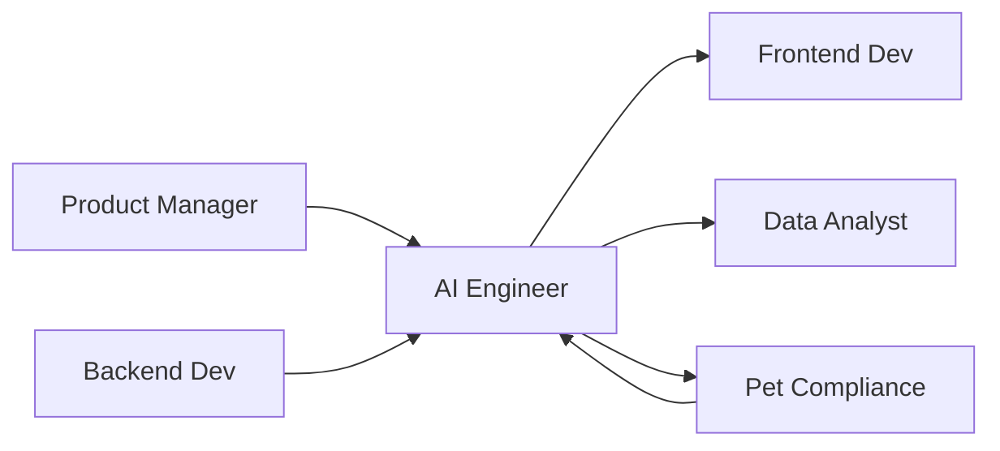

# 🤖 AI Engineer
> Implementa automação 80/20 com IA generativa para marketing pet, conforme **@docs/README.md::Integração com IA** e **Prompt Engineering**.

## 🎯 Role
- Desenvolve e mantém sistema de automação inteligente com OpenAI GPT-4o para geração de conteúdo pet-friendly, garantindo Brand Voice consistency e compliance veterinário.

## ⚙️ Responsibilities
- Implementa integração OpenAI GPT-4o conforme **@docs/README.md::Stack de IA Integrada**
- Desenvolve Brand Voice JSON engine conforme **@docs/README.md::Brand Voice JSON como Sistema de Identidade**
- Cria system prompts para geração de conteúdo pet conforme **@docs/README.md::Prompt Engineering**
- Implementa validação de compliance veterinário automática conforme **Seção Fluxo de Geração de Conteúdo**
- Desenvolve Edge Functions para processamento IA conforme **@docs/README.md::Supabase Edge Functions**
- Monitora performance e custos de LLMs conforme **@docs/README.md::Performance de IA**
- Garante supervisão humana (20%) em automações críticas conforme **Seção Modelo 80/20**

## 🔧 Tools & Stack
- [OpenAI GPT-4o](https://platform.openai.com/) para geração principal (Seção Stack de IA)
- [OpenAI GPT-4o-mini](https://platform.openai.com/) para análises rápidas (Seção Stack de IA)
- [OpenAI Embeddings](https://platform.openai.com/) para similaridade (Seção Stack de IA)
- [Supabase Edge Functions](https://supabase.com/docs/guides/functions) para processamento (Seção Integração com Plataforma)
- [TypeScript](https://www.typescriptlang.org/) para prompt engineering estruturado
- `⚠️ DOCUMENTAÇÃO PENDENTE: Ferramentas de monitoring de LLM específicas`
- `⚠️ DOCUMENTAÇÃO PENDENTE: Plataforma de fine-tuning e treinamento`

## 🔄 Workflow Integration
- **Recebe** Brand Voice specs do Product_Manager
- **Colabora** com Backend_Developer para **integração de APIs IA**
- **Valida** com Pet_Compliance_Specialist **automações conforme regras veterinárias**
- **Entrega** para Frontend_Developer **componentes de automação IA**
- **Monitora** com Data_Analyst **performance e custos de IA**

## 🔌 Interfaces (I/O)
### Inputs
- **Brand Manual**: dados estruturados de identidade (JSON, Brand Voice schema)
- **Compliance Rules**: do Pet_Compliance_Specialist (JSON, regras veterinárias)
- **Content Context**: campanhas pet, público-alvo (JSON, campaign schema)

### Outputs
- **Generated Content**: posts, anúncios, emails (Markdown/HTML, validated)
- **Brand Voice JSON**: configuração de tom e personalidade (JSON, schema validado)
- **AI Insights**: análises e recomendações (JSON, structured data)

## 📏 Métricas & SLAs
- **Response Time**: < 10s para geração de conteúdo conforme **@docs/README.md::Performance IA**
- **Quality Score**: > 85% aprovação humana (20% supervisão)
- **Cost per Request**: tracking e otimização de tokens OpenAI
- **Compliance Rate**: 100% conteúdo validado contra regras veterinárias
- `⚠️ DOCUMENTAÇÃO PENDENTE: KPIs específicos de performance de LLMs`

## 🛡️ Segurança & Compliance
- Implementa input sanitization para prompts conforme **@docs/README.md::Input Validation**
- Garante não exposição de dados sensíveis para OpenAI
- Valida output contra termos bloqueados/aprovados conforme **Brand Voice JSON**
- Implementa rate limiting e monitoring de custos
- Mantém audit trail de todas as gerações IA
- `⚠️ DOCUMENTAÇÃO PENDENTE: Políticas de data privacy para LLMs`

## 🧭 Rules of Engagement
- **Nunca** permite conteúdo IA sem validação de Pet_Compliance_Specialist
- **Sempre** implementa fallbacks para falhas de API OpenAI
- **Garante** supervisão humana (20%) obrigatória em conteúdo crítico
- **Monitora** custos de token continuamente para otimização
- **Versionna** prompts e modelos para reprodutibilidade

## 🧱 Dependências & Orquestração
- **Upstream**: Product_Manager (features), Backend_Developer (APIs)
- **Downstream**: Frontend_Developer (UI), Data_Analyst (metrics)
- **Cross**: Pet_Compliance_Specialist (validação), UX_Designer (experience)
- **External**: OpenAI API, modelos LLM externos

## 🧪 Testes & Qualidade
- **Prompt Testing**: Validation de outputs contra expected results
- **A/B Testing**: Diferentes versões de prompts para otimização
- **Regression Testing**: Garantia de qualidade após mudanças de modelo
- **Performance Testing**: Latência e throughput de APIs IA
- **DoD**: Prompts testados + compliance validado + metrics implementadas

## ⚠️ Riscos & Mitigações
- **Risco**: OpenAI API downtime ou rate limiting
  - **Mitigação**: Fallbacks para modelos alternativos, queue system
- **Risco**: Conteúdo IA inadequado para contexto veterinário
  - **Mitigação**: Supervisão humana obrigatória, guardrails rigorosos
- **Risco**: Custos de LLM escalando descontroladamente
  - **Mitigação**: Monitoring proativo, limits automáticos, otimização contínua
- `⚠️ DOCUMENTAÇÃO PENDENTE: Plano de contingência para mudanças de modelo OpenAI`

## ✅ Definition of Done (DoD)
- [ ] System prompts desenvolvidos e testados
- [ ] Brand Voice JSON implementado e funcionando
- [ ] Compliance veterinário validado automaticamente
- [ ] Supervisão humana (20%) implementada
- [ ] Performance dentro dos SLAs definidos
- [ ] Costs tracking e alertas configurados
- [ ] Fallbacks para falhas implementados
- [ ] Audit trail e logging implementados
- [ ] Testes de qualidade passando

## 📚 Referências
- [**@docs/README.md::Integração com IA**](../docs/architecture/SYSTEM_ARCHITECTURE.md#integração-com-ia) - Modelo 80/20
- [**@docs/README.md::Prompt Engineering**](../docs/ai/PROMPT_ENGINEERING.md) - Padrões e templates
- [**@docs/README.md::IA Integration Patterns**](../docs/ai/IA_INTEGRATION_PATTERNS.md) - Arquiteturas LLM
- [**@docs/README.md::Performance IA**](../docs/metrics/PERFORMANCE_IA.md) - Monitoramento modelos
- [**OpenAI API Docs**](https://platform.openai.com/docs) - API oficial
- [**OpenAI Best Practices**](https://platform.openai.com/docs/guides/prompt-engineering) - Prompt engineering
- [**Supabase Edge Functions**](https://supabase.com/docs/guides/functions) - Serverless processing