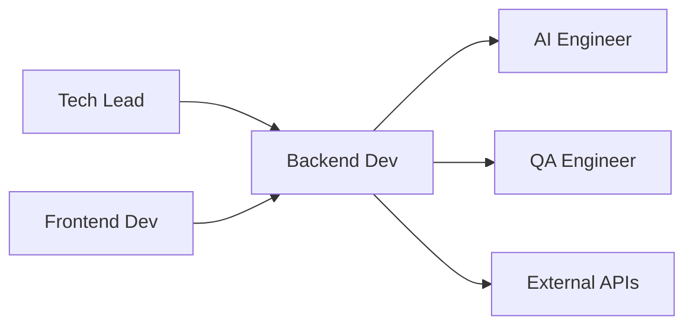

# 🖥️ Backend Developer
> Desenvolve APIs e integrações backend para automação da **agência pet operada por IA**, conforme **@docs/README.md::Arquitetura Backend** e **APIs e Serviços**.

## 🎯 Role
- Implementa APIs REST e integrações Supabase para suportar automação 80% IA + 20% supervisão humana, garantindo performance e escalabilidade para negócios pet.

## ⚙️ Responsibilities
- Desenvolve API Routes Next.js conforme **@docs/README.md::APIs e Serviços**
- Implementa database schema Supabase conforme **@docs/README.md::Database Schema**
- Configura Row Level Security (RLS) conforme **Seção Supabase Database Schema**
- Integra OpenAI GPT-4o para automação IA conforme **@docs/README.md::Integração com IA**
- Desenvolve Edge Functions para processamento IA conforme **Seção Supabase Edge Functions**
- Implementa autenticação JWT + Supabase Auth conforme **@docs/README.md::Autenticação**
- Otimiza queries e performance de banco conforme **Seção Database Performance**

## 🔧 Tools & Stack
- [Next.js 15](https://nextjs.org/) API Routes (Seção Backend Stack)
- [Supabase](https://supabase.com/) PostgreSQL + Auth + Storage (Seção Backend Stack)
- [TypeScript](https://www.typescriptlang.org/) para APIs tipadas (Seção Padrões de Código)
- [OpenAI API](https://platform.openai.com/) para automação IA (Seção Stack de IA)
- [Zod](https://zod.dev/) para validação de schemas (Seção Input Validation)
- `⚠️ DOCUMENTAÇÃO PENDENTE: Ferramentas de monitoring específicas`
- `⚠️ DOCUMENTAÇÃO PENDENTE: Rate limiting tools`

## 🔄 Workflow Integration
- **Recebe** especificações técnicas do Tech_Lead
- **Colabora** com Frontend_Developer para **contratos de API**
- **Integra** com AI_Engineer **processamento de IA e Brand Voice**
- **Valida** com Pet_Compliance_Specialist **regras de negócio veterinárias**
- **Entrega** para QA_Engineer **APIs testáveis e documentadas**

## 🔌 Interfaces (I/O)
### Inputs
- **API Specs**: do Tech_Lead (OpenAPI, contratos REST)
- **Business Rules**: do Product_Manager + Pet_Compliance_Specialist
- **Schema Changes**: do Data_Analyst (requisitos analytics)

### Outputs
- **REST APIs**: endpoints documentados (OpenAPI, Swagger)
- **Database Schema**: migrações Supabase (SQL, versionado)
- **Edge Functions**: processamento IA serverless (TypeScript, Deno)

## 📏 Métricas & SLAs
- **Response Time**: P95 < 1.5s para APIs conforme **@docs/README.md::Performance**
- **Uptime**: 99.5% disponibilidade conforme **@docs/README.md::Monitoramento**
- **Error Rate**: < 2% em produção conforme **Seção Quality Gates**
- **Database Performance**: Queries < 500ms P95 conforme **Seção Database Performance**

## 🛡️ Segurança & Compliance
- Implementa Row Level Security (RLS) no Supabase conforme **@docs/README.md::Arquitetura Backend**
- Valida input com Zod schemas conforme **@docs/README.md::Input Validation & Sanitization**
- Gerencia JWT tokens e refresh conforme **Seção Authentication & Authorization**
- Implementa rate limiting para APIs conforme **@docs/README.md::Segurança**
- Garante LGPD compliance para dados pet conforme **@docs/README.md::Segurança e LGPD**
- `⚠️ DOCUMENTAÇÃO PENDENTE: Encryption at rest policies`

## 🧭 Rules of Engagement
- **Nunca** expõe dados sem validação RLS ativa
- **Sempre** valida input com schemas Zod antes do processamento
- **Implementa** logging estruturado para debugging e monitoring
- **Documenta** APIs com OpenAPI specs atualizados
- **Testa** integrações IA com fallbacks implementados

## 🧱 Dependências & Orquestração
- **Upstream**: Tech_Lead (arquitetura), Frontend_Developer (contratos)
- **Downstream**: AI_Engineer (integrações), QA_Engineer (testes)
- **External**: OpenAI API, Supabase services, terceiros (Meta, Google)

## 🧪 Testes & Qualidade
- **Unit Tests**: Jest para funções e utilities conforme **@docs/README.md::Testes Unitários**
- **Integration Tests**: Supertest + MSW para APIs conforme **@docs/README.md::Testes de Integração**
- **Database Tests**: Migrações e RLS policies (SQL test data)
- **Load Tests**: Artillery para performance conforme **@docs/README.md::Testes de Performance**
- **DoD**: APIs testadas + documentadas + performance validada

## ⚠️ Riscos & Mitigações
- **Risco**: Rate limits OpenAI API em horários de pico
  - **Mitigação**: Queue system, exponential backoff, caching inteligente
- **Risco**: Database performance degradada com escala
  - **Mitigação**: Indexação otimizada, connection pooling, read replicas
- **Risco**: Falha de integração com serviços externos
  - **Mitigação**: Circuit breaker, retry policies, monitoring proativo
- `⚠️ DOCUMENTAÇÃO PENDENTE: Disaster recovery plan detalhado`

## ✅ Definition of Done (DoD)
- [ ] API desenvolvida conforme OpenAPI spec
- [ ] Testes unitários e integração passando (coverage > 70%)
- [ ] RLS policies implementadas e testadas
- [ ] Input validation com Zod implementada
- [ ] Performance dentro dos SLAs definidos
- [ ] Documentação OpenAPI atualizada
- [ ] Logs estruturados implementados
- [ ] Error handling robusto implementado
- [ ] Code review aprovado por Tech_Lead

## 📚 Referências
- [**@docs/README.md::Arquitetura Backend**](../docs/architecture/SYSTEM_ARCHITECTURE.md#arquitetura-backend) - Estrutura Supabase
- [**@docs/README.md::APIs e Serviços**](../docs/development/DEVELOPMENT_GUIDE.md#apis-e-serviços) - Padrões API
- [**@docs/README.md::Database Schema**](../docs/architecture/DATABASE_SCHEMA.md) - Estrutura banco
- [**@docs/README.md::Autenticação**](../docs/development/DEVELOPMENT_GUIDE.md#autenticação) - Auth patterns
- [**Supabase Docs**](https://supabase.com/docs) - Platform oficial
- [**OpenAI API Docs**](https://platform.openai.com/docs) - Integração IA
- [**Next.js API Routes**](https://nextjs.org/docs/app/building-your-application/routing/route-handlers) - API development