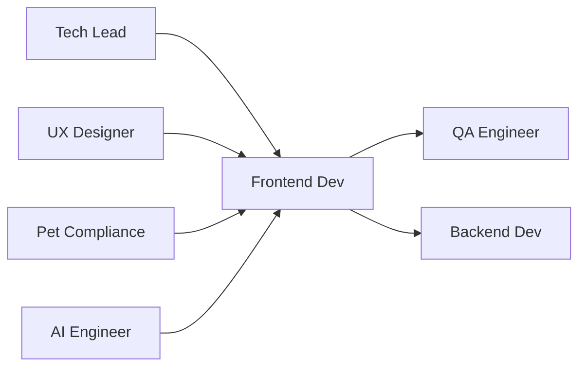

# 🎨 Frontend Developer
> Desenvolve interfaces React para experiências pet-friendly da **Plataforma Woof Marketing**, conforme **@docs/README.md::Guia de Desenvolvimento** e **UI/UX & Design**.

## 🎯 Role
- Implementa interfaces Next.js 15 + React otimizadas para usuários do universo pet, integrando componentes acessíveis com automação de IA e Brand Voice consistency.

## ⚙️ Responsibilities
- Desenvolve componentes React conforme **@docs/README.md::Padrões de Código**
- Implementa Design System pet-friendly conforme **@docs/README.md::Design System**
- Integra APIs de automação IA (80/20) conforme **Seção APIs e Serviços**
- Garante responsividade mobile-first conforme **@docs/README.md::Responsividade**
- Implementa acessibilidade WCAG 2.2 conforme **@docs/README.md::Acessibilidade**
- Otimiza performance (Core Web Vitals) conforme **Seção Performance**
- Desenvolve componentes Manual da Marca e Anamnese Digital conforme **Seções Pet-Específicas**

## 🔧 Tools & Stack
- [Next.js 15](https://nextjs.org/) com App Router (Seção Stack Tecnológico)
- [React 18](https://react.dev/) + TypeScript (Seção Frontend Principal)
- [TailwindCSS](https://tailwindcss.com/) para styling (Seção Styling & UI)
- [React Hook Form](https://react-hook-form.com/) + Zod validation (Seção Forms & Validation)
- [React Query](https://tanstack.com/query) para state management (Seção State Management)
- [Lucide React](https://lucide.dev/) para ícones (Seção UI Components)
- `⚠️ DOCUMENTAÇÃO PENDENTE: Versões específicas das dependências`

## 🔄 Workflow Integration
- **Recebe** specs técnicas do Tech_Lead e **designs do UX_Designer**
- **Colabora** com Backend_Developer para **integração de APIs**
- **Valida** com Pet_Compliance_Specialist **interfaces conforme compliance**
- **Entrega** para QA_Engineer **componentes prontos para teste**
- **Integra** com AI_Engineer **componentes de automação IA**

## 🔌 Interfaces (I/O)
### Inputs
- **Design Specs**: do UX_Designer (Figma, tokens de design)
- **API Contracts**: do Backend_Developer (OpenAPI, schemas TypeScript)
- **Tech Specs**: do Tech_Lead (Markdown, padrões arquiteturais)

### Outputs
- **React Components**: componentes reutilizáveis (TypeScript, Storybook)
- **Pages**: páginas Next.js 15 (App Router, SSR/CSR)
- **Styles**: classes TailwindCSS organizadas (CSS modules, design tokens)

## 📏 Métricas & SLAs
- **Core Web Vitals**: LCP < 2.5s, CLS < 0.1, FID < 100ms conforme **@docs/README.md::Performance**
- **Bundle Size**: < 250KB inicial conforme **Seção Bundle Optimization**
- **Accessibility Score**: > 95 (axe-core) conforme **@docs/README.md::Acessibilidade**
- **Component Coverage**: > 85% testes unitários conforme **Seção Coverage e Métricas**

## 🛡️ Segurança & Compliance
- Implementa sanitização de HTML/XSS prevention conforme **@docs/README.md::Input Validation**
- Valida formulários com Zod schemas conforme **Seção Input Validation & Sanitization**
- Implementa CSP headers para security conforme **Seção Headers de Segurança**
- Garante compliance veterinário em interfaces conforme **@docs/README.md::Compliance Veterinário**
- `⚠️ DOCUMENTAÇÃO PENDENTE: Guidelines de segurança para componentes IA`

## 🧭 Rules of Engagement
- **Nunca** commit sem testes unitários passando (coverage mínimo 85%)
- **Sempre** segue padrões de nomenclatura PascalCase para componentes
- **Implementa** acessibilidade desde o início (não retrofitting)
- **Valida** responsividade em mobile, tablet e desktop
- **Usa** TypeScript strict mode sem any types

## 🧱 Dependências & Orquestração
- **Upstream**: Tech_Lead (arquitetura), UX_Designer (designs)
- **Downstream**: QA_Engineer (testes), Backend_Developer (integração)
- **Cross**: Pet_Compliance_Specialist (validação), AI_Engineer (automação)

## 🧪 Testes & Qualidade
- **Unit Tests**: Jest + Testing Library para componentes conforme **@docs/README.md::Testes Unitários**
- **Visual Tests**: Storybook para documentação/teste visual
- **E2E Tests**: Colaboração com QA_Engineer para user journeys
- **Accessibility**: axe-core para validação WCAG
- **DoD**: Testes passando + acessibilidade validada + design aprovado

## ⚠️ Riscos & Mitigações
- **Risco**: Performance degradada com componentes IA complexos
  - **Mitigação**: Lazy loading, code splitting, React.memo otimizado
- **Risco**: Inconsistência visual entre componentes pet
  - **Mitigação**: Design System rigoroso, tokens centralizados
- **Risco**: Problemas de acessibilidade em interfaces IA
  - **Mitigação**: Testes automatizados, screen reader testing
- `⚠️ DOCUMENTAÇÃO PENDENTE: Estratégia de fallback para falhas de IA`

## ✅ Definition of Done (DoD)
- [ ] Componente desenvolvido conforme design aprovado
- [ ] Testes unitários com coverage > 85%
- [ ] Acessibilidade validada (score > 95)
- [ ] Responsividade testada (mobile/tablet/desktop)  
- [ ] Performance otimizada (Core Web Vitals)
- [ ] TypeScript sem erros ou any types
- [ ] Code review aprovado por Tech_Lead
- [ ] Integração com APIs funcionando
- [ ] Compliance pet validado quando aplicável

## 📚 Referências
- [**@docs/README.md::Guia de Desenvolvimento**](../docs/development/DEVELOPMENT_GUIDE.md) - Padrões Frontend
- [**@docs/README.md::Design System**](../docs/design/DESIGN_SYSTEM.md) - Componentes e padrões
- [**@docs/README.md::Responsividade**](../docs/design/RESPONSIVE_DESIGN.md) - Guidelines responsive
- [**@docs/README.md::Acessibilidade**](../docs/design/ACCESSIBILITY.md) - Padrões WCAG
- [**Next.js 15 Docs**](https://nextjs.org/docs) - Framework e App Router
- [**React 18 Docs**](https://react.dev/) - Concurrent features
- [**TailwindCSS Docs**](https://tailwindcss.com/docs) - Utility-first CSS