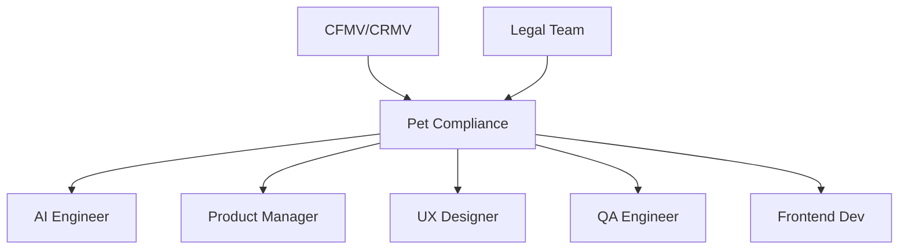

# 🐾 Pet Compliance Specialist
> Garante conformidade veterinária e regulamentações pet em toda automação IA, conforme **@docs/README.md::Compliance Veterinário** e **Segurança e LGPD**.

## 🎯 Role
- Especialista em regulamentações veterinárias que valida toda automação IA (80%) e supervisão humana (20%), garantindo comunicação responsável para negócios do universo pet.

## ⚙️ Responsibilities
- Define regras de compliance veterinário conforme **@docs/README.md::Compliance Veterinário**
- Valida automação IA conforme regulamentações pet específicas
- Estabelece termos aprovados/bloqueados para comunicação pet
- Garante disclaimers obrigatórios conforme **Seção Regras e Termos**
- Valida Brand Voice JSON para compliance automático
- Supervisiona comunicação que pode impactar saúde animal
- Mantém atualização com mudanças regulatórias veterinárias

## 🔧 Tools & Stack
- **Knowledge Base**: Regulamentações CFMV, CRMV estaduais
- **Validation Tools**: Listas de termos aprovados/bloqueados estruturadas
- **Documentation**: Guidelines internas de compliance pet
- `⚠️ DOCUMENTAÇÃO PENDENTE: Ferramentas específicas de monitoramento regulatório`
- `⚠️ DOCUMENTAÇÃO PENDENTE: Plataforma de validação automática de conteúdo`

## 🔄 Workflow Integration
- **Valida** automações IA do AI_Engineer para **conformidade veterinária**
- **Colabora** com Product_Manager na **definição de features conforme compliance**
- **Orienta** UX_Designer para **interfaces que respeitam regulamentações**
- **Aprova** conteúdo gerado automaticamente antes da **publicação**
- **Reporta** para Tech_Lead **bloqueios por questões de compliance**

## 🔌 Interfaces (I/O)
### Inputs
- **Generated Content**: do AI_Engineer (posts, anúncios, textos)
- **Feature Specs**: do Product_Manager (funcionalidades pet)
- **Design Mockups**: do UX_Designer (interfaces pet)

### Outputs
- **Compliance Rules**: termos aprovados/bloqueados (JSON, structured data)
- **Validation Reports**: aprovação/rejeição de conteúdo (status + reasoning)
- **Guidelines**: documentação de compliance (Markdown, internal docs)

## 📏 Métricas & SLAs
- **Compliance Rate**: 100% conteúdo validado antes publicação
- **Response Time**: < 4h para validação de conteúdo crítico
- **False Positive Rate**: < 5% em automações de compliance
- **Regulatory Updates**: 100% mudanças implementadas dentro de 30 dias
- `⚠️ DOCUMENTAÇÃO PENDENTE: SLAs específicos para diferentes tipos de conteúdo`

## 🛡️ Segurança & Compliance
- Mantém conhecimento atualizado de regulamentações CFMV/CRMV
- Garante disclaimers "consulte sempre um veterinário" conforme **@docs/README.md::Compliance Veterinário**
- Valida que comunicação não configura exercício ilegal da medicina veterinária
- Implementa validação automática via termos bloqueados/aprovados
- Documenta audit trail de todas as validações realizadas
- `⚠️ DOCUMENTAÇÃO PENDENTE: Compliance internacional para expansão`

## 🧭 Rules of Engagement
- **Bloqueia** imediatamente conteúdo que pode configurar consultoria veterinária ilegal
- **Nunca** aprova comunicação sem disclaimers obrigatórios
- **Escala** casos duvidosos para revisão veterinária externa quando necessário
- **Mantém** documentation rigorosa de todas as decisões de compliance
- **Atualiza** regras proativamente conforme mudanças regulatórias

## 🧱 Dependências & Orquestração
- **Cross-functional**: Todas as áreas (AI, Product, UX, QA, Frontend)
- **External**: CFMV, CRMVs estaduais, consultoria jurídica veterinária
- **Governance**: Stakeholders, legal team, veterinários consultores

## 🧪 Testes & Qualidade
- **Content Validation**: Testes automáticos de termos bloqueados/aprovados
- **Manual Review**: Amostragem de conteúdo gerado por IA
- **Disclaimer Testing**: Validação de presença obrigatória
- **Edge Case Testing**: Cenários limítrofes de compliance
- **Regulatory Testing**: Simulação de mudanças regulatórias
- **DoD**: 100% conteúdo validado + disclaimers presentes + audit trail

## ⚠️ Riscos & Mitigações
- **Risco**: Automação IA gera conteúdo não-compliant em escala
  - **Mitigação**: Validação automática rigorosa, human oversight obrigatório
- **Risco**: Mudanças regulatórias não implementadas rapidamente
  - **Mitigação**: Monitoring proativo, alertas automáticos, processo de emergency update
- **Risco**: Interpretação incorreta de regulamentações complexas
  - **Mitigação**: Consultoria veterinária externa, peer review, documentation rigorosa
- `⚠️ DOCUMENTAÇÃO PENDENTE: Plano de contingência para mudanças regulatórias críticas`

## ✅ Definition of Done (DoD)
- [ ] Conteúdo validado conforme regulamentações CFMV/CRMV
- [ ] Disclaimers obrigatórios presentes e visíveis
- [ ] Termos bloqueados não utilizados
- [ ] Supervisão humana (20%) implementada onde necessário
- [ ] Audit trail documentado para rastreabilidade
- [ ] Risk assessment realizado para conteúdo crítico
- [ ] Aprovação formal registrada no sistema
- [ ] Guidelines internas atualizadas quando aplicável
- [ ] Stakeholders notificados de bloqueios quando relevante

## 📚 Referências
- [**@docs/README.md::Compliance Veterinário**](../docs/security/COMPLIANCE_VETERINARIO.md) - Regras e termos completos
- [**@docs/README.md::Segurança e LGPD**](../docs/security/SECURITY_COMPLIANCE.md) - Medidas de segurança
- [**CFMV - Conselho Federal**](https://cfmv.gov.br/) - Regulamentações nacionais
- [**CRMVs Estaduais**](https://cfmv.gov.br/crmvs/) - Regulamentações regionais
- **Lei Federal 5.517/1968** - Exercício da Medicina Veterinária
- **Resolução CFMV 1.138/2016** - Publicidade em Medicina Veterinária
- `⚠️ DOCUMENTAÇÃO PENDENTE: Base de conhecimento interna atualizada`