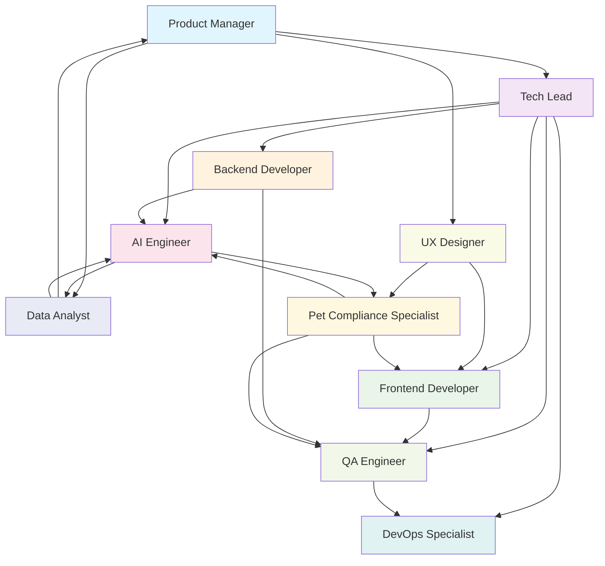

# 🤖 Catálogo de AI Agents - Plataforma Woof Marketing

Este catálogo define os AI Agents especializados para desenvolvimento da **primeira agência de marketing pet operada por IA** no Brasil, seguindo estritamente as diretrizes estabelecidas em `@docs/README.md`.

## 📖 Visão Geral

O catálogo implementa agentes especializados para suportar o modelo **80% automação + 20% supervisão humana** da Plataforma Woof Marketing, garantindo qualidade, compliance veterinário e consistência de marca para negócios do universo pet.

## 🗂️ Catálogo de Agentes

| Agente | Propósito | Principais Interações | Artefatos Gerados |
|--------|-----------|----------------------|-------------------|
| [**Tech_Lead**](./Tech_Lead.md) | Liderança técnica e arquitetura da plataforma pet | PM → Frontend → QA | ADRs, Code Reviews, Arquitetura |
| [**Product_Manager**](./Product_Manager.md) | Gestão de produto focado em soluções pet | Stakeholders → Tech_Lead → UX_Designer | PRDs, User Stories, Roadmap |
| [**Frontend_Developer**](./Frontend_Developer.md) | Desenvolvimento UI/UX para agência pet | Tech_Lead → Backend → QA_Engineer | Componentes React, Interfaces Pet |
| [**Backend_Developer**](./Backend_Developer.md) | APIs e integrações para automação pet | Frontend → AI_Engineer → DevOps | APIs REST, Integrações OpenAI |
| [**AI_Engineer**](./AI_Engineer.md) | Implementação da automação 80/20 para marketing pet | Backend → Frontend → Pet_Compliance | Prompts IA, Brand Voice JSON, Compliance |
| [**QA_Engineer**](./QA_Engineer.md) | Testes e qualidade para plataforma pet | Frontend → Backend → DevOps | Testes E2E, Casos de Teste Pet |
| [**DevOps_Specialist**](./DevOps_Specialist.md) | Infraestrutura e deploy da agência pet | Backend → QA → Monitoring | Pipelines CI/CD, Infraestrutura Vercel |
| [**UX_Designer**](./UX_Designer.md) | Design centrado em usuários do universo pet | Product_Manager → Frontend → Pet_Compliance | Design System, Wireframes Pet |
| [**Pet_Compliance_Specialist**](./Pet_Compliance_Specialist.md) | Compliance veterinário e regulamentações pet | AI_Engineer → UX_Designer → QA_Engineer | Guidelines Veterinárias, Validações |
| [**Data_Analyst**](./Data_Analyst.md) | Analytics e métricas de performance pet | Backend → AI_Engineer → Product_Manager | Dashboards, KPIs Pet, Insights |

## 🔄 RACI Simplificado

| Atividade | Tech Lead | PM | Frontend | Backend | AI Eng | QA | DevOps | UX | Pet Comp | Data |
|-----------|-----------|----|---------|---------|----- ---|----|---------|----|----------|------|
| **Arquitetura Sistema** | R | A | C | C | C | I | C | I | I | I |
| **Features Pet** | C | R | A | A | R | R | I | C | R | C |
| **Deploy Produção** | A | I | I | I | I | C | R | I | C | I |
| **Compliance Veterinário** | C | C | C | C | C | C | I | C | R | I |
| **Brand Voice IA** | C | C | C | C | R | C | I | C | A | I |

**Legenda**: R=Responsável, A=Aprovador, C=Consultado, I=Informado

## 🔗 DAG de Interações

## 🌐 Padrões Globais

### Convenções de Desenvolvimento
Conforme **@docs/README.md::Guia de Desenvolvimento**:

- **Stack**: Next.js 15 + TypeScript + Supabase + TailwindCSS
- **Branches**: `main` (prod), `staging` (qa), `develop` (dev), `feature/*`
- **PRs**: Obrigatório para `main`, revisão por pares, testes passando
- **Commits**: Conventional Commits (`feat:`, `fix:`, `docs:`, etc.)
- **Deploy**: Vercel com pipeline automatizado via GitHub Actions

### Testes e Qualidade
Conforme **@docs/README.md::Estratégia de Testes**:

- **Coverage Mínimo**: 70% global, 80% componentes, 85% hooks
- **Pirâmide**: 70% unit, 20% integration, 10% e2e
- **Tools**: Jest + Testing Library + Playwright
- **Quality Gates**: Coverage, performance, accessibility, security

### Segurança e Compliance
Conforme **@docs/README.md::Segurança e LGPD**:

- **Autenticação**: Supabase Auth + JWT + Row Level Security
- **Compliance Pet**: Validação automática via Pet_Compliance_Specialist
- **LGPD**: Consentimento explícito, dados minimizados, portabilidade
- **Veterinário**: Disclaimers obrigatórios, termos aprovados/bloqueados

### IA e Automação 80/20
Conforme **@docs/README.md::Integração com IA**:

- **LLM Principal**: OpenAI GPT-4o para geração de conteúdo
- **Brand Voice**: JSON estruturado para consistência de marca
- **Supervisão Humana**: 20% validação manual obrigatória
- **Compliance**: Validação automática de termos veterinários

### Performance e Monitoramento
Conforme **@docs/README.md::Deploy & DevOps**:

- **Core Web Vitals**: LCP < 2.5s, CLS < 0.1, FID < 100ms
- **Response Time**: P95 < 1.5s APIs, P95 < 2s páginas
- **Error Rate**: < 2% produção, < 5% staging
- **Uptime**: 99.5% SLA mínimo

### Documentação
Conforme **@docs/README.md::Convenções da Documentação**:

- **Formato**: Markdown com emojis, exemplos de código
- **Versionamento**: Data de atualização, histórico de mudanças
- **Status**: ✅ Completo, 🔄 Em desenvolvimento, ⚠️ Desatualizado
- **Links**: Anchors internos, URLs oficiais externos

## 🔍 Lacunas Identificadas

As seguintes lacunas foram identificadas na documentação base e marcadas com **⚠️ DOCUMENTAÇÃO PENDENTE** nos agentes:

1. **Versionamento de API**: Estratégia semver para APIs não definida
2. **Alertas de Monitoramento**: Thresholds específicos para alertas
3. **Disaster Recovery**: Plano de recuperação de desastres detalhado  
4. **Métricas de IA**: KPIs específicos para performance dos LLMs
5. **Compliance Internacional**: Regulamentações fora do Brasil
6. **Escalabilidade**: Limites de recursos e estratégias de scaling

## 📚 Referências Normativas

- **Fonte Única**: [@docs/README.md](../docs/README.md)
- **Desenvolvimento**: [@docs/development/DEVELOPMENT_GUIDE.md](../docs/development/DEVELOPMENT_GUIDE.md)
- **Arquitetura**: [@docs/architecture/SYSTEM_ARCHITECTURE.md](../docs/architecture/SYSTEM_ARCHITECTURE.md)
- **Deploy**: [@docs/deployment/DEPLOYMENT_PROCESS.md](../docs/deployment/DEPLOYMENT_PROCESS.md)
- **Testes**: [@docs/testing/TEST_STRATEGY.md](../docs/testing/TEST_STRATEGY.md)
- **IA Integration**: [@docs/ai/IA_INTEGRATION_PATTERNS.md](../docs/ai/IA_INTEGRATION_PATTERNS.md)

---

**Criado em:** 24 de agosto de 2025  
**Baseado em:** @docs/README.md versão 2.0  
**Status:** ✅ Completo  
**Agentes:** 10 especializados para desenvolvimento de agência pet operada por IA