# 🎨 Design System Pet - Componentes e Padrões Especializados

> **Versão:** 2.0 | **Status:** ✅ Ativo | **Última Atualização:** 24/08/2025  
> **Responsável:** Frontend Developer + UI/UX Designer  
> **Integração:** Sistema base PRD v2.0 para consistência visual pet

## 🎯 **Visão Geral**

O **Design System Pet** é um conjunto especializado de componentes, padrões visuais e guidelines que garantem consistência e otimização da experiência para o mercado pet. Baseado em research comportamental de tutores de pets e best practices de UX para negócios de serviços especializados.

### **Princípios Fundamentais**

#### **🐾 Pet-Centric Design**
- **Emotional Connection** - Elementos que reforçam o vínculo tutor-pet
- **Trust Building** - Componentes que transmitem confiança e expertise
- **Urgency Awareness** - Estados para situações de saúde urgentes
- **Care Communication** - Tom visual que comunica cuidado e atenção

#### **🎯 Business-Focused UX**
- **Service Clarity** - Informações claras sobre serviços especializados
- **Booking Optimization** - Fluxos otimizados para agendamento
- **Compliance Visual** - Elementos para comunicação regulamentada
- **Performance Orientation** - Componentes otimizados para conversão

## 🏗️ **Arquitetura do Sistema**

### **Estrutura Hierárquica**

```mermaid
graph TD
    A[Design System Pet] --> B[Tokens Base]
    A --> C[Componentes Primitivos]
    A --> D[Componentes Compostos]
    A --> E[Padrões Pet]
    
    B --> B1[Cores Pet-Friendly]
    B --> B2[Typography Confiável]
    B --> B3[Espaçamentos Harmoniosos]
    
    C --> C1[Buttons]
    C --> C2[Forms]
    C --> C3[Navigation]
    
    D --> D1[ServiceCard]
    D --> D2[PetProfile]
    D --> D3[AppointmentBooker]
    
    E --> E1[Emergency Patterns]
    E --> E2[Trust Indicators]
    E --> E3[Compliance Elements]
```


### **Design Token Architecture**
```typescript
interface PetDesignTokens {
  colors: PetColorPalette;
  typography: PetTypographyScale;
  spacing: PetSpacingScale;
  elevation: PetElevationScale;
  motion: PetMotionTokens;
  breakpoints: ResponsiveBreakpoints;
  petSpecific: PetSpecificTokens;
}

interface PetSpecificTokens {
  trustIndicators: TrustColorTokens;
  urgencyStates: UrgencyColorTokens;
  serviceTypes: ServiceColorMapping;
  emotions: EmotionalColorPalette;
  compliance: ComplianceColorTokens;
}
```

## 🎨 **Sistema de Cores**

### **Paleta Principal Pet-Friendly**
```scss
:root {
  // Primary - Transmite confiança e profissionalismo
  --pet-primary-50: #F0F9FF;
  --pet-primary-100: #E0F2FE;
  --pet-primary-200: #BAE6FD;
  --pet-primary-300: #7DD3FC;
  --pet-primary-400: #38BDF8;
  --pet-primary-500: #0EA5E9; // Main primary
  --pet-primary-600: #0284C7;
  --pet-primary-700: #0369A1;
  --pet-primary-800: #075985;
  --pet-primary-900: #0C4A6E;
  
  // Secondary - Warmth e acolhimento
  --pet-secondary-50: #FFF7ED;
  --pet-secondary-100: #FFEDD5;
  --pet-secondary-200: #FED7AA;
  --pet-secondary-300: #FDBA74;
  --pet-secondary-400: #FB923C;
  --pet-secondary-500: #F97316; // Main secondary
  --pet-secondary-600: #EA580C;
  --pet-secondary-700: #C2410C;
  --pet-secondary-800: #9A3412;
  --pet-secondary-900: #7C2D12;
  
  // Success - Saúde e bem-estar
  --pet-success-50: #ECFDF5;
  --pet-success-100: #D1FAE5;
  --pet-success-200: #A7F3D0;
  --pet-success-300: #6EE7B7;
  --pet-success-400: #34D399;
  --pet-success-500: #10B981; // Main success
  --pet-success-600: #059669;
  --pet-success-700: #047857;
  --pet-success-800: #065F46;
  --pet-success-900: #064E3B;
  
  // Warning - Atenção sem alarme
  --pet-warning-50: #FFFBEB;
  --pet-warning-100: #FEF3C7;
  --pet-warning-200: #FDE68A;
  --pet-warning-300: #FCD34D;
  --pet-warning-400: #FBBF24;
  --pet-warning-500: #F59E0B; // Main warning
  --pet-warning-600: #D97706;
  --pet-warning-700: #B45309;
  --pet-warning-800: #92400E;
  --pet-warning-900: #78350F;
  
  // Danger - Urgência médica
  --pet-danger-50: #FEF2F2;
  --pet-danger-100: #FEE2E2;
  --pet-danger-200: #FECACA;
  --pet-danger-300: #FCA5A5;
  --pet-danger-400: #F87171;
  --pet-danger-500: #EF4444; // Main danger
  --pet-danger-600: #DC2626;
  --pet-danger-700: #B91C1C;
  --pet-danger-800: #991B1B;
  --pet-danger-900: #7F1D1D;
}
```

### **Cores Específicas por Segmento**
```scss
// Veterinária - Cores médicas profissionais
:root {
  --vet-primary: #1E40AF; // Azul médico confiável
  --vet-secondary: #059669; // Verde saúde
  --vet-accent: #7C3AED; // Roxo tecnologia/IA
  --vet-emergency: #DC2626; // Vermelho urgência
}

// Pet Shop - Cores alegres e comerciais
:root {
  --petshop-primary: #7C2D92; // Roxo premium
  --petshop-secondary: #F97316; // Laranja energia
  --petshop-accent: #10B981; // Verde natural
  --petshop-promo: #EF4444; // Vermelho promoção
}

// Banho & Tosa - Cores frescas e limpas
:root {
  --grooming-primary: #0EA5E9; // Azul água
  --grooming-secondary: #06B6D4; // Cyan frescor
  --grooming-accent: #8B5CF6; // Roxo luxo
  --grooming-clean: #F0F9FF; // Branco limpeza
}

// Hotel Pet - Cores aconchegantes
:root {
  --hotel-primary: #059669; // Verde natureza
  --hotel-secondary: #F59E0B; // Amarelo aconchego
  --hotel-accent: #6366F1; // Azul conforto
  --hotel-cozy: #FFF7ED; // Creme acolhedor
}
```

### **Aplicação Contextual**
```typescript
const PetColorContext = createContext<PetColorScheme>();

const usePetColors = (segment: BusinessSegment) => {
  const colorMap = {
    veterinaria: {
      primary: 'var(--vet-primary)',
      secondary: 'var(--vet-secondary)',
      accent: 'var(--vet-accent)',
      emergency: 'var(--vet-emergency)'
    },
    petshop: {
      primary: 'var(--petshop-primary)',
      secondary: 'var(--petshop-secondary)', 
      accent: 'var(--petshop-accent)',
      promo: 'var(--petshop-promo)'
    },
    // ... outros segmentos
  };
  
  return colorMap[segment] || colorMap.veterinaria;
};
```

## ✍️ **Sistema Tipográfico**

### **Hierarquia Pet-Focused**
```scss
// Font Stacks - Legibilidade e confiança
:root {
  --pet-font-primary: 'Inter', -apple-system, BlinkMacSystemFont, 'Segoe UI', sans-serif;
  --pet-font-heading: 'Poppins', var(--pet-font-primary);
  --pet-font-mono: 'JetBrains Mono', 'SF Mono', Consolas, monospace;
  
  // Weights
  --pet-font-light: 300;
  --pet-font-regular: 400;
  --pet-font-medium: 500;
  --pet-font-semibold: 600;
  --pet-font-bold: 700;
  --pet-font-extrabold: 800;
}

// Scale - Otimizada para densidade de informação pet
.pet-typography {
  --pet-text-xs: 0.75rem;    // 12px - Disclaimers
  --pet-text-sm: 0.875rem;   // 14px - Support text
  --pet-text-base: 1rem;     // 16px - Body text
  --pet-text-lg: 1.125rem;   // 18px - Emphasized
  --pet-text-xl: 1.25rem;    // 20px - Small headings
  --pet-text-2xl: 1.5rem;    // 24px - Section headings
  --pet-text-3xl: 1.875rem;  // 30px - Page headings
  --pet-text-4xl: 2.25rem;   // 36px - Display
  --pet-text-5xl: 3rem;      // 48px - Hero
  
  // Line Heights - Optimized for reading
  --pet-leading-tight: 1.25;
  --pet-leading-snug: 1.375;
  --pet-leading-normal: 1.5;
  --pet-leading-relaxed: 1.625;
  --pet-leading-loose: 2;
}
```

### **Typography Components**
```typescript
interface PetTextProps {
  variant: 'hero' | 'heading' | 'subheading' | 'body' | 'caption' | 'disclaimer';
  weight?: 'light' | 'regular' | 'medium' | 'semibold' | 'bold';
  color?: PetColorToken;
  align?: 'left' | 'center' | 'right';
  truncate?: boolean;
  emotion?: 'trust' | 'urgency' | 'care' | 'neutral';
}

const PetText: FC<PetTextProps> = ({ 
  variant, 
  weight = 'regular',
  emotion = 'neutral',
  children,
  ...props 
}) => {
  const emotionStyles = {
    trust: 'text-pet-primary-600 font-medium',
    urgency: 'text-pet-danger-600 font-semibold',
    care: 'text-pet-success-600 font-medium',
    neutral: 'text-gray-700'
  };
  
  return (
    <span 
      className={cn(
        `pet-text-${variant}`,
        `font-${weight}`,
        emotionStyles[emotion],
        props.className
      )}
    >
      {children}
    </span>
  );
};

// Usage Examples
<PetText variant="heading" emotion="trust">
  Consulta Veterinária de Qualidade
</PetText>

<PetText variant="body" emotion="urgency">
  Atendimento de emergência 24h disponível
</PetText>
```

## 📐 **Sistema de Espaçamento**

### **Scale Harmônica Pet-Optimized**
```scss
:root {
  // Base unit - 4px para alinhamento pixel-perfect
  --pet-space-px: 1px;
  --pet-space-0: 0;
  --pet-space-1: 0.25rem;  // 4px
  --pet-space-2: 0.5rem;   // 8px
  --pet-space-3: 0.75rem;  // 12px
  --pet-space-4: 1rem;     // 16px - Base unit
  --pet-space-5: 1.25rem;  // 20px
  --pet-space-6: 1.5rem;   // 24px
  --pet-space-8: 2rem;     // 32px
  --pet-space-10: 2.5rem;  // 40px
  --pet-space-12: 3rem;    // 48px
  --pet-space-16: 4rem;    // 64px
  --pet-space-20: 5rem;    // 80px
  --pet-space-24: 6rem;    // 96px
  --pet-space-32: 8rem;    // 128px
  
  // Semantic spacing
  --pet-space-xs: var(--pet-space-2);
  --pet-space-sm: var(--pet-space-4);
  --pet-space-md: var(--pet-space-6);
  --pet-space-lg: var(--pet-space-8);
  --pet-space-xl: var(--pet-space-12);
  --pet-space-2xl: var(--pet-space-16);
}
```

### **Layout Patterns**
```typescript
const PetLayoutPatterns = {
  // Card spacing - otimizado para densidade de informação
  cardPadding: 'var(--pet-space-6)', // 24px
  cardGap: 'var(--pet-space-4)', // 16px between elements
  cardMargin: 'var(--pet-space-6)', // 24px between cards
  
  // Form spacing - reduz friction em formulários longos
  formFieldGap: 'var(--pet-space-4)', // 16px between fields
  formSectionGap: 'var(--pet-space-8)', // 32px between sections
  formPadding: 'var(--pet-space-6)', // 24px form padding
  
  // Page layout - breathing room sem desperdício
  pageMargin: 'var(--pet-space-6)', // 24px page edges
  sectionGap: 'var(--pet-space-12)', // 48px between sections
  contentMaxWidth: '1200px' // Optimal reading width
};
```

## 🧩 **Componentes Primitivos**

### **Pet Button System**
```typescript
interface PetButtonProps {
  variant: 'primary' | 'secondary' | 'outline' | 'ghost' | 'emergency';
  size: 'sm' | 'md' | 'lg' | 'xl';
  urgency?: 'low' | 'medium' | 'high' | 'emergency';
  loading?: boolean;
  icon?: ReactNode;
  segment?: BusinessSegment;
}

const PetButton: FC<PetButtonProps> = ({ 
  variant,
  size = 'md',
  urgency = 'low',
  segment = 'veterinaria',
  loading,
  icon,
  children,
  ...props 
}) => {
  const variants = {
    primary: `
      bg-gradient-to-r from-pet-primary-500 to-pet-primary-600
      hover:from-pet-primary-600 hover:to-pet-primary-700
      text-white shadow-lg hover:shadow-xl
      transition-all duration-200 ease-out
    `,
    secondary: `
      bg-pet-secondary-500 hover:bg-pet-secondary-600
      text-white shadow-md hover:shadow-lg
    `,
    emergency: `
      bg-gradient-to-r from-pet-danger-500 to-pet-danger-600
      hover:from-pet-danger-600 hover:to-pet-danger-700
      text-white shadow-lg hover:shadow-xl
      animate-pulse-subtle
    `
  };
  
  const sizes = {
    sm: 'px-3 py-2 text-sm',
    md: 'px-4 py-2.5 text-base',
    lg: 'px-6 py-3 text-lg',
    xl: 'px-8 py-4 text-xl'
  };
  
  const urgencyStyles = {
    emergency: 'ring-2 ring-pet-danger-200 ring-opacity-50'
  };
  
  return (
    <button
      className={cn(
        'inline-flex items-center justify-center',
        'font-medium rounded-lg',
        'focus:outline-none focus:ring-2 focus:ring-offset-2',
        'disabled:opacity-50 disabled:cursor-not-allowed',
        'transform transition-transform hover:scale-[1.02] active:scale-[0.98]',
        variants[variant],
        sizes[size],
        urgency === 'emergency' && urgencyStyles.emergency
      )}
      disabled={loading}
      {...props}
    >
      {loading && <Spinner size="sm" className="mr-2" />}
      {icon && <span className="mr-2">{icon}</span>}
      {children}
    </button>
  );
};

// Usage Examples
<PetButton variant="primary" size="lg">
  Agendar Consulta
</PetButton>

<PetButton variant="emergency" urgency="emergency" icon="🚨">
  Emergência 24h
</PetButton>
```

### **Pet Form Controls**
```typescript
const PetInput: FC<PetInputProps> = ({ 
  label,
  error,
  required,
  icon,
  validation = 'none',
  ...props 
}) => {
  const validationStates = {
    none: '',
    valid: 'border-pet-success-300 focus:border-pet-success-500',
    invalid: 'border-pet-danger-300 focus:border-pet-danger-500',
    warning: 'border-pet-warning-300 focus:border-pet-warning-500'
  };
  
  return (
    <div className="pet-form-field">
      {label && (
        <label className="pet-form-label">
          {label}
          {required && <span className="text-pet-danger-500 ml-1">*</span>}
        </label>
      )}
      
      <div className="relative">
        {icon && (
          <div className="absolute inset-y-0 left-0 pl-3 flex items-center">
            {icon}
          </div>
        )}
        
        <input
          className={cn(
            'pet-form-input',
            icon && 'pl-10',
            validationStates[validation],
            error && validationStates.invalid
          )}
          {...props}
        />
        
        {validation === 'valid' && (
          <CheckIcon className="absolute right-3 top-1/2 transform -translate-y-1/2 text-pet-success-500" />
        )}
      </div>
      
      {error && (
        <p className="pet-form-error">
          <ExclamationIcon className="inline mr-1" />
          {error}
        </p>
      )}
    </div>
  );
};
```

### **Pet Navigation**
```typescript
const PetNavigation: FC<PetNavigationProps> = ({
  items,
  currentPath,
  segment,
  userType = 'customer'
}) => {
  const colors = usePetColors(segment);
  
  return (
    <nav className="pet-navigation">
      <div className="pet-nav-brand">
        <PetLogo segment={segment} />
        <SegmentBadge segment={segment} />
      </div>
      
      <div className="pet-nav-items">
        {items.map(item => (
          <PetNavItem
            key={item.id}
            {...item}
            isActive={currentPath === item.path}
            colors={colors}
            urgency={item.urgency}
          />
        ))}
      </div>
      
      <div className="pet-nav-actions">
        {segment === 'veterinaria' && (
          <PetButton variant="emergency" size="sm">
            🚨 Emergência
          </PetButton>
        )}
        <UserMenu userType={userType} />
      </div>
    </nav>
  );
};
```

## 🏗️ **Componentes Compostos Pet**

### **ServiceCard - Card de Serviço Especializado**
```typescript
interface ServiceCardProps {
  service: PetService;
  segment: BusinessSegment;
  urgency?: 'routine' | 'important' | 'urgent' | 'emergency';
  showBooking?: boolean;
  showPrice?: boolean;
  complianceNote?: string;
}

const ServiceCard: FC<ServiceCardProps> = ({
  service,
  segment,
  urgency = 'routine',
  showBooking = true,
  showPrice = true,
  complianceNote
}) => {
  const urgencyStyles = {
    routine: 'border-gray-200',
    important: 'border-pet-warning-200 bg-pet-warning-50',
    urgent: 'border-pet-danger-200 bg-pet-danger-50',
    emergency: 'border-pet-danger-400 bg-pet-danger-100 animate-pulse-subtle'
  };
  
  return (
    <Card className={cn('service-card', urgencyStyles[urgency])}>
      <ServiceIcon 
        type={service.type} 
        urgency={urgency}
        segment={segment} 
      />
      
      <CardContent>
        <ServiceTitle urgency={urgency}>
          {service.name}
          {urgency === 'emergency' && <UrgencyBadge />}
        </ServiceTitle>
        
        <ServiceDescription>
          {service.description}
        </ServiceDescription>
        
        {service.features && (
          <ServiceFeatures features={service.features} />
        )}
        
        <ServiceMetadata>
          <Duration>{service.duration}</Duration>
          {showPrice && <Price value={service.price} />}
          <AvailabilityIndicator available={service.available} />
        </ServiceMetadata>
        
        {complianceNote && (
          <ComplianceNote>{complianceNote}</ComplianceNote>
        )}
      </CardContent>
      
      {showBooking && (
        <CardActions>
          <PetButton 
            variant={urgency === 'emergency' ? 'emergency' : 'primary'}
            size="md"
            fullWidth
          >
            {urgency === 'emergency' ? 'Atendimento Imediato' : 'Agendar'}
          </PetButton>
        </CardActions>
      )}
    </Card>
  );
};
```

### **PetProfile - Perfil de Pet**
```typescript
interface PetProfileProps {
  pet: Pet;
  owner: Owner;
  showMedicalStatus?: boolean;
  showLastVisit?: boolean;
  interactive?: boolean;
  size?: 'sm' | 'md' | 'lg';
}

const PetProfile: FC<PetProfileProps> = ({
  pet,
  owner,
  showMedicalStatus = true,
  showLastVisit = true,
  interactive = false,
  size = 'md'
}) => {
  return (
    <div className={cn('pet-profile', `pet-profile--${size}`)}>
      <PetAvatar
        src={pet.photo}
        name={pet.name}
        species={pet.species}
        size={size}
      />
      
      <PetInfo>
        <PetName>{pet.name}</PetName>
        <PetMetadata>
          <SpeciesBreed>
            {pet.species} • {pet.breed}
          </SpeciesBreed>
          <Age>{calculateAge(pet.birthDate)}</Age>
          <Gender>{pet.gender}</Gender>
        </PetMetadata>
        
        <OwnerInfo>
          <OwnerName>{owner.name}</OwnerName>
          <ContactInfo phone={owner.phone} />
        </OwnerInfo>
      </PetInfo>
      
      {showMedicalStatus && (
        <MedicalStatus>
          <VaccinationStatus status={pet.vaccinations.status} />
          <HealthAlerts alerts={pet.healthAlerts} />
        </MedicalStatus>
      )}
      
      {showLastVisit && pet.lastVisit && (
        <LastVisit>
          <VisitDate>{formatDate(pet.lastVisit.date)}</VisitDate>
          <VisitType>{pet.lastVisit.type}</VisitType>
        </LastVisit>
      )}
      
      {interactive && (
        <PetActions>
          <ActionButton icon="📋" label="Histórico" />
          <ActionButton icon="📅" label="Agendar" />
          <ActionButton icon="💊" label="Medicações" />
        </PetActions>
      )}
    </div>
  );
};
```

### **AppointmentBooker - Agendador Otimizado**
```typescript
interface AppointmentBookerProps {
  service: PetService;
  availability: AvailabilitySlot[];
  pet?: Pet;
  urgency?: AppointmentUrgency;
  onBook: (booking: BookingData) => void;
}

const AppointmentBooker: FC<AppointmentBookerProps> = ({
  service,
  availability,
  pet,
  urgency = 'routine',
  onBook
}) => {
  const [selectedSlot, setSelectedSlot] = useState<AvailabilitySlot>();
  const [bookingData, setBookingData] = useState<BookingData>();
  
  return (
    <div className="appointment-booker">
      <BookerHeader>
        <ServiceInfo service={service} />
        {urgency !== 'routine' && (
          <UrgencyIndicator urgency={urgency} />
        )}
      </BookerHeader>
      
      <TimeSlotPicker
        slots={availability}
        selected={selectedSlot}
        onSelect={setSelectedSlot}
        urgency={urgency}
        filterByUrgency={urgency === 'emergency'}
      />
      
      <BookingForm
        pet={pet}
        service={service}
        slot={selectedSlot}
        urgency={urgency}
        onChange={setBookingData}
      />
      
      <BookingActions>
        <PetButton 
          variant={urgency === 'emergency' ? 'emergency' : 'primary'}
          size="lg"
          fullWidth
          disabled={!selectedSlot || !bookingData}
          onClick={() => onBook({ ...bookingData, slot: selectedSlot })}
        >
          {urgency === 'emergency' 
            ? 'Confirmar Emergência' 
            : 'Confirmar Agendamento'
          }
        </PetButton>
      </BookingActions>
      
      <BookingSummary
        service={service}
        slot={selectedSlot}
        urgency={urgency}
      />
    </div>
  );
};
```

## 🚨 **Padrões de Urgência**

### **Emergency Pattern System**
```typescript
interface EmergencyPattern {
  level: 'routine' | 'important' | 'urgent' | 'emergency';
  visual: EmergencyVisualCues;
  behavioral: EmergencyBehaviorCues;
  copy: EmergencyCopyTone;
}

const emergencyPatterns: Record<string, EmergencyPattern> = {
  emergency: {
    level: 'emergency',
    visual: {
      colors: ['pet-danger-500', 'pet-danger-600'],
      animation: 'pulse-subtle',
      icons: ['🚨', '⚡', '🏥'],
      borders: 'thick-red',
      shadows: 'danger-glow'
    },
    behavioral: {
      autoFocus: true,
      skipValidation: false, // Still validate for safety
      fastTrack: true,
      immediateConfirmation: true
    },
    copy: {
      tone: 'urgent-but-calm',
      cta: 'immediate-action',
      messaging: 'solution-focused'
    }
  },
  
  urgent: {
    level: 'urgent',
    visual: {
      colors: ['pet-warning-500', 'pet-warning-600'],
      animation: 'gentle-pulse',
      icons: ['⚠️', '⏰'],
      borders: 'medium-orange'
    },
    behavioral: {
      priorityPlacement: true,
      reducedFriction: true
    }
  }
};

// Usage
const EmergencyButton = () => (
  <PetButton 
    variant="emergency"
    pattern={emergencyPatterns.emergency}
    className="animate-pulse-subtle ring-2 ring-pet-danger-200"
  >
    🚨 Atendimento de Emergência
  </PetButton>
);
```

### **Trust Building Components**
```typescript
const TrustIndicators = {
  CertificationBadge: ({ certification }: { certification: Certification }) => (
    <div className="trust-badge">
      <CertificationIcon icon={certification.icon} />
      <BadgeText>{certification.name}</BadgeText>
      <VerificationMark />
    </div>
  ),
  
  ExperienceIndicator: ({ years, specialties }: ExperienceProps) => (
    <div className="experience-indicator">
      <ExperienceYears years={years} />
      <SpecialtyList specialties={specialties} />
    </div>
  ),
  
  TestimonialPreview: ({ testimonial }: { testimonial: Testimonial }) => (
    <Card className="testimonial-preview">
      <Stars rating={testimonial.rating} />
      <TestimonialText>{testimonial.excerpt}</TestimonialText>
      <CustomerInfo>
        <PetOwnerName>{testimonial.customerName}</PetOwnerName>
        <PetInfo>{testimonial.petName} • {testimonial.petSpecies}</PetInfo>
      </CustomerInfo>
    </Card>
  )
};
```

## 📱 **Responsive Design Patterns**

### **Mobile-First Pet UX**
```scss
// Mobile-optimized touch targets for pet emergencies
.pet-emergency-mobile {
  @media (max-width: 768px) {
    .emergency-button {
      min-height: 56px; // Large touch target
      font-size: 18px;
      font-weight: 600;
    }
    
    .quick-actions {
      position: fixed;
      bottom: 20px;
      right: 20px;
      z-index: 1000;
      
      .floating-emergency {
        width: 64px;
        height: 64px;
        border-radius: 50%;
        box-shadow: 0 4px 20px rgba(239, 68, 68, 0.4);
      }
    }
  }
}

// Tablet optimization for form-heavy flows
.pet-booking-tablet {
  @media (min-width: 768px) and (max-width: 1024px) {
    .booking-form {
      display: grid;
      grid-template-columns: 1fr 1fr;
      gap: 1.5rem;
    }
    
    .service-grid {
      grid-template-columns: repeat(2, 1fr);
    }
  }
}

// Desktop optimization for dashboard/admin
.pet-dashboard-desktop {
  @media (min-width: 1024px) {
    .main-content {
      display: grid;
      grid-template-columns: 280px 1fr;
      gap: 2rem;
    }
    
    .service-grid {
      grid-template-columns: repeat(auto-fill, minmax(320px, 1fr));
    }
  }
}
```

### **Adaptive Components**
```typescript
const useResponsivePetLayout = () => {
  const [breakpoint, setBreakpoint] = useState<PetBreakpoint>('mobile');
  
  useEffect(() => {
    const updateBreakpoint = () => {
      const width = window.innerWidth;
      if (width >= 1024) setBreakpoint('desktop');
      else if (width >= 768) setBreakpoint('tablet');
      else setBreakpoint('mobile');
    };
    
    updateBreakpoint();
    window.addEventListener('resize', updateBreakpoint);
    return () => window.removeEventListener('resize', updateBreakpoint);
  }, []);
  
  return {
    breakpoint,
    isMobile: breakpoint === 'mobile',
    isTablet: breakpoint === 'tablet',
    isDesktop: breakpoint === 'desktop',
    
    // Pet-specific responsive behaviors
    showFloatingEmergency: breakpoint === 'mobile',
    useCompactServiceCards: breakpoint !== 'desktop',
    showDetailedPetProfiles: breakpoint === 'desktop',
    useSlidingNavigation: breakpoint === 'mobile'
  };
};
```

## 🎯 **Accessibility Pet-Focused**

### **A11y for Pet Emergency Scenarios**
```typescript
const EmergencyAccessibility = {
  // High contrast mode for stress situations
  highContrastEmergency: {
    'background-color': '#000000',
    'color': '#FFFFFF',
    'border': '3px solid #FF0000'
  },
  
  // Screen reader optimizations
  emergencyAnnouncements: {
    'aria-live': 'assertive',
    'aria-atomic': true,
    'role': 'alert'
  },
  
  // Keyboard navigation for rapid interaction
  keyboardShortcuts: {
    'e': 'emergency-booking',
    'c': 'call-clinic',
    'escape': 'cancel-emergency'
  }
};

const AccessibleEmergencyButton: FC = () => (
  <button
    className="emergency-button"
    aria-label="Atendimento de emergência 24 horas - Clique ou pressione E"
    aria-describedby="emergency-description"
    onKeyDown={(e) => e.key === 'e' && handleEmergency()}
    {...EmergencyAccessibility.emergencyAnnouncements}
  >
    <span aria-hidden="true">🚨</span>
    Emergência
    <span 
      id="emergency-description" 
      className="sr-only"
    >
      Atendimento veterinário de emergência disponível 24 horas por dia
    </span>
  </button>
);
```

### **Inclusive Pet Terminology**
```typescript
const InclusivePetLanguage = {
  // Gender-neutral terms
  owner: 'tutor', // More inclusive than "dono"
  petParent: 'responsável pelo pet',
  family: 'família pet',
  
  // Accessibility-friendly descriptions
  visualDescriptions: {
    'happy-dog': 'Cachorro feliz com língua para fora',
    'sleeping-cat': 'Gato dormindo tranquilamente',
    'playing-pets': 'Pets brincando juntos no jardim'
  },
  
  // Multi-language support for common terms
  commonTerms: {
    pt: { dog: 'cachorro', cat: 'gato', vet: 'veterinário' },
    en: { dog: 'dog', cat: 'cat', vet: 'veterinarian' },
    es: { dog: 'perro', cat: 'gato', vet: 'veterinario' }
  }
};
```

## 📊 **Performance Metrics**

### **Pet-Specific Performance Goals**
```typescript
interface PetPerformanceMetrics {
  // Emergency flow performance
  emergencyButtonFirstPaint: number; // < 100ms
  emergencyFormComplete: number; // < 5 seconds
  
  // Booking flow performance
  serviceSelectionTime: number; // < 2 seconds
  bookingFlowCompletion: number; // < 90 seconds
  
  // Trust building metrics
  certificationBadgeLoad: number; // < 200ms
  testimonialCarouselSmooth: number; // 60fps
  
  // Mobile performance for pet emergencies
  mobileEmergencyButtonTap: number; // < 50ms response
  mobileFormInputFocus: number; // < 100ms
}

const petPerformanceTargets: PetPerformanceMetrics = {
  emergencyButtonFirstPaint: 50,
  emergencyFormComplete: 3000,
  serviceSelectionTime: 1500,
  bookingFlowCompletion: 60000,
  certificationBadgeLoad: 150,
  testimonialCarouselSmooth: 16.67, // 60fps = 16.67ms per frame
  mobileEmergencyButtonTap: 30,
  mobileFormInputFocus: 80
};
```

## 🔧 **Development Guidelines**

### **Component Development Standards**
```typescript
// Pet Component Naming Convention
const PetComponentNaming = {
  // Prefix all pet-specific components
  components: 'Pet{ComponentName}', // PetButton, PetCard
  
  // Suffix for business segment variants
  variants: '{Component}{Segment}', // ButtonVet, CardGrooming
  
  // Emergency components get Emergency prefix
  emergency: 'Emergency{Component}', // EmergencyButton, EmergencyForm
  
  // Utility classes follow BEM with pet prefix
  utilities: 'pet-{block}__{element}--{modifier}'
};

// Component Structure Template
const PetComponentTemplate = `
interface Pet{ComponentName}Props {
  // Business segment for theming
  segment?: BusinessSegment;
  
  // Urgency level for emergency handling
  urgency?: UrgencyLevel;
  
  // Standard props
  children?: ReactNode;
  className?: string;
  
  // Pet-specific props
  [petSpecificProp]?: PetSpecificType;
}

const Pet{ComponentName}: FC<Pet{ComponentName}Props> = ({
  segment = 'veterinaria',
  urgency = 'routine',
  children,
  className,
  ...props
}) => {
  // Use pet-specific hooks
  const colors = usePetColors(segment);
  const urgencyStyles = usePetUrgency(urgency);
  
  return (
    <div 
      className={cn(
        'pet-{component-name}',
        urgencyStyles,
        className
      )}
      data-segment={segment}
      data-urgency={urgency}
      {...props}
    >
      {children}
    </div>
  );
};
`;
```

### **Testing Strategy**
```typescript
describe('Pet Design System', () => {
  describe('PetButton', () => {
    it('should apply emergency styles for emergency variant', () => {
      render(<PetButton variant="emergency">Emergency</PetButton>);
      
      const button = screen.getByRole('button');
      expect(button).toHaveClass('bg-pet-danger-500');
      expect(button).toHaveAttribute('data-urgency', 'emergency');
    });
    
    it('should be accessible with keyboard navigation', () => {
      render(<PetButton variant="emergency">Emergency</PetButton>);
      
      const button = screen.getByRole('button');
      button.focus();
      fireEvent.keyDown(button, { key: 'Enter' });
      
      expect(button).toHaveFocus();
    });
  });
  
  describe('ServiceCard', () => {
    it('should show urgency indicators for urgent services', () => {
      const urgentService = createMockService({ urgency: 'urgent' });
      render(<ServiceCard service={urgentService} />);
      
      expect(screen.getByTestId('urgency-indicator')).toBeVisible();
    });
  });
});
```

## 📋 **Status Atual**

- ✅ **Tokens definidos** - Cores, typography, spacing pet-optimizado
- ✅ **Componentes primitivos** - Button, Input, Navigation especializados
- ✅ **Componentes compostos** - ServiceCard, PetProfile, AppointmentBooker
- ✅ **Padrões de urgência** - Emergency patterns e trust indicators
- ✅ **Responsividade** - Mobile-first com adaptações pet-específicas
- ✅ **Acessibilidade** - A11y para emergências e inclusividade
- 🔄 **Em desenvolvimento** - Sprint 2 em andamento
- ⏳ **Próximos passos** - Implementação dos componentes React

---

**Documento criado em:** 24/08/2025  
**Versão:** 2.0  
**Sprint:** 2 - Semana 3  
**Responsáveis:** Frontend Developer + UI/UX Designer