# 🛡️ Ads Guardrails - Sistema de Pausas Automáticas

> **Versão:** 2.0 | **Status:** ✅ Ativo | **Última Atualização:** 24/08/2025  
> **Responsável:** Backend Developer + Security Engineer  
> **Integração:** Sistema crítico PRD v2.0 para proteção automática de campanhas

## 🎯 **Visão Geral**

O **Sistema de Ads Guardrails** é uma proteção inteligente que monitora campanhas de ads em tempo real, identificando problemas de performance, compliance e orçamento, executando pausas automáticas e notificações para proteger o investimento do cliente e a reputação da agência.

### **Conceito de Proteção 24/7**
- **Monitoramento Contínuo:** IA analisa performance a cada 15 minutos
- **Decisões Automáticas:** Pausas imediatas sem intervenção humana
- **Escalação Inteligente:** Notificações graduais conforme severidade
- **Recovery Automático:** Reativação quando problemas são resolvidos

### **Tipos de Guardrails**

```mermaid
graph TD
    A[Ads Guardrails] --> B[Performance Guards]
    A --> C[Budget Guards]  
    A --> D[Compliance Guards]
    A --> E[Quality Guards]
    
    B --> B1[CPC Alto]
    B --> B2[CTR Baixo] 
    B --> B3[Conversões Zero]
    
    C --> C1[Budget Burnout]
    C --> C2[CPA Elevado]
    C --> C3[Gasto Acelerado]
    
    D --> D1[Compliance Veterinário]
    D --> D2[LGPD Violations]
    D --> D3[Platform Policies]
    
    E --> E1[Ad Quality Score]
    E --> E2[Landing Page Issues]
    E --> E3[Creative Performance]
```


## 🏗️ **Arquitetura do Sistema**

### **Core Monitoring Engine**
```typescript
interface GuardrailsEngine {
  // Monitoring Services
  performanceMonitor: PerformanceMonitorService;
  budgetMonitor: BudgetMonitorService;
  complianceMonitor: ComplianceMonitorService;
  qualityMonitor: QualityMonitorService;
  
  // Decision Engine
  decisionEngine: AutomatedDecisionEngine;
  
  // Action Executors
  pauseExecutor: CampaignPauseService;
  notificationService: AlertNotificationService;
  recoveryService: AutoRecoveryService;
  
  // Data Sources
  facebookAdsAPI: FacebookAdsConnector;
  googleAdsAPI: GoogleAdsConnector;
  analyticsAPI: AnalyticsConnector;
  complianceDB: ComplianceDatabase;
}
```

### **Database Schema para Guardrails**
```sql
-- Tabela principal de campanhas monitoradas
CREATE TABLE monitored_campaigns (
  id UUID PRIMARY KEY DEFAULT gen_random_uuid(),
  campaign_id VARCHAR(255) NOT NULL, -- ID na plataforma (Facebook, Google)
  platform ads_platform NOT NULL,
  business_id UUID REFERENCES businesses(id),
  
  -- Configurações de monitoramento
  monitoring_config JSONB NOT NULL,
  
  -- Thresholds personalizados
  thresholds JSONB NOT NULL,
  
  -- Status atual
  status campaign_status DEFAULT 'active',
  last_check TIMESTAMP WITH TIME ZONE DEFAULT NOW(),
  
  -- Metrics snapshot
  current_metrics JSONB,
  
  created_at TIMESTAMP WITH TIME ZONE DEFAULT NOW(),
  updated_at TIMESTAMP WITH TIME ZONE DEFAULT NOW(),
  
  UNIQUE(campaign_id, platform)
);

-- Tabela de alertas e ações
CREATE TABLE guardrail_alerts (
  id UUID PRIMARY KEY DEFAULT gen_random_uuid(),
  campaign_id UUID REFERENCES monitored_campaigns(id),
  
  -- Tipo e severidade do alerta
  alert_type guardrail_type NOT NULL,
  severity alert_severity NOT NULL,
  
  -- Dados do problema detectado
  issue_description TEXT NOT NULL,
  metrics_snapshot JSONB NOT NULL,
  threshold_violated JSONB NOT NULL,
  
  -- Ação tomada
  action_taken guardrail_action,
  action_timestamp TIMESTAMP WITH TIME ZONE,
  auto_resolved BOOLEAN DEFAULT false,
  resolution_timestamp TIMESTAMP WITH TIME ZONE,
  
  -- Metadata
  detection_method VARCHAR(100), -- 'scheduled', 'real_time', 'manual'
  
  created_at TIMESTAMP WITH TIME ZONE DEFAULT NOW(),
  
  INDEX idx_alerts_campaign_type (campaign_id, alert_type),
  INDEX idx_alerts_severity_status (severity, action_taken)
);

-- Tabela de histórico de performance
CREATE TABLE campaign_performance_history (
  id UUID PRIMARY KEY DEFAULT gen_random_uuid(),
  campaign_id UUID REFERENCES monitored_campaigns(id),
  
  -- Métricas de performance
  impressions INTEGER DEFAULT 0,
  clicks INTEGER DEFAULT 0,
  spend DECIMAL(10,2) DEFAULT 0.00,
  conversions INTEGER DEFAULT 0,
  
  -- Métricas calculadas  
  ctr DECIMAL(5,4), -- Click-through rate
  cpc DECIMAL(10,2), -- Cost per click
  cpa DECIMAL(10,2), -- Cost per acquisition
  roas DECIMAL(5,2), -- Return on ad spend
  
  -- Quality metrics
  quality_score INTEGER, -- 1-10 scale
  relevance_score INTEGER,
  
  -- Timestamp
  recorded_at TIMESTAMP WITH TIME ZONE DEFAULT NOW(),
  hour_of_day INTEGER, -- 0-23 for hourly analysis
  day_of_week INTEGER, -- 1-7 for weekly patterns
  
  INDEX idx_performance_campaign_time (campaign_id, recorded_at),
  INDEX idx_performance_metrics (ctr, cpc, cpa)
);

-- Tipos ENUM
CREATE TYPE ads_platform AS ENUM ('facebook', 'google', 'instagram', 'tiktok');
CREATE TYPE campaign_status AS ENUM ('active', 'paused', 'under_review', 'disabled');
CREATE TYPE guardrail_type AS ENUM (
  'high_cpc', 'low_ctr', 'zero_conversions', 'budget_burnout',
  'high_cpa', 'compliance_violation', 'quality_score_low',
  'landing_page_error', 'creative_rejected', 'spend_acceleration'
);
CREATE TYPE alert_severity AS ENUM ('low', 'medium', 'high', 'critical');
CREATE TYPE guardrail_action AS ENUM ('pause', 'reduce_budget', 'notify_only', 'escalate');
```

## 🔍 **Tipos de Guardrails**

### **⚡ Performance Guardrails**

#### **High CPC Guard**
```typescript
class HighCPCGuard implements PerformanceGuard {
  async check(campaign: MonitoredCampaign): Promise<GuardrailResult> {
    const currentMetrics = await this.getRealtimeMetrics(campaign);
    const historicalAverage = await this.getHistoricalAverage(campaign, 'cpc', 30); // 30 days
    const industryBenchmark = await this.getIndustryBenchmark(campaign.segment, 'cpc');
    
    // Dynamic threshold based on multiple factors
    const dynamicThreshold = this.calculateDynamicThreshold({
      historical: historicalAverage,
      industry: industryBenchmark,
      seasonality: await this.getSeasonalityFactor(campaign),
      competition: await this.getCompetitionLevel(campaign)
    });
    
    const isViolated = currentMetrics.cpc > dynamicThreshold;
    const severity = this.calculateSeverity(currentMetrics.cpc, dynamicThreshold);
    
    return {
      type: 'high_cpc',
      violated: isViolated,
      severity,
      currentValue: currentMetrics.cpc,
      threshold: dynamicThreshold,
      recommendation: this.generateRecommendation(currentMetrics, dynamicThreshold),
      action: this.determineAction(severity),
      metadata: {
        historical: historicalAverage,
        industry: industryBenchmark,
        percentageIncrease: ((currentMetrics.cpc - historicalAverage) / historicalAverage) * 100
      }
    };
  }
  
  private calculateDynamicThreshold(factors: ThresholdFactors): number {
    const baseThreshold = factors.historical * 1.5; // 50% above historical
    const industryMultiplier = factors.industry > factors.historical ? 1.2 : 1.0;
    const seasonalityMultiplier = factors.seasonality; // 0.8 - 1.3
    const competitionMultiplier = factors.competition; // 1.0 - 1.4
    
    return baseThreshold * industryMultiplier * seasonalityMultiplier * competitionMultiplier;
  }
  
  private determineAction(severity: AlertSeverity): GuardrailAction {
    const actionMap: Record<AlertSeverity, GuardrailAction> = {
      low: 'notify_only',
      medium: 'reduce_budget', 
      high: 'pause',
      critical: 'pause'
    };
    
    return actionMap[severity];
  }
}
```

#### **Low CTR Guard**
```typescript
class LowCTRGuard implements PerformanceGuard {
  async check(campaign: MonitoredCampaign): Promise<GuardrailResult> {
    const currentMetrics = await this.getRealtimeMetrics(campaign);
    const minimumSampleSize = 1000; // Minimum impressions for statistical significance
    
    // Don't evaluate if insufficient data
    if (currentMetrics.impressions < minimumSampleSize) {
      return { type: 'low_ctr', violated: false, reason: 'insufficient_data' };
    }
    
    const benchmarks = await this.getCTRBenchmarks(campaign);
    const threshold = this.calculateCTRThreshold(campaign, benchmarks);
    
    // Consider time-based patterns (CTR varies by hour/day)
    const timeBasedFactor = await this.getTimeBasedCTRFactor(campaign);
    const adjustedThreshold = threshold * timeBasedFactor;
    
    const isViolated = currentMetrics.ctr < adjustedThreshold;
    const severity = this.calculateCTRSeverity(currentMetrics.ctr, adjustedThreshold);
    
    return {
      type: 'low_ctr',
      violated: isViolated,
      severity,
      currentValue: currentMetrics.ctr,
      threshold: adjustedThreshold,
      action: severity === 'critical' ? 'pause' : 'notify_only',
      recommendation: await this.generateCTRImprovement(campaign, currentMetrics),
      metadata: {
        sampleSize: currentMetrics.impressions,
        benchmarkCTR: benchmarks.industry,
        timeBasedFactor
      }
    };
  }
  
  private async generateCTRImprovement(
    campaign: MonitoredCampaign,
    metrics: CampaignMetrics
  ): Promise<string[]> {
    const recommendations: string[] = [];
    
    // Creative performance analysis
    const creativePerformance = await this.analyzeCreativePerformance(campaign);
    if (creativePerformance.lowPerformers.length > 0) {
      recommendations.push(`Pause ${creativePerformance.lowPerformers.length} low-performing creatives`);
    }
    
    // Audience targeting analysis
    const audienceAnalysis = await this.analyzeAudiencePerformance(campaign);
    if (audienceAnalysis.broadTargeting) {
      recommendations.push('Refine audience targeting - current targeting may be too broad');
    }
    
    // Ad schedule optimization
    const scheduleAnalysis = await this.analyzeAdSchedule(campaign);
    if (scheduleAnalysis.lowPerformanceHours.length > 0) {
      recommendations.push(`Consider pausing ads during ${scheduleAnalysis.lowPerformanceHours.join(', ')}`);
    }
    
    return recommendations;
  }
}
```

### **💰 Budget Guardrails**

#### **Budget Burnout Guard**
```typescript
class BudgetBurnoutGuard implements BudgetGuard {
  async check(campaign: MonitoredCampaign): Promise<GuardrailResult> {
    const budgetConfig = campaign.monitoring_config.budget;
    const currentSpend = await this.getCurrentSpend(campaign);
    const timeframe = await this.getCampaignTimeframe(campaign);
    
    // Calculate burn rate
    const burnRate = this.calculateBurnRate(currentSpend, timeframe);
    const projectedSpend = this.projectTotalSpend(burnRate, timeframe);
    
    // Multiple budget violation scenarios
    const violations = await this.checkBudgetViolations({
      campaign,
      currentSpend,
      burnRate,
      projectedSpend,
      budgetConfig
    });
    
    const highestSeverity = violations.length > 0 
      ? violations.reduce((max, v) => v.severity > max ? v.severity : max, 'low' as AlertSeverity)
      : null;
    
    return {
      type: 'budget_burnout',
      violated: violations.length > 0,
      severity: highestSeverity,
      currentValue: currentSpend.total,
      threshold: budgetConfig.daily_limit,
      action: this.determineBudgetAction(violations),
      violations,
      metadata: {
        burnRate: burnRate.dailyAverage,
        projectedTotalSpend: projectedSpend,
        budgetUtilization: (currentSpend.total / budgetConfig.total_budget) * 100,
        daysRemaining: timeframe.daysRemaining
      }
    };
  }
  
  private async checkBudgetViolations(params: BudgetCheckParams): Promise<BudgetViolation[]> {
    const violations: BudgetViolation[] = [];
    
    // Daily budget exceeded
    if (params.currentSpend.today > params.budgetConfig.daily_limit) {
      violations.push({
        type: 'daily_exceeded',
        severity: 'high',
        amount: params.currentSpend.today,
        limit: params.budgetConfig.daily_limit,
        percentage: (params.currentSpend.today / params.budgetConfig.daily_limit) * 100
      });
    }
    
    // Accelerated spending (>150% of normal rate)
    const expectedDailySpend = params.budgetConfig.total_budget / params.timeframe.totalDays;
    if (params.burnRate.dailyAverage > expectedDailySpend * 1.5) {
      violations.push({
        type: 'accelerated_spending',
        severity: 'medium',
        amount: params.burnRate.dailyAverage,
        limit: expectedDailySpend,
        percentage: (params.burnRate.dailyAverage / expectedDailySpend) * 100
      });
    }
    
    // Projected budget overrun
    if (params.projectedSpend > params.budgetConfig.total_budget * 1.1) { // 10% buffer
      violations.push({
        type: 'projected_overrun',
        severity: 'critical',
        amount: params.projectedSpend,
        limit: params.budgetConfig.total_budget,
        percentage: (params.projectedSpend / params.budgetConfig.total_budget) * 100
      });
    }
    
    return violations;
  }
}
```

#### **High CPA Guard**
```typescript
class HighCPAGuard implements BudgetGuard {
  async check(campaign: MonitoredCampaign): Promise<GuardrailResult> {
    const metrics = await this.getRealtimeMetrics(campaign);
    const targetCPA = campaign.thresholds.target_cpa;
    const maxCPA = campaign.thresholds.max_cpa || targetCPA * 2;
    
    // Insufficient conversions check
    if (metrics.conversions === 0 && metrics.spend > targetCPA * 2) {
      return {
        type: 'zero_conversions_high_spend',
        violated: true,
        severity: 'high',
        currentValue: null, // No CPA when no conversions
        threshold: targetCPA,
        action: 'pause',
        recommendation: ['Review targeting and creative', 'Check conversion tracking', 'Verify landing page functionality']
      };
    }
    
    if (metrics.conversions === 0) {
      return { type: 'high_cpa', violated: false, reason: 'no_conversions_yet' };
    }
    
    const currentCPA = metrics.spend / metrics.conversions;
    const isViolated = currentCPA > maxCPA;
    
    // Trend analysis - is CPA getting worse?
    const cpaHistory = await this.getCPAHistory(campaign, 7); // Last 7 days
    const cpaTrend = this.analyzeTrend(cpaHistory);
    
    const severity = this.calculateCPASeverity({
      current: currentCPA,
      target: targetCPA,
      max: maxCPA,
      trend: cpaTrend
    });
    
    return {
      type: 'high_cpa',
      violated: isViolated,
      severity,
      currentValue: currentCPA,
      threshold: maxCPA,
      action: this.determineCPAAction(severity, cpaTrend),
      recommendation: await this.generateCPARecommendations(campaign, metrics, cpaTrend),
      metadata: {
        targetCPA,
        overspend: currentCPA - targetCPA,
        trend: cpaTrend.direction,
        conversionVolume: metrics.conversions
      }
    };
  }
  
  private async generateCPARecommendations(
    campaign: MonitoredCampaign,
    metrics: CampaignMetrics,
    trend: TrendAnalysis
  ): Promise<string[]> {
    const recommendations: string[] = [];
    
    // Bid strategy optimization
    if (campaign.bid_strategy === 'manual') {
      recommendations.push('Consider switching to automated bidding (Target CPA)');
    }
    
    // Audience refinement
    const audienceSize = await this.getAudienceSize(campaign);
    if (audienceSize > 1000000) { // Very broad audience
      recommendations.push('Refine audience targeting - current audience may be too broad');
    }
    
    // Creative rotation
    const creativeFatigue = await this.checkCreativeFatigue(campaign);
    if (creativeFatigue.fatigued) {
      recommendations.push('Refresh creative assets - showing signs of creative fatigue');
    }
    
    // Landing page optimization
    const landingPageMetrics = await this.getLandingPageMetrics(campaign);
    if (landingPageMetrics.conversionRate < 0.05) { // 5%
      recommendations.push('Optimize landing page - low conversion rate detected');
    }
    
    return recommendations;
  }
}
```

### **📋 Compliance Guardrails**

#### **Veterinary Compliance Guard**
```typescript
class VeterinaryComplianceGuard implements ComplianceGuard {
  private prohibitedTerms: string[] = [
    'cura', 'tratamento milagroso', 'medicamento natural',
    'diagnóstico online', 'consulta por foto', 'receita sem consulta'
  ];
  
  private requiredDisclaimers: string[] = [
    'Consulte sempre um médico veterinário',
    'Este conteúdo não substitui consulta veterinária',
    'Em caso de emergência, procure atendimento veterinário imediato'
  ];
  
  async check(campaign: MonitoredCampaign): Promise<GuardrailResult> {
    const creatives = await this.getCampaignCreatives(campaign);
    const landingPages = await this.getCampaignLandingPages(campaign);
    
    const violations: ComplianceViolation[] = [];
    
    // Check creatives for prohibited content
    for (const creative of creatives) {
      const creativeViolations = await this.checkCreativeCompliance(creative);
      violations.push(...creativeViolations);
    }
    
    // Check landing pages for required disclaimers
    for (const landingPage of landingPages) {
      const pageViolations = await this.checkLandingPageCompliance(landingPage);
      violations.push(...pageViolations);
    }
    
    // Check targeting compliance (no health condition targeting)
    const targetingViolations = await this.checkTargetingCompliance(campaign);
    violations.push(...targetingViolations);
    
    const severity = violations.length === 0 ? null :
      violations.some(v => v.severity === 'critical') ? 'critical' :
      violations.some(v => v.severity === 'high') ? 'high' : 'medium';
    
    return {
      type: 'compliance_violation',
      violated: violations.length > 0,
      severity,
      violations,
      action: severity === 'critical' ? 'pause' : 'notify_only',
      recommendation: this.generateComplianceRecommendations(violations)
    };
  }
  
  private async checkCreativeCompliance(creative: AdCreative): Promise<ComplianceViolation[]> {
    const violations: ComplianceViolation[] = [];
    
    // Check for prohibited terms
    const prohibitedFound = this.findProhibitedTerms(creative.text);
    if (prohibitedFound.length > 0) {
      violations.push({
        type: 'prohibited_terms',
        severity: 'critical',
        description: `Prohibited terms found: ${prohibitedFound.join(', ')}`,
        location: 'creative_text',
        creativeId: creative.id
      });
    }
    
    // Check for medical claims without disclaimers
    const medicalClaims = this.detectMedicalClaims(creative.text);
    if (medicalClaims.length > 0) {
      const hasDisclaimer = this.hasRequiredDisclaimer(creative.text);
      if (!hasDisclaimer) {
        violations.push({
          type: 'medical_claims_without_disclaimer',
          severity: 'high',
          description: 'Medical claims without proper veterinary disclaimer',
          location: 'creative_text',
          creativeId: creative.id
        });
      }
    }
    
    // Check image compliance (no graphic medical procedures)
    if (creative.image_url) {
      const imageCompliance = await this.checkImageCompliance(creative.image_url);
      if (!imageCompliance.compliant) {
        violations.push({
          type: 'inappropriate_image',
          severity: 'high',
          description: imageCompliance.reason,
          location: 'creative_image',
          creativeId: creative.id
        });
      }
    }
    
    return violations;
  }
  
  private findProhibitedTerms(text: string): string[] {
    const lowercaseText = text.toLowerCase();
    return this.prohibitedTerms.filter(term => 
      lowercaseText.includes(term.toLowerCase())
    );
  }
  
  private detectMedicalClaims(text: string): string[] {
    const medicalKeywords = [
      'trata', 'previne', 'cura', 'diagnóstica', 'medicamento',
      'remédio', 'sintoma', 'doença', 'patologia'
    ];
    
    return medicalKeywords.filter(keyword =>
      text.toLowerCase().includes(keyword)
    );
  }
}
```

#### **LGPD Compliance Guard**
```typescript
class LGPDComplianceGuard implements ComplianceGuard {
  async check(campaign: MonitoredCampaign): Promise<GuardrailResult> {
    const violations: ComplianceViolation[] = [];
    
    // Check landing page privacy compliance
    const landingPages = await this.getCampaignLandingPages(campaign);
    for (const page of landingPages) {
      const privacyViolations = await this.checkPrivacyCompliance(page);
      violations.push(...privacyViolations);
    }
    
    // Check data collection practices
    const dataCollectionViolations = await this.checkDataCollection(campaign);
    violations.push(...dataCollectionViolations);
    
    // Check consent mechanisms
    const consentViolations = await this.checkConsentMechanisms(campaign);
    violations.push(...consentViolations);
    
    return {
      type: 'lgpd_violation',
      violated: violations.length > 0,
      severity: this.calculateLGPDSeverity(violations),
      violations,
      action: violations.some(v => v.severity === 'critical') ? 'pause' : 'notify_only',
      recommendation: this.generateLGPDRecommendations(violations)
    };
  }
  
  private async checkPrivacyCompliance(landingPage: LandingPage): Promise<ComplianceViolation[]> {
    const violations: ComplianceViolation[] = [];
    
    // Check for privacy policy link
    const hasPrivacyPolicy = await this.checkPrivacyPolicyLink(landingPage.url);
    if (!hasPrivacyPolicy) {
      violations.push({
        type: 'missing_privacy_policy',
        severity: 'critical',
        description: 'Privacy policy link not found on landing page',
        location: 'landing_page',
        pageUrl: landingPage.url
      });
    }
    
    // Check for cookie consent
    const hasCookieConsent = await this.checkCookieConsent(landingPage.url);
    if (!hasCookieConsent) {
      violations.push({
        type: 'missing_cookie_consent',
        severity: 'high',
        description: 'Cookie consent mechanism not found',
        location: 'landing_page',
        pageUrl: landingPage.url
      });
    }
    
    // Check form consent checkboxes
    const forms = await this.extractForms(landingPage.url);
    for (const form of forms) {
      const hasConsentCheckbox = this.hasConsentCheckbox(form);
      if (!hasConsentCheckbox) {
        violations.push({
          type: 'missing_form_consent',
          severity: 'high',
          description: 'Form lacks explicit consent checkbox',
          location: 'form',
          pageUrl: landingPage.url
        });
      }
    }
    
    return violations;
  }
}
```

## ⚡ **Real-time Monitoring Engine**

### **Monitoring Orchestrator**
```typescript
class GuardrailMonitoringOrchestrator {
  private guards: Map<string, GuardInterface> = new Map();
  private scheduler: CronScheduler;
  private realTimeProcessor: EventProcessor;
  
  constructor() {
    this.setupGuards();
    this.setupScheduling();
    this.setupRealTimeProcessing();
  }
  
  private setupGuards() {
    // Performance Guards
    this.guards.set('high_cpc', new HighCPCGuard());
    this.guards.set('low_ctr', new LowCTRGuard());
    this.guards.set('zero_conversions', new ZeroConversionsGuard());
    
    // Budget Guards
    this.guards.set('budget_burnout', new BudgetBurnoutGuard());
    this.guards.set('high_cpa', new HighCPAGuard());
    this.guards.set('spend_acceleration', new SpendAccelerationGuard());
    
    // Compliance Guards
    this.guards.set('veterinary_compliance', new VeterinaryComplianceGuard());
    this.guards.set('lgpd_compliance', new LGPDComplianceGuard());
    this.guards.set('platform_policies', new PlatformPolicyGuard());
    
    // Quality Guards
    this.guards.set('quality_score', new QualityScoreGuard());
    this.guards.set('landing_page_issues', new LandingPageGuard());
    this.guards.set('creative_performance', new CreativePerformanceGuard());
  }
  
  private setupScheduling() {
    // High-frequency monitoring (every 15 minutes)
    this.scheduler.schedule('*/15 * * * *', async () => {
      await this.runScheduledChecks('high_frequency');
    });
    
    // Medium-frequency monitoring (every hour)
    this.scheduler.schedule('0 * * * *', async () => {
      await this.runScheduledChecks('medium_frequency');
    });
    
    // Low-frequency monitoring (every 4 hours)
    this.scheduler.schedule('0 */4 * * *', async () => {
      await this.runScheduledChecks('low_frequency');
    });
    
    // Daily compliance checks
    this.scheduler.schedule('0 9 * * *', async () => {
      await this.runComplianceChecks();
    });
  }
  
  async runScheduledChecks(frequency: MonitoringFrequency) {
    const campaigns = await this.getActiveCampaigns();
    const guardsToRun = this.getGuardsForFrequency(frequency);
    
    const checkPromises = campaigns.map(campaign =>
      this.runGuardsForCampaign(campaign, guardsToRun)
    );
    
    const results = await Promise.allSettled(checkPromises);
    
    // Process results
    results.forEach((result, index) => {
      if (result.status === 'fulfilled') {
        this.processGuardResults(campaigns[index], result.value);
      } else {
        this.handleMonitoringError(campaigns[index], result.reason);
      }
    });
  }
  
  private async runGuardsForCampaign(
    campaign: MonitoredCampaign,
    guards: string[]
  ): Promise<GuardrailResult[]> {
    const results: GuardrailResult[] = [];
    
    for (const guardType of guards) {
      const guard = this.guards.get(guardType);
      if (guard) {
        try {
          const result = await guard.check(campaign);
          results.push(result);
        } catch (error) {
          console.error(`Guard ${guardType} failed for campaign ${campaign.id}:`, error);
          results.push({
            type: guardType,
            violated: false,
            error: error.message
          });
        }
      }
    }
    
    return results;
  }
  
  private async processGuardResults(
    campaign: MonitoredCampaign,
    results: GuardrailResult[]
  ) {
    const violations = results.filter(r => r.violated);
    
    if (violations.length === 0) {
      // No violations - check if we can auto-resume paused campaigns
      await this.checkAutoResume(campaign);
      return;
    }
    
    // Process violations by severity
    const criticalViolations = violations.filter(v => v.severity === 'critical');
    const highViolations = violations.filter(v => v.severity === 'high');
    
    // Execute immediate actions for critical violations
    if (criticalViolations.length > 0) {
      await this.executeCriticalActions(campaign, criticalViolations);
    }
    
    // Execute standard actions for high violations
    if (highViolations.length > 0) {
      await this.executeHighSeverityActions(campaign, highViolations);
    }
    
    // Log all violations
    await this.logViolations(campaign, violations);
    
    // Send notifications
    await this.sendNotifications(campaign, violations);
  }
}
```

### **Automated Action Executor**
```typescript
class GuardrailActionExecutor {
  private facebookAds: FacebookAdsService;
  private googleAds: GoogleAdsService;
  private notificationService: NotificationService;
  
  async executeCriticalActions(
    campaign: MonitoredCampaign,
    violations: GuardrailResult[]
  ) {
    // Immediate campaign pause
    await this.pauseCampaign(campaign);
    
    // Critical alert to team
    await this.sendCriticalAlert(campaign, violations);
    
    // Create incident ticket
    await this.createIncident(campaign, violations);
    
    // Log action
    await this.logAction(campaign, 'pause', 'critical_violations', violations);
  }
  
  async pauseCampaign(campaign: MonitoredCampaign): Promise<ActionResult> {
    try {
      let result: ActionResult;
      
      switch (campaign.platform) {
        case 'facebook':
          result = await this.facebookAds.pauseCampaign(campaign.campaign_id);
          break;
        case 'google':
          result = await this.googleAds.pauseCampaign(campaign.campaign_id);
          break;
        default:
          throw new Error(`Unsupported platform: ${campaign.platform}`);
      }
      
      // Update database
      await this.updateCampaignStatus(campaign.id, 'paused');
      
      return result;
    } catch (error) {
      console.error(`Failed to pause campaign ${campaign.id}:`, error);
      
      // Escalate if API pause fails
      await this.escalateFailedPause(campaign, error);
      
      throw error;
    }
  }
  
  async reduceBudget(
    campaign: MonitoredCampaign,
    reductionPercentage: number = 50
  ): Promise<ActionResult> {
    const currentBudget = await this.getCurrentBudget(campaign);
    const newBudget = currentBudget * (1 - reductionPercentage / 100);
    
    let result: ActionResult;
    
    switch (campaign.platform) {
      case 'facebook':
        result = await this.facebookAds.updateBudget(campaign.campaign_id, newBudget);
        break;
      case 'google':
        result = await this.googleAds.updateBudget(campaign.campaign_id, newBudget);
        break;
      default:
        throw new Error(`Unsupported platform: ${campaign.platform}`);
    }
    
    // Log budget change
    await this.logBudgetChange(campaign, currentBudget, newBudget, 'automated_reduction');
    
    return result;
  }
  
  async checkAutoResume(campaign: MonitoredCampaign) {
    if (campaign.status !== 'paused') return;
    
    // Check if pause reasons are resolved
    const recentAlerts = await this.getRecentAlerts(campaign.id, 24); // Last 24 hours
    const unresolvedAlerts = recentAlerts.filter(alert => !alert.auto_resolved);
    
    if (unresolvedAlerts.length > 0) return; // Still have unresolved issues
    
    // Run all guards to confirm everything is OK
    const currentResults = await this.runAllGuards(campaign);
    const currentViolations = currentResults.filter(r => r.violated);
    
    if (currentViolations.length === 0) {
      await this.autoResumeCampaign(campaign);
    }
  }
  
  private async autoResumeCampaign(campaign: MonitoredCampaign) {
    try {
      // Resume campaign on platform
      switch (campaign.platform) {
        case 'facebook':
          await this.facebookAds.resumeCampaign(campaign.campaign_id);
          break;
        case 'google':
          await this.googleAds.resumeCampaign(campaign.campaign_id);
          break;
      }
      
      // Update database
      await this.updateCampaignStatus(campaign.id, 'active');
      
      // Mark related alerts as resolved
      await this.resolveRelatedAlerts(campaign.id);
      
      // Notify team of auto-resume
      await this.notifyAutoResume(campaign);
      
    } catch (error) {
      console.error(`Failed to auto-resume campaign ${campaign.id}:`, error);
    }
  }
}
```

## 📊 **Dashboard e Alertas**

### **Guardrails Dashboard API**
```typescript
class GuardrailsDashboardAPI {
  async getGuardrailsOverview(): Promise<GuardrailsOverview> {
    const campaigns = await this.getMonitoredCampaigns();
    const recentAlerts = await this.getRecentAlerts(24); // Last 24 hours
    
    return {
      totalCampaigns: campaigns.length,
      activeCampaigns: campaigns.filter(c => c.status === 'active').length,
      pausedCampaigns: campaigns.filter(c => c.status === 'paused').length,
      
      alertsSummary: {
        critical: recentAlerts.filter(a => a.severity === 'critical').length,
        high: recentAlerts.filter(a => a.severity === 'high').length,
        medium: recentAlerts.filter(a => a.severity === 'medium').length,
        low: recentAlerts.filter(a => a.severity === 'low').length
      },
      
      guardrailsStatus: await this.getGuardrailsHealthStatus(),
      topViolations: await this.getTopViolationTypes(7), // Last 7 days
      
      performanceMetrics: await this.calculateGuardrailsPerformance(),
      
      upcomingChecks: await this.getUpcomingChecks()
    };
  }
  
  async getCampaignGuardrails(campaignId: string): Promise<CampaignGuardrailsDetail> {
    const campaign = await this.getCampaign(campaignId);
    const alerts = await this.getCampaignAlerts(campaignId, 30); // Last 30 days
    const currentMetrics = await this.getCurrentMetrics(campaign);
    
    return {
      campaign: {
        id: campaign.id,
        name: campaign.name,
        platform: campaign.platform,
        status: campaign.status,
        lastChecked: campaign.last_check
      },
      
      currentMetrics,
      
      thresholds: campaign.thresholds,
      
      alerts: alerts.map(alert => ({
        id: alert.id,
        type: alert.alert_type,
        severity: alert.severity,
        description: alert.issue_description,
        actionTaken: alert.action_taken,
        timestamp: alert.created_at,
        resolved: alert.auto_resolved,
        resolutionTime: alert.resolution_timestamp
      })),
      
      healthScore: this.calculateCampaignHealthScore(currentMetrics, campaign.thresholds),
      
      recommendations: await this.generateRecommendations(campaign, alerts)
    };
  }
  
  private calculateCampaignHealthScore(
    metrics: CampaignMetrics,
    thresholds: CampaignThresholds
  ): HealthScore {
    const scores: number[] = [];
    
    // CPC Score (0-100, lower CPC = higher score)
    if (metrics.cpc && thresholds.max_cpc) {
      const cpcScore = Math.max(0, 100 - (metrics.cpc / thresholds.max_cpc) * 100);
      scores.push(cpcScore);
    }
    
    // CTR Score (0-100, higher CTR = higher score)
    if (metrics.ctr && thresholds.min_ctr) {
      const ctrScore = Math.min(100, (metrics.ctr / thresholds.min_ctr) * 100);
      scores.push(ctrScore);
    }
    
    // CPA Score (0-100, lower CPA = higher score)
    if (metrics.cpa && thresholds.max_cpa) {
      const cpaScore = Math.max(0, 100 - (metrics.cpa / thresholds.max_cpa) * 100);
      scores.push(cpaScore);
    }
    
    // Quality Score (already 0-100)
    if (metrics.quality_score) {
      scores.push(metrics.quality_score * 10); // Convert 1-10 to 0-100
    }
    
    const overallScore = scores.length > 0 
      ? scores.reduce((a, b) => a + b, 0) / scores.length
      : 0;
    
    return {
      overall: Math.round(overallScore),
      components: {
        performance: this.calculatePerformanceScore(metrics, thresholds),
        budget: this.calculateBudgetScore(metrics, thresholds),
        quality: metrics.quality_score * 10 || 0,
        compliance: 100 // Assume compliant if no violations
      },
      trend: 'stable' // Would calculate from historical data
    };
  }
}
```

### **Notification System**
```typescript
class GuardrailNotificationSystem {
  private channels: Map<string, NotificationChannel> = new Map();
  
  constructor() {
    this.setupChannels();
  }
  
  private setupChannels() {
    // Slack integration
    this.channels.set('slack', new SlackNotificationChannel({
      webhookUrl: process.env.SLACK_WEBHOOK_URL,
      defaultChannel: '#ads-alerts'
    }));
    
    // Email notifications
    this.channels.set('email', new EmailNotificationChannel({
      smtpConfig: process.env.SMTP_CONFIG,
      templates: './notification-templates'
    }));
    
    // SMS for critical alerts
    this.channels.set('sms', new SMSNotificationChannel({
      twilioConfig: process.env.TWILIO_CONFIG
    }));
    
    // WhatsApp Business API
    this.channels.set('whatsapp', new WhatsAppNotificationChannel({
      apiKey: process.env.WHATSAPP_API_KEY
    }));
  }
  
  async sendNotifications(
    campaign: MonitoredCampaign,
    violations: GuardrailResult[]
  ) {
    const business = await this.getBusiness(campaign.business_id);
    const notificationConfig = business.notification_preferences;
    
    // Determine notification urgency
    const urgency = this.calculateNotificationUrgency(violations);
    
    // Send notifications based on urgency and preferences
    await this.sendBasedOnUrgency(urgency, campaign, violations, notificationConfig);
  }
  
  private async sendBasedOnUrgency(
    urgency: NotificationUrgency,
    campaign: MonitoredCampaign,
    violations: GuardrailResult[],
    config: NotificationConfig
  ) {
    const notifications: Promise<NotificationResult>[] = [];
    
    switch (urgency) {
      case 'critical':
        // Multi-channel immediate alerts
        notifications.push(this.sendSlackAlert(campaign, violations, 'critical'));
        notifications.push(this.sendEmailAlert(campaign, violations, 'critical'));
        
        // SMS for after-hours critical alerts
        if (this.isAfterHours() && config.sms_enabled) {
          notifications.push(this.sendSMSAlert(campaign, violations));
        }
        break;
        
      case 'high':
        // Slack + Email
        notifications.push(this.sendSlackAlert(campaign, violations, 'high'));
        notifications.push(this.sendEmailAlert(campaign, violations, 'high'));
        break;
        
      case 'medium':
        // Slack only during business hours, email summary
        if (this.isBusinessHours()) {
          notifications.push(this.sendSlackAlert(campaign, violations, 'medium'));
        } else {
          notifications.push(this.scheduleEmailSummary(campaign, violations));
        }
        break;
        
      case 'low':
        // Daily/Weekly email summary only
        notifications.push(this.addToEmailDigest(campaign, violations));
        break;
    }
    
    // Wait for all notifications and log results
    const results = await Promise.allSettled(notifications);
    await this.logNotificationResults(campaign, violations, results);
  }
  
  private async sendSlackAlert(
    campaign: MonitoredCampaign,
    violations: GuardrailResult[],
    severity: AlertSeverity
  ): Promise<NotificationResult> {
    const slackChannel = this.channels.get('slack') as SlackNotificationChannel;
    
    const message = this.buildSlackMessage(campaign, violations, severity);
    
    return await slackChannel.send(message);
  }
  
  private buildSlackMessage(
    campaign: MonitoredCampaign,
    violations: GuardrailResult[],
    severity: AlertSeverity
  ): SlackMessage {
    const severityEmojis = {
      critical: '🚨',
      high: '⚠️',
      medium: '📊',
      low: 'ℹ️'
    };
    
    const emoji = severityEmojis[severity];
    const violationsList = violations.map(v => `• ${v.type}: ${v.currentValue}`).join('\n');
    
    return {
      text: `${emoji} Campaign Alert - ${campaign.name}`,
      blocks: [
        {
          type: 'section',
          text: {
            type: 'mrkdwn',
            text: `*${emoji} ${severity.toUpperCase()} Alert*\n*Campaign:* ${campaign.name}\n*Platform:* ${campaign.platform}`
          }
        },
        {
          type: 'section',
          text: {
            type: 'mrkdwn',
            text: `*Violations:*\n${violationsList}`
          }
        },
        {
          type: 'actions',
          elements: [
            {
              type: 'button',
              text: { type: 'plain_text', text: 'View Campaign' },
              url: `${process.env.DASHBOARD_URL}/campaigns/${campaign.id}`,
              style: 'primary'
            },
            {
              type: 'button',
              text: { type: 'plain_text', text: 'Acknowledge' },
              action_id: `acknowledge_alert_${campaign.id}`,
              style: 'default'
            }
          ]
        }
      ]
    };
  }
}
```

## 📋 **Status Atual**

- ✅ **Arquitetura definida** - Sistema completo de monitoramento 24/7
- ✅ **Guardrails especificados** - Performance, Budget, Compliance, Quality
- ✅ **Ações automatizadas** - Pause, Budget Reduction, Notifications
- ✅ **Compliance framework** - Veterinário e LGPD especializado
- ✅ **Dashboard API** - Interfaces para visualização e controle
- ✅ **Sistema de alertas** - Multi-canal com escalação inteligente
- 🔄 **Em desenvolvimento** - Sprint 2 Semana 4 em andamento
- ⏳ **Próximos passos** - Compliance Veterinário e Integration Patterns

---

**Documento criado em:** 24/08/2025  
**Versão:** 2.0  
**Sprint:** 2 - Semana 4  
**Responsáveis:** Backend Developer + Security Engineer