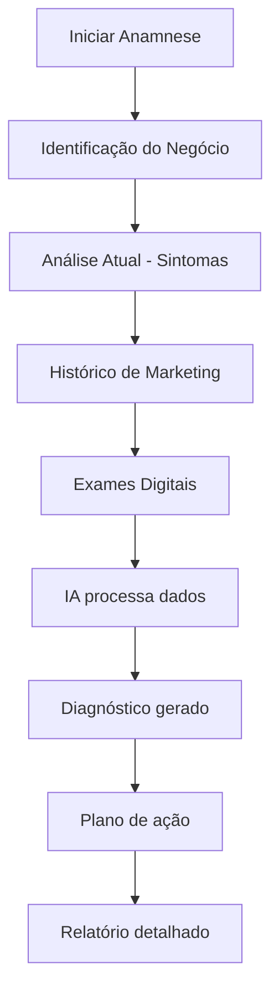

# 🏥 Anamnese Digital Pet - Análise Especializada de Negócios Pet

> **Versão:** 2.0 | **Status:** ✅ Ativo | **Última Atualização:** 24/08/2025  
> **Responsável:** Frontend Developer + UI/UX Designer  
> **Integração:** Feature exclusiva PRD v2.0 para diagnóstico de negócios pet

## 🎯 **Visão Geral**

A **Anamnese Digital Pet** é um sistema inteligente que realiza diagnóstico abrangente de negócios pet, coletando dados específicos do mercado veterinário, pet shop, banho & tosa e demais segmentos para gerar insights acionáveis e recomendar estratégias de marketing personalizadas.

### **Conceito Médico-Veterinário**
Inspirada na anamnese clínica veterinária, a ferramenta faz uma "consulta" completa do negócio, identificando:
- **Sintomas** - Problemas atuais de marketing
- **Histórico** - Performance passada e tendências
- **Exames** - Análise de dados e métricas
- **Diagnóstico** - Identificação de oportunidades
- **Tratamento** - Plano de ação personalizado

## 🏗️ **Arquitetura do Sistema**

### **Fluxo de Anamnese**


### **Módulos de Análise**
1. **🏢 Identificação** - Dados básicos do negócio
2. **📊 Performance Atual** - Métricas e indicadores
3. **📈 Histórico** - Evolução temporal
4. **🔍 Análise Digital** - Presença online
5. **👥 Público** - Análise de audiência
6. **🏆 Competitivo** - Posicionamento no mercado
7. **💰 Financeiro** - ROI e investimento
8. **🎯 Oportunidades** - Potencial de crescimento

## 📋 **Estrutura da Anamnese**

### **🏢 Módulo 1: Identificação do Negócio**

**Objetivo:** Coletar dados básicos e contexto do negócio pet

**Componentes UX:**
- **Business Type Selector** - Veterinária, Pet Shop, Banho & Tosa, Hotel Pet
- **Location Mapper** - Localização e raio de atuação
- **Service Portfolio** - Catálogo de serviços oferecidos
- **Team Analysis** - Tamanho e especialização da equipe

**Interface:**
```typescript
interface BusinessIdentification {
  businessType: 'veterinaria' | 'petshop' | 'banho_tosa' | 'hotel_pet' | 'multiplo';
  subSpecialties?: string[];
  location: {
    address: string;
    city: string;
    state: string;
    coordinates: [number, number];
    serviceRadius: number; // km
  };
  establishment: {
    foundedYear: number;
    size: 'pequeno' | 'medio' | 'grande';
    employees: number;
    facilities: string[];
  };
  services: ServicePortfolio[];
}
```

**Componente React:**
```typescript
const BusinessIdentificationForm: FC<{
  onComplete: (data: BusinessIdentification) => void;
}> = ({ onComplete }) => {
  const [businessType, setBusinessType] = useState<BusinessType>();
  const [location, setLocation] = useState<LocationData>();
  
  return (
    <Card className="anamnese-module">
      <ModuleHeader 
        icon="🏢" 
        title="Identificação do Negócio"
        description="Vamos conhecer seu negócio pet"
      />
      
      <BusinessTypeSelector
        value={businessType}
        onChange={setBusinessType}
        options={businessTypeOptions}
      />
      
      <LocationPicker
        onLocationSelect={setLocation}
        placeholder="Digite o endereço do seu negócio"
      />
      
      <ServicePortfolioBuilder
        businessType={businessType}
        services={services}
        onChange={setServices}
      />
    </Card>
  );
};
```

### **📊 Módulo 2: Performance Atual**

**Objetivo:** Avaliar indicadores atuais de performance do negócio

**Métricas Pet-Específicas:**
- **Veterinária:** Consultas/mês, emergências, cirurgias, exames
- **Pet Shop:** Ticket médio, recorrência, categorias mais vendidas
- **Banho & Tosa:** Agendamentos, no-show, fidelização
- **Hotel Pet:** Taxa de ocupação, sazonalidade, repeat customers

**Componentes UX:**
```typescript
interface PerformanceMetrics {
  revenue: {
    monthly: number;
    quarterly: number;
    yearOverYear: number;
    seasonality: SeasonalityData[];
  };
  customers: {
    total: number;
    active: number;
    newPerMonth: number;
    churnRate: number;
    averageLifetime: number;
  };
  services: {
    mostPopular: ServiceData[];
    highestMargin: ServiceData[];
    seasonal: ServiceData[];
  };
  marketing: {
    currentChannels: MarketingChannel[];
    budget: number;
    roi: number;
    leadSources: LeadSource[];
  };
}
```

**Widget de Métricas:**
```typescript
const PerformanceWidget: FC<{
  metric: keyof PerformanceMetrics;
  value: number;
  comparison: 'good' | 'average' | 'needs_improvement';
  industry_benchmark?: number;
}> = ({ metric, value, comparison, industry_benchmark }) => (
  <div className={`metric-widget metric-widget--${comparison}`}>
    <MetricIcon metric={metric} />
    <MetricValue value={value} />
    {industry_benchmark && (
      <BenchmarkComparison 
        value={value} 
        benchmark={industry_benchmark} 
      />
    )}
    <ImprovementSuggestion metric={metric} />
  </div>
);
```

### **📈 Módulo 3: Histórico de Marketing**

**Objetivo:** Analisar tentativas anteriores e resultados obtidos

**Dados Coletados:**
- **Campanhas anteriores** - O que já foi testado
- **Canais utilizados** - Facebook, Google, Instagram, etc.
- **Investimentos** - Budget histórico e ROI
- **Resultados** - Sucessos e fracassos

**Timeline Interativa:**
```typescript
interface MarketingHistory {
  campaigns: CampaignData[];
  channels: ChannelPerformance[];
  budget: BudgetEvolution[];
  learnings: MarketingLearning[];
}

const MarketingTimeline: FC<{ history: MarketingHistory }> = ({ history }) => (
  <div className="marketing-timeline">
    {history.campaigns.map(campaign => (
      <TimelineEvent key={campaign.id}>
        <CampaignCard campaign={campaign} />
        <ResultsAnalysis results={campaign.results} />
        <LessonsLearned learnings={campaign.learnings} />
      </TimelineEvent>
    ))}
  </div>
);
```

### **🔍 Módulo 4: Análise Digital**

**Objetivo:** Avaliar presença digital atual e oportunidades

**Auditoria Automatizada:**
- **Website:** Análise automática via web scraping
- **Redes Sociais:** Conectores com APIs (Facebook, Instagram, Google)
- **Google Meu Negócio:** Reviews, fotos, informações
- **Concorrência:** Análise comparativa automatizada

**Digital Audit Engine:**
```typescript
interface DigitalAudit {
  website: WebsiteAnalysis;
  socialMedia: SocialMediaAnalysis;
  googleMyBusiness: GMBAnalysis;
  seo: SEOAnalysis;
  competitors: CompetitorAnalysis[];
}

const performDigitalAudit = async (
  businessData: BusinessIdentification
): Promise<DigitalAudit> => {
  const results = await Promise.all([
    auditWebsite(businessData.website),
    auditSocialMedia(businessData.socialAccounts),
    auditGMB(businessData.gmbProfile),
    auditSEO(businessData.website),
    auditCompetitors(businessData.location)
  ]);
  
  return {
    website: results[0],
    socialMedia: results[1],
    googleMyBusiness: results[2],
    seo: results[3],
    competitors: results[4]
  };
};
```

### **👥 Módulo 5: Análise de Público**

**Objetivo:** Mapear audiência atual e potencial

**Pet-Specific Demographics:**
- **Perfil dos Tutores:** Idade, renda, estilo de vida
- **Perfil dos Pets:** Espécies, idades, raças populares
- **Comportamento:** Frequência de visitas, sazonalidade
- **Necessidades:** Preventivo, curativo, estético, emergencial

**Audience Insights:**
```typescript
interface AudienceAnalysis {
  demographics: {
    age: AgeDistribution;
    income: IncomeDistribution;
    location: LocationDistribution;
    lifestyle: LifestyleSegments;
  };
  pets: {
    species: SpeciesDistribution;
    breeds: BreedPopularity[];
    ageGroups: PetAgeDistribution;
    healthNeeds: HealthNeedAnalysis;
  };
  behavior: {
    visitFrequency: FrequencyAnalysis;
    seasonality: SeasonalPatterns;
    servicePreferences: ServicePreferences;
    pricesensitivity: PriceSensitivityAnalysis;
  };
}
```

### **🏆 Módulo 6: Análise Competitiva**

**Objetivo:** Mapear concorrentes e posicionamento no mercado

**Competitive Intelligence:**
- **Concorrentes Diretos:** Mesmo segmento e região
- **Análise de Preços:** Benchmarking de serviços
- **Diferenciação:** Pontos fortes e fracos
- **Oportunidades:** Gaps no mercado

**Competitor Radar:**
```typescript
const CompetitorRadar: FC<{ competitors: Competitor[] }> = ({ competitors }) => (
  <div className="competitor-radar">
    <RadarChart>
      {competitors.map(competitor => (
        <RadarDataSet key={competitor.id}>
          <DataPoint metric="price" value={competitor.pricing} />
          <DataPoint metric="quality" value={competitor.quality} />
          <DataPoint metric="digital" value={competitor.digitalPresence} />
          <DataPoint metric="service" value={competitor.serviceRange} />
        </RadarDataSet>
      ))}
    </RadarChart>
    <CompetitorInsights competitors={competitors} />
  </div>
);
```

### **💰 Módulo 7: Análise Financeira**

**Objetivo:** Avaliar saúde financeira e potencial de investimento

**Financial Health Check:**
- **Revenue Streams:** Análise por serviço/produto
- **Margins:** Rentabilidade por categoria
- **Cash Flow:** Fluxo de caixa e sazonalidade
- **Investment Capacity:** Potencial para marketing

```typescript
interface FinancialAnalysis {
  revenue: {
    total: number;
    byService: ServiceRevenue[];
    growth: GrowthMetrics;
    seasonality: SeasonalityImpact;
  };
  costs: {
    fixed: number;
    variable: number;
    marketing: number;
    percentages: CostBreakdown;
  };
  profitability: {
    gross: number;
    net: number;
    byService: ServiceProfitability[];
  };
  investment: {
    capacity: number;
    recommended: number;
    expectedROI: number;
  };
}
```

### **🎯 Módulo 8: Identificação de Oportunidades**

**Objetivo:** IA processa todos os dados e identifica oportunidades

**AI-Powered Opportunity Discovery:**
- **Gap Analysis:** Serviços em falta
- **Market Opportunities:** Segmentos desatendidos
- **Digital Gaps:** Oportunidades online
- **Competitive Advantages:** Pontos de diferenciação

```typescript
const identifyOpportunities = async (
  anamneseData: AnamneseData
): Promise<OpportunityAnalysis> => {
  const prompt = buildOpportunityPrompt(anamneseData);
  
  const analysis = await openai.chat.completions.create({
    model: "gpt-4o",
    messages: [
      {
        role: "system",
        content: `Você é um consultor especialista em marketing para negócios pet. 
        Analise os dados da anamnese e identifique oportunidades específicas considerando:
        - Características únicas do mercado pet
        - Sazonalidade de serviços veterinários
        - Comportamento de tutores de pets
        - Tendências do mercado pet brasileiro`
      },
      {
        role: "user",
        content: prompt
      }
    ],
    response_format: { type: "json_object" }
  });
  
  return JSON.parse(analysis.choices[0].message.content);
};
```

## 🎨 **Interface da Anamnese**

### **Layout Principal**
```typescript
const AnamneseContainer: FC = () => {
  const [currentModule, setCurrentModule] = useState(1);
  const [anamneseData, setAnamneseData] = useState<AnamneseData>();
  const [isProcessing, setIsProcessing] = useState(false);
  
  return (
    <div className="anamnese-container">
      <AnamneseHeader 
        progress={(currentModule / 8) * 100}
        currentModule={currentModule}
        businessName={anamneseData?.business?.name}
      />
      
      <AnamneseContent>
        <ModuleRenderer
          moduleNumber={currentModule}
          data={anamneseData}
          onDataUpdate={setAnamneseData}
        />
      </AnamneseContent>
      
      <AnamneseNavigation
        currentModule={currentModule}
        onPrevious={() => setCurrentModule(currentModule - 1)}
        onNext={() => setCurrentModule(currentModule + 1)}
        onComplete={() => processAnamnese(anamneseData)}
        isLoading={isProcessing}
      />
    </div>
  );
};
```

### **Componentes de Entrada de Dados**

#### **NumberInput com Benchmarks**
```typescript
const BenchmarkNumberInput: FC<{
  label: string;
  value: number;
  onChange: (value: number) => void;
  benchmark?: number;
  unit?: string;
  industryAverage?: number;
}> = ({ label, value, onChange, benchmark, unit, industryAverage }) => (
  <div className="benchmark-input">
    <Label>{label}</Label>
    <InputGroup>
      <NumberInput 
        value={value} 
        onChange={onChange}
        placeholder={industryAverage ? `Média: ${industryAverage}${unit}` : undefined}
      />
      {unit && <InputAddon>{unit}</InputAddon>}
    </InputGroup>
    {benchmark && (
      <BenchmarkIndicator 
        current={value} 
        benchmark={benchmark}
        status={value >= benchmark ? 'good' : 'needs_improvement'}
      />
    )}
  </div>
);
```

#### **Service Portfolio Builder**
```typescript
const ServicePortfolioBuilder: FC<{
  businessType: BusinessType;
  services: Service[];
  onChange: (services: Service[]) => void;
}> = ({ businessType, services, onChange }) => {
  const availableServices = getServicesForBusinessType(businessType);
  
  return (
    <div className="service-portfolio">
      <ServiceCategories>
        {availableServices.map(category => (
          <CategorySection key={category.name}>
            <CategoryHeader>{category.name}</CategoryHeader>
            {category.services.map(service => (
              <ServiceCheckbox
                key={service.id}
                service={service}
                checked={services.includes(service)}
                onChange={(checked) => 
                  onChange(
                    checked 
                      ? [...services, service]
                      : services.filter(s => s.id !== service.id)
                  )
                }
              />
            ))}
          </CategorySection>
        ))}
      </ServiceCategories>
      
      <CustomServiceAdder 
        onAddService={(service) => onChange([...services, service])}
      />
    </div>
  );
};
```

## 📊 **Relatório de Diagnóstico**

### **Executive Summary**
```typescript
interface DiagnosisReport {
  executiveSummary: {
    overallHealth: 'excellent' | 'good' | 'average' | 'needs_attention';
    keyFindings: string[];
    criticalIssues: string[];
    topOpportunities: string[];
  };
  
  moduleResults: {
    [moduleId: string]: ModuleResult;
  };
  
  recommendations: {
    immediate: Recommendation[];
    shortTerm: Recommendation[];
    longTerm: Recommendation[];
  };
  
  actionPlan: ActionPlan;
  
  nextSteps: NextStep[];
}
```

### **Visualizações de Dados**
```typescript
const DiagnosisCharts: FC<{ report: DiagnosisReport }> = ({ report }) => (
  <div className="diagnosis-charts">
    <HealthScoreRadar scores={report.healthScores} />
    <OpportunityMatrix opportunities={report.opportunities} />
    <CompetitivePositioning position={report.marketPosition} />
    <GrowthProjection projections={report.growthPotential} />
  </div>
);
```

### **Action Plan Generator**
```typescript
const generateActionPlan = (report: DiagnosisReport): ActionPlan => {
  return {
    phase1: {
      title: "Correções Urgentes (30 dias)",
      actions: report.recommendations.immediate.map(rec => ({
        task: rec.task,
        priority: rec.priority,
        estimatedROI: rec.estimatedROI,
        resources: rec.resources
      }))
    },
    phase2: {
      title: "Otimizações (90 dias)",
      actions: report.recommendations.shortTerm
    },
    phase3: {
      title: "Crescimento (6 meses)",
      actions: report.recommendations.longTerm
    }
  };
};
```

## 🤖 **Integração com IA**

### **Processamento Inteligente**
```typescript
const processAnamneseWithAI = async (
  anamneseData: AnamneseData
): Promise<DiagnosisReport> => {
  const systemPrompt = `
    Você é um consultor sênior especializado em marketing para negócios pet no Brasil.
    
    Sua missão é analisar a anamnese completa e gerar um diagnóstico preciso considerando:
    
    1. ESPECIFICIDADES DO MERCADO PET:
    - Sazonalidade de serviços (vacinação, banho no verão, etc.)
    - Comportamento emocional dos tutores
    - Urgência em situações de saúde
    - Fidelização por confiança
    
    2. SEGMENTOS ESPECÍFICOS:
    - Veterinária: Preventivo vs. curativo, emergências
    - Pet Shop: Recorrência, ticket médio, categorias
    - Banho & Tosa: Agendamentos, sazonalidade estética
    
    3. MÉTRICAS RELEVANTES:
    - LTV (Lifetime Value) alto no mercado pet
    - Taxa de retenção por confiança
    - Word-of-mouth forte
    - Sensibilidade a preço vs. qualidade
  `;
  
  const userPrompt = buildAnamnesePrompt(anamneseData);
  
  const response = await openai.chat.completions.create({
    model: "gpt-4o",
    messages: [
      { role: "system", content: systemPrompt },
      { role: "user", content: userPrompt }
    ],
    response_format: { type: "json_object" }
  });
  
  return JSON.parse(response.choices[0].message.content);
};
```

### **Benchmarking Automático**
```typescript
const getBenchmarkData = async (
  businessType: BusinessType,
  location: LocationData
): Promise<BenchmarkData> => {
  // Dados de mercado específicos por segmento e região
  const marketData = await fetchMarketData(businessType, location);
  
  return {
    revenue: {
      averageMonthly: marketData.revenue.average,
      topQuartile: marketData.revenue.p75,
      industry: marketData.revenue.industry
    },
    customers: {
      averageBase: marketData.customers.average,
      retentionRate: marketData.customers.retention,
      acquisitionCost: marketData.customers.cac
    },
    digital: {
      socialFollowers: marketData.social.followers,
      engagementRate: marketData.social.engagement,
      websiteTraffic: marketData.digital.traffic
    }
  };
};
```

## 📱 **Responsividade e UX**

### **Mobile Experience**
```typescript
const MobileAnamneseFlow = () => {
  const [activeModule, setActiveModule] = useState(0);
  const isLargeScreen = useMediaQuery('(min-width: 768px)');
  
  return (
    <div className="anamnese-mobile">
      {!isLargeScreen ? (
        // Mobile: One module at a time
        <ModuleCarousel
          modules={anamneseModules}
          activeModule={activeModule}
          onModuleChange={setActiveModule}
        />
      ) : (
        // Desktop: Side navigation
        <AnamneseGrid>
          <ModuleNavigation />
          <ModuleContent />
        </AnamneseGrid>
      )}
    </div>
  );
};
```

### **Progressive Data Collection**
```typescript
const useProgressiveSave = (anamneseData: AnamneseData) => {
  const debouncedData = useDebounce(anamneseData, 1000);
  
  useEffect(() => {
    if (debouncedData) {
      saveAnamneseDraft(debouncedData);
    }
  }, [debouncedData]);
};
```

## 🔒 **Privacidade e Compliance**

### **LGPD Compliance**
- **Consentimento explícito** para coleta de dados
- **Minimização de dados** - apenas necessários
- **Direito ao esquecimento** - exclusão de dados
- **Portabilidade** - export de dados do usuário

```typescript
interface PrivacyControls {
  dataRetentionPeriod: number; // days
  allowAnalytics: boolean;
  allowBenchmarking: boolean;
  anonymizeData: boolean;
}

const PrivacySettings: FC<{ onUpdate: (settings: PrivacyControls) => void }> = ({
  onUpdate
}) => (
  <Card>
    <CardHeader>Controles de Privacidade</CardHeader>
    <PrivacyToggle 
      label="Permitir uso para benchmarking (dados anonimizados)"
      description="Ajuda a melhorar as análises para outros negócios pet"
    />
    <DataRetentionSlider 
      min={30} 
      max={365}
      label="Período de retenção dos dados"
    />
    <ExportDataButton />
    <DeleteDataButton />
  </Card>
);
```

## 📊 **Métricas da Anamnese**

### **Completion Analytics**
```typescript
interface AnamneseMetrics {
  completionRate: number; // % que completam todos os módulos
  averageCompletionTime: number; // minutos
  dropoffPoints: ModuleDropoff[]; // onde usuários abandonam
  moduleAccuracy: ModuleAccuracy[]; // precisão dos dados por módulo
  satisfactionScore: number; // NPS do relatório gerado
}

const trackAnamneseProgress = (moduleId: string, completionRate: number) => {
  analytics.track('anamnese_module_progress', {
    module: moduleId,
    completion: completionRate,
    timestamp: Date.now(),
    userSegment: getUserSegment()
  });
};
```

### **Quality Metrics**
```typescript
interface DiagnosisQuality {
  accuracyScore: number; // 0-100, baseado em validação posterior
  actionabilityScore: number; // Quão acionáveis são as recomendações
  businessImpact: number; // Impacto real nos resultados do cliente
  implementationRate: number; // % de recomendações implementadas
}
```

## 🚀 **Performance e Otimização**

### **Lazy Loading de Módulos**
```typescript
const modules = {
  1: lazy(() => import('./modules/BusinessIdentification')),
  2: lazy(() => import('./modules/PerformanceAnalysis')),
  3: lazy(() => import('./modules/MarketingHistory')),
  4: lazy(() => import('./modules/DigitalAudit')),
  5: lazy(() => import('./modules/AudienceAnalysis')),
  6: lazy(() => import('./modules/CompetitiveAnalysis')),
  7: lazy(() => import('./modules/FinancialAnalysis')),
  8: lazy(() => import('./modules/OpportunityDiscovery'))
};

const ModuleRenderer: FC<{ moduleNumber: number }> = ({ moduleNumber }) => {
  const Module = modules[moduleNumber];
  
  return (
    <Suspense fallback={<ModuleSkeleton />}>
      <Module />
    </Suspense>
  );
};
```

### **Data Caching**
```typescript
const useAnamneseCache = (businessId: string) => {
  const queryClient = useQueryClient();
  
  return useQuery({
    queryKey: ['anamnese', businessId],
    queryFn: () => fetchAnamneseData(businessId),
    staleTime: 5 * 60 * 1000, // 5 minutes
    cacheTime: 30 * 60 * 1000, // 30 minutes
    refetchOnWindowFocus: false
  });
};
```

## 🔧 **Testing Strategy**

### **Unit Tests**
```typescript
describe('AnamneseModule', () => {
  it('should validate business data correctly', () => {
    const validData = {
      businessType: 'veterinaria',
      location: { city: 'São Paulo', state: 'SP' },
      services: ['consulta', 'vacina', 'cirurgia']
    };
    
    expect(validateBusinessData(validData)).toBe(true);
  });
  
  it('should calculate health score accurately', () => {
    const mockData = createMockAnamneseData();
    const score = calculateHealthScore(mockData);
    
    expect(score).toBeGreaterThanOrEqual(0);
    expect(score).toBeLessThanOrEqual(100);
  });
});
```

### **E2E Tests**
```typescript
describe('Anamnese Flow', () => {
  it('should complete full anamnese journey', () => {
    cy.visit('/anamnese/nova');
    
    // Module 1: Business Info
    cy.get('[data-testid="business-type-veterinaria"]').click();
    cy.get('[data-testid="location-input"]').type('São Paulo, SP');
    cy.get('[data-testid="next-module"]').click();
    
    // Module 2: Performance
    cy.get('[data-testid="monthly-revenue"]').type('50000');
    cy.get('[data-testid="customer-count"]').type('500');
    cy.get('[data-testid="next-module"]').click();
    
    // ... test all modules
    
    cy.get('[data-testid="generate-diagnosis"]').click();
    cy.get('[data-testid="diagnosis-report"]').should('be.visible');
  });
});
```

## 📋 **Status Atual**

- ✅ **Arquitetura definida** - 8 módulos especializados
- ✅ **Interface especificada** - UX pet-friendly com benchmarks
- ✅ **IA Integration** - Processamento inteligente de dados
- ✅ **Compliance mapeado** - LGPD e privacidade
- 🔄 **Em desenvolvimento** - Sprint 2 em andamento
- ⏳ **Próximos passos** - Implementação dos módulos React

---

**Documento criado em:** 24/08/2025  
**Versão:** 2.0  
**Sprint:** 2 - Semana 3  
**Responsáveis:** Frontend Developer + UI/UX Designer