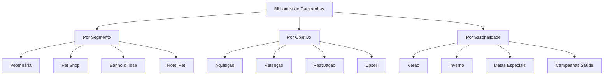

# 📚 Biblioteca de Campanhas Pet - Kits de Marketing Especializados

> **Versão:** 2.0 | **Status:** ✅ Ativo | **Última Atualização:** 24/08/2025  
> **Responsável:** Frontend Developer + UI/UX Designer  
> **Integração:** Feature central PRD v2.0 para campanhas pet pré-configuradas

## 🎯 **Visão Geral**

A **Biblioteca de Campanhas Pet** é uma coleção curada de kits de marketing especializados para diferentes momentos e necessidades do mercado pet. Cada kit contém templates, copy, criativos, automações e jornadas completas prontas para personalização com a Brand Voice do cliente.

### **Conceito de Kits**
Cada campanha é um "kit completo" que inclui:
- **📱 Criativos** - Posts, stories, banners otimizados por segmento
- **✍️ Copy** - Textos personalizáveis com Brand Voice
- **🎯 Segmentação** - Audiences específicas para cada campanha
- **🤖 Automações** - Sequências de e-mail e WhatsApp
- **📊 Métricas** - KPIs específicos e benchmarks do setor
- **⚙️ Configurações** - Setup completo para ads e landing pages

## 🏗️ **Arquitetura da Biblioteca**

### **Taxonomia de Campanhas**


### **Estrutura de Kit de Campanha**
```typescript
interface CampaignKit {
  id: string;
  name: string;
  category: CampaignCategory;
  segment: BusinessSegment[];
  objective: CampaignObjective;
  seasonality: SeasonalityType;
  
  // Conteúdo do Kit
  assets: {
    creatives: Creative[];
    copy: CopyTemplate[];
    landingPages: LandingPageTemplate[];
    emails: EmailTemplate[];
    whatsapp: WhatsAppTemplate[];
  };
  
  // Configurações
  targeting: {
    demographics: TargetingCriteria;
    interests: string[];
    behaviors: string[];
    customAudiences: string[];
  };
  
  // Automações
  automations: {
    emailSequence: EmailSequenceConfig;
    whatsappFlow: WhatsAppFlowConfig;
    retargeting: RetargetingConfig;
  };
  
  // Métricas e Benchmarks
  benchmarks: {
    expectedCTR: number;
    expectedCPC: number;
    expectedConversionRate: number;
    recommendedBudget: BudgetRange;
  };
  
  // Metadados
  metadata: {
    difficulty: 'beginner' | 'intermediate' | 'advanced';
    setupTime: number; // minutes
    launchReadiness: number; // days
    lastUpdated: Date;
    performance: KitPerformanceMetrics;
  };
}
```

## 📋 **Catálogo de Campanhas**

### **🏥 Campanhas Veterinárias**

#### **Kit: Campanha de Vacinação**
```typescript
const vacinationCampaignKit: CampaignKit = {
  id: 'vet-vaccination-2025',
  name: 'Campanha de Vacinação - Proteção Anual',
  category: 'health_prevention',
  segment: ['veterinaria'],
  objective: 'appointment_booking',
  seasonality: 'annual_vaccination_period',
  
  assets: {
    creatives: [
      {
        type: 'facebook_post',
        format: '1080x1080',
        template: 'vaccination_reminder_pet_owner',
        brandElements: ['logo', 'primaryColor', 'petImagery']
      },
      {
        type: 'instagram_story',
        format: '1080x1920', 
        template: 'vaccination_calendar_reminder',
        interactiveElements: ['agendamento_swipe_up']
      }
    ],
    copy: [
      {
        platform: 'facebook',
        template: `🛡️ Proteja quem você mais ama!
        
        A vacinação é o melhor investimento na saúde do seu pet. Nossa equipe especializada está pronta para cuidar de quem faz parte da sua família.
        
        ✅ Vacinas importadas de qualidade
        ✅ Protocolo individual para cada pet  
        ✅ Acompanhamento pós-vacinal
        ✅ Carteira de vacinação digital
        
        📞 Agende já: [PHONE]
        💻 WhatsApp: [WHATSAPP]
        
        #VacinaçãoPet #SaúdePet #[CITY]`,
        brandVoiceAdaptation: true
      }
    ]
  },
  
  targeting: {
    demographics: {
      age: [25, 55],
      gender: 'all',
      income: ['C', 'B', 'A'],
      location: { radius: 15, unit: 'km' }
    },
    interests: [
      'Pet care',
      'Veterinary services', 
      'Pet health',
      'Dog owners',
      'Cat owners'
    ],
    behaviors: [
      'Recent pet adoption',
      'Pet vaccination overdue',
      'Vet clinic visits'
    ]
  },
  
  benchmarks: {
    expectedCTR: 2.8,
    expectedCPC: 1.50,
    expectedConversionRate: 8.5,
    recommendedBudget: { min: 500, max: 2000, optimal: 1200 }
  }
};
```

#### **Kit: Campanha Check-up Preventivo**
```typescript
const checkupCampaignKit: CampaignKit = {
  id: 'vet-preventive-checkup',
  name: 'Check-up Preventivo - Detecte Cedo',
  category: 'health_prevention',
  objective: 'lead_generation',
  
  assets: {
    landingPages: [{
      template: 'checkup_landing_page',
      sections: [
        'hero_section_senior_pet',
        'benefits_early_detection',
        'testimonials_satisfied_owners',
        'pricing_transparent',
        'booking_form_integrated',
        'trust_badges_certifications'
      ],
      conversionElements: [
        'floating_whatsapp_button',
        'exit_intent_discount_popup',
        'social_proof_reviews'
      ]
    }],
    
    emails: [{
      sequence: [
        {
          delay: 0,
          subject: '[PET_NAME] merece o melhor cuidado 🐾',
          template: 'checkup_immediate_followup'
        },
        {
          delay: 3, // days
          subject: 'Prevenção salva vidas - História da [PET_NAME_EXAMPLE]',
          template: 'checkup_educational_nurture'
        },
        {
          delay: 7,
          subject: 'Última chance: Check-up preventivo com desconto',
          template: 'checkup_urgency_offer'
        }
      ]
    }]
  }
};
```

### **🛍️ Campanhas Pet Shop**

#### **Kit: Black Friday Pet**
```typescript
const blackFridayPetKit: CampaignKit = {
  id: 'petshop-black-friday-2025',
  name: 'Black Friday Pet - Super Ofertas',
  category: 'promotional',
  seasonality: 'black_friday',
  
  assets: {
    creatives: [
      {
        type: 'facebook_carousel',
        products: ['racao_premium', 'brinquedos', 'acessorios', 'higiene'],
        template: 'black_friday_product_showcase',
        discountBadges: true,
        urgencyElements: ['countdown_timer', 'stock_indicator']
      }
    ],
    
    automations: {
      emailSequence: {
        prelaunch: [
          { days: -7, template: 'bf_teaser_early_access' },
          { days: -3, template: 'bf_preview_vip_customers' },
          { days: -1, template: 'bf_countdown_starts_tomorrow' }
        ],
        during: [
          { hours: 0, template: 'bf_live_shop_now' },
          { hours: 12, template: 'bf_midday_flash_offers' },
          { hours: 36, template: 'bf_last_chance_urgency' }
        ],
        postlaunch: [
          { days: 1, template: 'bf_thank_you_loyalty_offer' }
        ]
      }
    }
  },
  
  targeting: {
    customAudiences: [
      'petshop_previous_buyers',
      'cart_abandoners_last_30_days',
      'website_visitors_product_pages',
      'email_subscribers_active'
    ],
    lookalike: {
      source: 'highest_ltv_customers',
      similarity: 3 // 3% similarity
    }
  }
};
```

### **🛁 Campanhas Banho & Tosa**

#### **Kit: Verão Pet - Banho & Tosa**
```typescript
const summerGroomingKit: CampaignKit = {
  id: 'grooming-summer-2025',
  name: 'Verão Pet - Frescor e Beleza',
  seasonality: 'summer',
  
  assets: {
    creatives: [
      {
        type: 'instagram_reel',
        template: 'before_after_grooming',
        music: 'upbeat_summer_vibes',
        transitions: ['zoom_transition', 'reveal_transformation'],
        captions: ['Transformação incrível! 😍', 'Seu pet merece se sentir fresquinho! 🌞']
      }
    ],
    
    whatsapp: [{
      template: `☀️ Oi! Seu pet está preparado para o verão?
      
      Nossos banhos refrescantes e tosas especiais vão deixar seu amiguinho lindo e fresquinho para enfrentar o calor!
      
      🚿 Banho com produtos naturais
      ✂️ Tosa higiênica ou estética  
      💅 Corte de unhas incluso
      🌿 Perfume pet natural
      
      Agende já pelo WhatsApp: *[PHONE]*
      
      Endereço: [ADDRESS]
      Horário: [HOURS]`,
      
      flow: [
        { trigger: 'appointment_interest', response: 'availability_check' },
        { trigger: 'price_question', response: 'service_menu_pricing' },
        { trigger: 'location_question', response: 'address_directions' }
      ]
    }]
  }
};
```

### **🏨 Campanhas Hotel Pet**

#### **Kit: Férias Tranquilas**
```typescript
const petHotelVacationKit: CampaignKit = {
  id: 'hotel-vacation-peace-mind',
  name: 'Férias Tranquilas - Seu Pet em Boas Mãos',
  seasonality: 'vacation_seasons',
  
  targeting: {
    demographics: {
      income: ['B', 'A'],
      interests: ['Travel', 'Vacation planning', 'Pet care']
    },
    behaviors: [
      'Frequent travelers',
      'Hotel booking searches',
      'Pet service users'
    ]
  },
  
  assets: {
    landingPages: [{
      template: 'pet_hotel_trust_builder',
      sections: [
        'hero_happy_pets_playing',
        'facility_virtual_tour',
        'staff_credentials_certifications', 
        'daily_routine_transparency',
        'parent_testimonials_videos',
        'real_time_pet_updates',
        'booking_calendar_availability'
      ]
    }]
  }
};
```

## 🎨 **Interface da Biblioteca**

### **Layout Principal**
```typescript
const CampaignLibrary: FC = () => {
  const [selectedFilters, setSelectedFilters] = useState<FilterState>({});
  const [viewMode, setViewMode] = useState<'grid' | 'list'>('grid');
  const [searchTerm, setSearchTerm] = useState('');
  
  return (
    <div className="campaign-library">
      <LibraryHeader>
        <SearchBar 
          value={searchTerm}
          onChange={setSearchTerm}
          placeholder="Buscar campanhas por nome, categoria ou objetivo..."
        />
        <FilterPanel 
          filters={availableFilters}
          selected={selectedFilters}
          onChange={setSelectedFilters}
        />
        <ViewToggle mode={viewMode} onChange={setViewMode} />
      </LibraryHeader>
      
      <CampaignGrid mode={viewMode}>
        {filteredCampaigns.map(campaign => (
          <CampaignCard 
            key={campaign.id}
            campaign={campaign}
            onPreview={() => openPreview(campaign)}
            onCustomize={() => customizeCampaign(campaign)}
          />
        ))}
      </CampaignGrid>
    </div>
  );
};
```

### **Card de Campanha**
```typescript
const CampaignCard: FC<{
  campaign: CampaignKit;
  onPreview: () => void;
  onCustomize: () => void;
}> = ({ campaign, onPreview, onCustomize }) => (
  <Card className="campaign-card">
    <CampaignThumbnail 
      preview={campaign.assets.creatives[0]} 
      segment={campaign.segment}
    />
    
    <CardContent>
      <CampaignTitle>{campaign.name}</CampaignTitle>
      <CampaignMetadata>
        <SegmentBadges segments={campaign.segment} />
        <ObjectiveBadge objective={campaign.objective} />
        <DifficultyBadge level={campaign.metadata.difficulty} />
      </CampaignMetadata>
      
      <CampaignMetrics>
        <MetricItem label="CTR esperado" value={`${campaign.benchmarks.expectedCTR}%`} />
        <MetricItem label="Orçamento sugerido" value={`R$${campaign.benchmarks.recommendedBudget.optimal}`} />
      </CampaignMetrics>
      
      <CardActions>
        <Button variant="outline" onClick={onPreview}>
          Prévia
        </Button>
        <Button variant="primary" onClick={onCustomize}>
          Personalizar
        </Button>
      </CardActions>
    </CardContent>
  </Card>
);
```

### **Filtros Inteligentes**
```typescript
const FilterPanel: FC<{
  filters: FilterOptions;
  selected: FilterState;
  onChange: (filters: FilterState) => void;
}> = ({ filters, selected, onChange }) => (
  <div className="filter-panel">
    <FilterSection title="Segmento do Negócio">
      <CheckboxGroup 
        options={filters.segments}
        selected={selected.segments}
        onChange={(segments) => onChange({ ...selected, segments })}
      />
    </FilterSection>
    
    <FilterSection title="Objetivo da Campanha">
      <RadioGroup
        options={filters.objectives}
        selected={selected.objective}
        onChange={(objective) => onChange({ ...selected, objective })}
      />
    </FilterSection>
    
    <FilterSection title="Sazonalidade">
      <SeasonalityPicker
        selected={selected.seasonality}
        onChange={(seasonality) => onChange({ ...selected, seasonality })}
      />
    </FilterSection>
    
    <FilterSection title="Orçamento">
      <BudgetRangeSlider
        range={selected.budgetRange}
        onChange={(budgetRange) => onChange({ ...selected, budgetRange })}
      />
    </FilterSection>
    
    <FilterSection title="Dificuldade">
      <DifficultySelector
        selected={selected.difficulty}
        onChange={(difficulty) => onChange({ ...selected, difficulty })}
      />
    </FilterSection>
  </div>
);
```

## 🎨 **Preview e Customização**

### **Campaign Preview Modal**
```typescript
const CampaignPreview: FC<{
  campaign: CampaignKit;
  isOpen: boolean;
  onClose: () => void;
}> = ({ campaign, isOpen, onClose }) => (
  <Modal isOpen={isOpen} onClose={onClose} size="large">
    <ModalHeader>
      <CampaignTitle>{campaign.name}</CampaignTitle>
      <CampaignMetadata campaign={campaign} />
    </ModalHeader>
    
    <ModalContent>
      <PreviewTabs>
        <TabPanel label="Criativos">
          <CreativePreview assets={campaign.assets.creatives} />
        </TabPanel>
        
        <TabPanel label="Copy">
          <CopyPreview templates={campaign.assets.copy} />
        </TabPanel>
        
        <TabPanel label="Landing Page">
          <LandingPagePreview template={campaign.assets.landingPages[0]} />
        </TabPanel>
        
        <TabPanel label="Automações">
          <AutomationFlowPreview 
            email={campaign.automations.emailSequence}
            whatsapp={campaign.automations.whatsappFlow}
          />
        </TabPanel>
        
        <TabPanel label="Métricas">
          <BenchmarkPreview benchmarks={campaign.benchmarks} />
        </TabPanel>
      </PreviewTabs>
    </ModalContent>
    
    <ModalFooter>
      <Button variant="outline" onClick={onClose}>Fechar</Button>
      <Button variant="primary" onClick={() => startCustomization(campaign)}>
        Personalizar Campanha
      </Button>
    </ModalFooter>
  </Modal>
);
```

### **Campaign Customization Flow**
```typescript
const CampaignCustomizer: FC<{
  baseCampaign: CampaignKit;
  brandVoice: BrandVoiceJSON;
}> = ({ baseCampaign, brandVoice }) => {
  const [customizedCampaign, setCustomizedCampaign] = useState<CampaignKit>();
  const [currentStep, setCurrentStep] = useState(0);
  
  const customizationSteps = [
    'brand_adaptation',
    'copy_personalization', 
    'creative_customization',
    'targeting_refinement',
    'budget_planning',
    'automation_setup',
    'final_review'
  ];
  
  return (
    <div className="campaign-customizer">
      <CustomizationProgress 
        steps={customizationSteps}
        currentStep={currentStep}
      />
      
      <StepRenderer
        step={customizationSteps[currentStep]}
        campaign={customizedCampaign}
        brandVoice={brandVoice}
        onChange={setCustomizedCampaign}
      />
      
      <StepNavigation
        canPrevious={currentStep > 0}
        canNext={isStepValid(currentStep)}
        onPrevious={() => setCurrentStep(currentStep - 1)}
        onNext={() => setCurrentStep(currentStep + 1)}
      />
    </div>
  );
};
```

## 🤖 **IA para Personalização**

### **Brand Voice Adaptation**
```typescript
const adaptCampaignToBrandVoice = async (
  campaign: CampaignKit,
  brandVoice: BrandVoiceJSON
): Promise<CampaignKit> => {
  const adaptationPrompt = `
    Você é um especialista em marketing pet responsável por adaptar campanhas para a Brand Voice específica.
    
    CAMPANHA ORIGINAL: ${campaign.name}
    COPY ORIGINAL: ${campaign.assets.copy[0].template}
    
    BRAND VOICE:
    - Tom: ${brandVoice.verbal.personality.tone}
    - Atributos: ${brandVoice.verbal.personality.traits.join(', ')}
    - Pilares: ${brandVoice.verbal.content.messagingPillars.join(', ')}
    - Palavras-chave: ${brandVoice.verbal.content.keywords.join(', ')}
    - Evitar: ${brandVoice.verbal.content.avoidTerms.join(', ')}
    
    ADAPTE:
    1. O copy mantendo o objetivo da campanha
    2. Use o tom de voz específico da marca
    3. Integre os pilares de mensagem
    4. Inclua palavras-chave naturalmente
    5. Evite termos proibidos
    6. Mantenha elementos de urgência e CTA
  `;
  
  const response = await openai.chat.completions.create({
    model: "gpt-4o",
    messages: [
      { role: "system", content: "Você é um copywriter especialista em marketing pet..." },
      { role: "user", content: adaptationPrompt }
    ]
  });
  
  return {
    ...campaign,
    assets: {
      ...campaign.assets,
      copy: [
        {
          ...campaign.assets.copy[0],
          template: response.choices[0].message.content,
          brandVoiceAdapted: true
        }
      ]
    }
  };
};
```

### **Performance Prediction**
```typescript
const predictCampaignPerformance = async (
  customizedCampaign: CampaignKit,
  businessContext: BusinessContext
): Promise<PerformancePrediction> => {
  const factors = {
    brandRecognition: businessContext.brandStrength,
    marketCompetition: businessContext.competitionLevel,
    budget: customizedCampaign.plannedBudget,
    targeting: customizedCampaign.targeting,
    seasonality: getCurrentSeasonalityFactor(customizedCampaign.seasonality)
  };
  
  // ML model trained on historical pet marketing data
  const prediction = await mlModel.predict(factors);
  
  return {
    expectedReach: prediction.reach,
    expectedCTR: prediction.ctr,
    expectedConversions: prediction.conversions,
    expectedROI: prediction.roi,
    confidenceScore: prediction.confidence,
    recommendations: generateOptimizationTips(prediction)
  };
};
```

## 📊 **Analytics e Performance**

### **Kit Performance Tracking**
```typescript
interface KitPerformanceMetrics {
  usage: {
    timesCustomized: number;
    averageCustomizationTime: number;
    completionRate: number; // % que finalizam customização
    launchRate: number; // % que efetivamente lançam
  };
  
  performance: {
    averageCTR: number;
    averageConversionRate: number;
    averageROI: number;
    customerSatisfaction: number;
  };
  
  optimization: {
    bestPerformingVariations: KitVariation[];
    commonCustomizations: CustomizationPattern[];
    improvementSuggestions: string[];
  };
}

const trackKitUsage = (kitId: string, event: KitUsageEvent) => {
  analytics.track('campaign_kit_usage', {
    kitId,
    event: event.type,
    customizationData: event.customizations,
    timestamp: Date.now(),
    businessSegment: event.businessContext.segment
  });
};
```

### **A/B Testing de Kits**
```typescript
const KitABTest: FC<{
  originalKit: CampaignKit;
  variations: CampaignKit[];
}> = ({ originalKit, variations }) => {
  const [testResults, setTestResults] = useState<ABTestResults>();
  
  return (
    <div className="kit-ab-test">
      <TestSetup
        control={originalKit}
        variations={variations}
        metrics={['ctr', 'conversion_rate', 'cost_per_acquisition']}
        trafficSplit={[50, 25, 25]} // Control: 50%, Variations: 25% each
      />
      
      <TestResults results={testResults} />
      
      <WinnerDeclaration 
        winner={testResults?.winner}
        onImplement={() => updateKitLibrary(testResults.winner)}
      />
    </div>
  );
};
```

## 🔄 **Gestão de Conteúdo**

### **Kit Lifecycle Management**
```typescript
interface KitLifecycle {
  status: 'draft' | 'active' | 'seasonal' | 'deprecated';
  version: string;
  lastUpdated: Date;
  performanceScore: number;
  updateReasons: UpdateReason[];
}

const KitManagement: FC = () => {
  const [kits, setKits] = useState<CampaignKit[]>([]);
  const [filter, setFilter] = useState<KitFilter>('all');
  
  return (
    <div className="kit-management">
      <KitFilters 
        currentFilter={filter}
        onChange={setFilter}
        stats={getKitStats(kits)}
      />
      
      <KitTable
        kits={filteredKits}
        columns={['name', 'performance', 'usage', 'lastUpdated', 'actions']}
        onEdit={editKit}
        onArchive={archiveKit}
        onDuplicate={duplicateKit}
      />
      
      <BulkActions
        selectedKits={selectedKits}
        actions={['bulk_update', 'performance_boost', 'seasonal_refresh']}
      />
    </div>
  );
};
```

### **Seasonal Updates**
```typescript
const seasonalKitUpdater = async () => {
  const currentSeason = getCurrentSeason();
  const seasonalKits = await getKitsBySeason(currentSeason);
  
  for (const kit of seasonalKits) {
    const updatedKit = await refreshSeasonalContent(kit, currentSeason);
    await updateKit(updatedKit);
    
    // Notificar usuários que usaram este kit
    await notifyKitUsers(kit.id, 'seasonal_update_available');
  }
};

// Cron job para atualização sazonal
// Runs every month
cron.schedule('0 0 1 * *', seasonalKitUpdater);
```

## 🎯 **Segmentação Inteligente**

### **Dynamic Audience Building**
```typescript
const buildAudienceForKit = (
  kit: CampaignKit,
  businessContext: BusinessContext
): AudienceDefinition => {
  const baseAudience = kit.targeting;
  
  // Refine based on business location
  const locationRefinement = {
    ...baseAudience.demographics,
    location: {
      center: businessContext.location,
      radius: calculateOptimalRadius(businessContext.serviceType),
      excludes: businessContext.competitorLocations
    }
  };
  
  // Add lookalike audiences if customer data exists
  const lookalikes = businessContext.customerData 
    ? generateLookalikeAudiences(businessContext.customerData)
    : [];
  
  // Seasonal adjustments
  const seasonalAdjustments = getCurrentSeasonalAdjustments(kit.seasonality);
  
  return {
    primary: { ...locationRefinement, ...seasonalAdjustments },
    lookalikes,
    retargeting: buildRetargetingAudiences(businessContext),
    exclusions: buildExclusionAudiences(businessContext)
  };
};
```

### **Budget Optimization**
```typescript
const optimizeBudgetAllocation = (
  kit: CampaignKit,
  totalBudget: number,
  businessGoals: BusinessGoals
): BudgetAllocation => {
  const allocation = {
    facebook: 0.4, // 40% - maior reach
    instagram: 0.3, // 30% - engagement visual
    google: 0.2, // 20% - intent-based
    remarketing: 0.1 // 10% - conversão
  };
  
  // Adjust based on business type
  if (businessGoals.priority === 'awareness') {
    allocation.facebook += 0.1;
    allocation.instagram += 0.1;
    allocation.google -= 0.2;
  }
  
  // Adjust based on kit performance history
  const kitPerformance = getKitPerformanceHistory(kit.id);
  if (kitPerformance.bestChannel) {
    allocation[kitPerformance.bestChannel] += 0.1;
  }
  
  return Object.entries(allocation).reduce((acc, [channel, percentage]) => {
    acc[channel] = Math.round(totalBudget * percentage);
    return acc;
  }, {} as BudgetAllocation);
};
```

## 🔧 **Development & Testing**

### **Component Testing**
```typescript
describe('CampaignLibrary', () => {
  it('should filter campaigns by segment', () => {
    render(<CampaignLibrary campaigns={mockCampaigns} />);
    
    fireEvent.click(screen.getByText('Veterinária'));
    
    expect(screen.getByText('Campanha de Vacinação')).toBeInTheDocument();
    expect(screen.queryByText('Black Friday Pet')).not.toBeInTheDocument();
  });
  
  it('should open campaign preview modal', () => {
    render(<CampaignLibrary campaigns={mockCampaigns} />);
    
    fireEvent.click(screen.getByText('Prévia'));
    
    expect(screen.getByTestId('campaign-preview-modal')).toBeVisible();
  });
});
```

### **Kit Validation**
```typescript
const validateCampaignKit = (kit: CampaignKit): ValidationResult => {
  const errors: ValidationError[] = [];
  
  // Validate required assets
  if (!kit.assets.creatives.length) {
    errors.push({ field: 'creatives', message: 'Pelo menos um criativo é obrigatório' });
  }
  
  // Validate targeting
  if (!kit.targeting.demographics.age) {
    errors.push({ field: 'targeting', message: 'Faixa etária deve ser definida' });
  }
  
  // Validate benchmarks
  if (kit.benchmarks.expectedCTR < 0.1 || kit.benchmarks.expectedCTR > 15) {
    errors.push({ field: 'benchmarks', message: 'CTR esperado fora do range realista' });
  }
  
  // Validate compliance
  const complianceCheck = validatePetMarketingCompliance(kit);
  errors.push(...complianceCheck.errors);
  
  return {
    isValid: errors.length === 0,
    errors,
    score: calculateKitQualityScore(kit)
  };
};
```

## 📋 **Status Atual**

- ✅ **Taxonomia definida** - Categorias e estrutura de kits
- ✅ **Interface especificada** - UX para browsing e customização  
- ✅ **Kits base documentados** - Templates para cada segmento
- ✅ **IA Integration** - Personalização automática com Brand Voice
- ✅ **Performance tracking** - Analytics e otimização
- 🔄 **Em desenvolvimento** - Sprint 2 em andamento
- ⏳ **Próximos passos** - Criação dos primeiros kits de produção

---

**Documento criado em:** 24/08/2025  
**Versão:** 2.0  
**Sprint:** 2 - Semana 3  
**Responsáveis:** Frontend Developer + UI/UX Designer