# 🩺 Compliance Veterinário - Sistema de Conformidade Regulatória

> **Versão:** 2.0 | **Status:** ✅ Ativo | **Última Atualização:** 24/08/2025  
> **Responsável:** Backend Developer + Security Engineer  
> **Integração:** Sistema crítico PRD v2.0 para conformidade com regulamentações do setor veterinário

## 🎯 **Visão Geral**

O **Sistema de Compliance Veterinário** é uma camada de proteção que garante que todas as campanhas, conteúdos e práticas da agência estejam em conformidade com as regulamentações do Conselho Federal de Medicina Veterinária (CFMV), Código de Defesa do Consumidor e leis específicas do setor pet.

### **Importância do Compliance Veterinário**
- **Proteção Legal:** Evita multas e processos regulatórios
- **Credibilidade Profissional:** Mantém reputação da agência e clientes
- **Segurança dos Animais:** Previne informações médicas incorretas
- **Confiança do Mercado:** Gera credibilidade junto a veterinários e tutores

### **Abrangência Regulatória**

```mermaid
graph TD
    A[Compliance Veterinário] --> B[CFMV - Conselho Federal]
    A --> C[CRMVs - Regionais]
    A --> D[CDC - Defesa do Consumidor]
    A --> E[ANVISA - Medicamentos]
    
    B --> B1[Publicidade Médica]
    B --> B2[Exercício Profissional]
    B --> B3[Telemedicina]
    
    C --> C1[Normas Regionais]
    C --> C2[Fiscalização Local]
    
    D --> D1[Propaganda Enganosa]
    D --> D2[Práticas Abusivas]
    D --> D3[Direitos do Consumidor]
    
    E --> E1[Medicamentos Controlados]
    E --> E2[Suplementos Pet]
    E --> E3[Produtos Veterinários]
```


## 📋 **Framework Regulatório**

### **CFMV - Diretrizes Fundamentais**

#### **Resolução CFMV nº 1.138/2016 - Publicidade Médica Veterinária**
```typescript
interface CFMVComplianceRules {
  // Proibições absolutas
  prohibitedContent: {
    guaranteedResults: string[]; // "cura garantida", "tratamento 100% eficaz"
    sensationalism: string[]; // "milagroso", "revolucionário", "único no mundo"
    beforeAfter: boolean; // Fotos de antes/depois sem contexto
    testimonials: {
      anonymous: boolean; // Proibido depoimentos anônimos
      withoutConsent: boolean; // Proibido sem autorização escrita
      misleading: boolean; // Proibido depoimentos enganosos
    };
    comparisons: {
      competitors: boolean; // Proibido comparar com concorrentes
      techniques: boolean; // Proibido depreciar outras técnicas
    };
  };
  
  // Conteúdo obrigatório
  requiredDisclamers: {
    diagnosticLimitation: string; // "Consulte sempre um médico veterinário"
    emergencyGuidance: string; // "Em emergências, procure atendimento imediato"
    individualResults: string; // "Resultados podem variar conforme o animal"
  };
  
  // Informações técnicas obrigatórias
  professionalInfo: {
    crmvNumber: boolean; // Obrigatório mostrar CRMV
    specialty: boolean; // Especialidade quando aplicável
    clinicLicense: boolean; // Licença da clínica
  };
  
  // Restrições de comunicação
  communicationLimits: {
    diagnosticByPhoto: boolean; // Proibido diagnóstico por foto
    prescriptionWithoutConsult: boolean; // Proibido receitar sem consulta
    teleconsultation: {
      limitations: string[]; // Limitações da teleconsulta
      requirements: string[]; // Requisitos obrigatórios
    };
  };
}
```

#### **Resolução CFMV nº 1.243/2018 - Telemedicina Veterinária**
```typescript
interface TelemedicineCompliance {
  allowedPractices: {
    teleeducation: {
      description: "Educação e orientação preventiva";
      requirements: string[];
      restrictions: string[];
    };
    telehealth: {
      description: "Promoção de saúde e prevenção";
      requirements: string[];
      restrictions: string[];
    };
    teleconsultation: {
      description: "Consulta entre profissionais";
      requirements: string[];
      restrictions: string[];
    };
  };
  
  prohibitedPractices: {
    remoteExamination: boolean; // Exame físico remoto proibido
    remoteDiagnosis: boolean; // Diagnóstico 100% remoto proibido  
    remotePrescription: boolean; // Prescrição sem exame físico
    remoteSurgery: boolean; // Orientação cirúrgica remota
  };
  
  requiredInfrastructure: {
    electronicRecord: boolean; // Prontuário eletrônico obrigatório
    dataEncryption: boolean; // Criptografia de dados
    professionalIdentification: boolean; // Identificação profissional clara
    consentTerms: boolean; // Termos de consentimento
  };
}
```

### **CDC - Código de Defesa do Consumidor**

#### **Publicidade Enganosa (Art. 37)**
```typescript
interface CDCComplianceRules {
  misleadingAdvertising: {
    falseInformation: {
      prohibited: string[]; // Informações comprovadamente falsas
      verification: "scientific_evidence" | "professional_consensus";
    };
    
    omittedInformation: {
      sideEffects: boolean; // Obrigatório mencionar efeitos colaterais
      contraindications: boolean; // Obrigatório mencionar contraindicações
      limitations: boolean; // Limitações do tratamento/produto
      costs: boolean; // Transparência de preços
    };
    
    exaggeratedClaims: {
      superlatives: string[]; // "melhor", "único", "revolucionário"
      guarantees: string[]; // "garantido", "100% eficaz"
      timeFrames: string[]; // "resultados imediatos", "cura rápida"
    };
  };
  
  abusivePractices: {
    emotionalExploitation: {
      petSuffering: boolean; // Proibido explorar sofrimento animal
      ownerGuilt: boolean; // Proibido induzir culpa no tutor
      urgencyPressure: boolean; // Pressão por urgência fabricada
    };
    
    priceManipulation: {
      hiddenCosts: boolean; // Custos ocultos
      abusivePricing: boolean; // Preços abusivos
      deceptiveDiscounts: boolean; // Descontos enganosos
    };
  };
  
  consumerRights: {
    informationAccess: boolean; // Direito à informação clara
    serviceRefusal: boolean; // Direito de recusar serviço
    qualityAssurance: boolean; // Direito à qualidade
    safetyAssurance: boolean; // Direito à segurança
  };
}
```

## 🛡️ **Sistema de Monitoramento**

### **Content Compliance Scanner**
```typescript
class VeterinaryContentScanner {
  private cfmvRules: CFMVComplianceRules;
  private cdcRules: CDCComplianceRules;
  private prohibitedTermsDB: ProhibitedTermsDatabase;
  private medicalTermsDB: MedicalTermsDatabase;
  
  async scanContent(content: ContentToScan): Promise<ComplianceResult> {
    const violations: ComplianceViolation[] = [];
    
    // 1. Scan for prohibited medical claims
    const medicalViolations = await this.scanMedicalClaims(content);
    violations.push(...medicalViolations);
    
    // 2. Scan for misleading advertising
    const advertisingViolations = await this.scanAdvertising(content);
    violations.push(...advertisingViolations);
    
    // 3. Scan for required disclaimers
    const disclaimerViolations = await this.scanDisclaimers(content);
    violations.push(...disclaimerViolations);
    
    // 4. Scan for professional information
    const professionalViolations = await this.scanProfessionalInfo(content);
    violations.push(...professionalViolations);
    
    // 5. Scan for telemedicine compliance
    const telemedicineViolations = await this.scanTelemedicine(content);
    violations.push(...telemedicineViolations);
    
    return {
      compliant: violations.length === 0,
      violations,
      score: this.calculateComplianceScore(violations),
      recommendations: await this.generateRecommendations(violations),
      requiredActions: this.determineRequiredActions(violations)
    };
  }
  
  private async scanMedicalClaims(content: ContentToScan): Promise<ComplianceViolation[]> {
    const violations: ComplianceViolation[] = [];
    const text = this.extractText(content);
    
    // Prohibited medical guarantees
    const guaranteeTerms = [
      'cura garantida', 'tratamento 100% eficaz', 'resultados garantidos',
      'nunca falha', 'sempre funciona', 'sem efeitos colaterais'
    ];
    
    for (const term of guaranteeTerms) {
      if (this.containsTerm(text, term)) {
        violations.push({
          type: 'prohibited_medical_guarantee',
          severity: 'critical',
          regulation: 'CFMV-1138/2016',
          description: `Prohibited guarantee term detected: "${term}"`,
          location: this.findTermLocation(text, term),
          requiredAction: 'remove_term',
          suggestion: 'Replace with: "Consulte um veterinário para avaliação individual"'
        });
      }
    }
    
    // Sensationalist terms
    const sensationalistTerms = [
      'milagroso', 'revolucionário', 'único no mundo', 'descoberta incrível',
      'solução definitiva', 'fim do sofrimento'
    ];
    
    for (const term of sensationalistTerms) {
      if (this.containsTerm(text, term)) {
        violations.push({
          type: 'sensationalist_language',
          severity: 'high',
          regulation: 'CFMV-1138/2016',
          description: `Sensationalist term detected: "${term}"`,
          location: this.findTermLocation(text, term),
          requiredAction: 'replace_term',
          suggestion: 'Use neutral, professional language'
        });
      }
    }
    
    // Medical procedures without proper disclaimers
    const medicalProcedures = await this.detectMedicalProcedures(text);
    if (medicalProcedures.length > 0) {
      const hasDisclaimer = this.hasVeterinaryDisclaimer(text);
      if (!hasDisclaimer) {
        violations.push({
          type: 'medical_content_without_disclaimer',
          severity: 'high',
          regulation: 'CFMV-1138/2016',
          description: 'Medical content detected without proper veterinary disclaimer',
          procedures: medicalProcedures,
          requiredAction: 'add_disclaimer',
          suggestion: 'Add: "Este conteúdo não substitui consulta veterinária. Consulte sempre um profissional qualificado."'
        });
      }
    }
    
    return violations;
  }
  
  private async scanTelemedicine(content: ContentToScan): Promise<ComplianceViolation[]> {
    const violations: ComplianceViolation[] = [];
    const text = this.extractText(content);
    
    // Prohibited remote practices
    const prohibitedPractices = [
      'diagnóstico por foto', 'diagnóstico online', 'diagnóstico remoto',
      'consulta por WhatsApp', 'receita sem consulta', 'exame por vídeo',
      'diagnóstico por videoconferência'
    ];
    
    for (const practice of prohibitedPractices) {
      if (this.containsTerm(text, practice)) {
        violations.push({
          type: 'prohibited_telemedicine_practice',
          severity: 'critical',
          regulation: 'CFMV-1243/2018',
          description: `Prohibited telemedicine practice: "${practice}"`,
          location: this.findTermLocation(text, practice),
          requiredAction: 'remove_or_modify',
          suggestion: 'Telemedicine is limited to education and professional consultation only'
        });
      }
    }
    
    // Check for telemedicine services offered
    const telemedicineIndicators = [
      'consulta online', 'atendimento remoto', 'veterinário online',
      'consulta por vídeo', 'telemedicina'
    ];
    
    let hasTelemedicineContent = false;
    for (const indicator of telemedicineIndicators) {
      if (this.containsTerm(text, indicator)) {
        hasTelemedicineContent = true;
        break;
      }
    }
    
    if (hasTelemedicineContent) {
      // Check for required compliance elements
      const complianceChecks = [
        {
          element: 'limitations_disclaimer',
          required: 'Limitações da telemedicina veterinária devem ser claras',
          check: () => this.hasTelemedicineLimitations(text)
        },
        {
          element: 'professional_identification',
          required: 'Identificação profissional completa (nome, CRMV)',
          check: () => this.hasProfessionalIdentification(text)
        },
        {
          element: 'emergency_guidance',
          required: 'Orientação para emergências presenciais',
          check: () => this.hasEmergencyGuidance(text)
        }
      ];
      
      for (const check of complianceChecks) {
        if (!check.check()) {
          violations.push({
            type: 'missing_telemedicine_requirement',
            severity: 'high',
            regulation: 'CFMV-1243/2018',
            description: `Missing required element: ${check.element}`,
            requiredAction: 'add_element',
            suggestion: check.required
          });
        }
      }
    }
    
    return violations;
  }
}
```

### **Landing Page Compliance Validator**
```typescript
class LandingPageComplianceValidator {
  async validateLandingPage(url: string): Promise<LandingPageComplianceResult> {
    const pageContent = await this.fetchPageContent(url);
    const violations: ComplianceViolation[] = [];
    
    // 1. Professional identification validation
    const professionalViolations = await this.validateProfessionalInfo(pageContent);
    violations.push(...professionalViolations);
    
    // 2. Required disclaimers validation
    const disclaimerViolations = await this.validateDisclaimers(pageContent);
    violations.push(...disclaimerViolations);
    
    // 3. Form compliance validation
    const formViolations = await this.validateForms(pageContent);
    violations.push(...formViolations);
    
    // 4. Service description compliance
    const serviceViolations = await this.validateServiceDescriptions(pageContent);
    violations.push(...serviceViolations);
    
    // 5. Privacy policy compliance
    const privacyViolations = await this.validatePrivacyCompliance(pageContent);
    violations.push(...privacyViolations);
    
    return {
      url,
      compliant: violations.length === 0,
      violations,
      score: this.calculatePageComplianceScore(violations),
      recommendations: await this.generatePageRecommendations(violations),
      requiredChanges: this.determineRequiredPageChanges(violations)
    };
  }
  
  private async validateProfessionalInfo(pageContent: PageContent): Promise<ComplianceViolation[]> {
    const violations: ComplianceViolation[] = [];
    
    // Check for CRMV number
    const crmvPattern = /CRMV[\s-]*[A-Z]{2}[\s-]*\d{4,6}/gi;
    const hasCRMV = crmvPattern.test(pageContent.text);
    
    if (!hasCRMV && this.isVeterinaryService(pageContent)) {
      violations.push({
        type: 'missing_crmv_number',
        severity: 'critical',
        regulation: 'CFMV-1138/2016',
        description: 'CRMV number not found on veterinary service page',
        location: 'professional_info_section',
        requiredAction: 'add_crmv',
        suggestion: 'Include veterinarian CRMV number in professional information section'
      });
    }
    
    // Check for complete professional identification
    const professionalElements = [
      'veterinarian_name',
      'crmv_number', 
      'specialties',
      'clinic_license'
    ];
    
    for (const element of professionalElements) {
      if (!this.hasElement(pageContent, element)) {
        violations.push({
          type: 'incomplete_professional_info',
          severity: 'medium',
          regulation: 'CFMV-1138/2016',
          description: `Missing professional element: ${element}`,
          requiredAction: 'add_element',
          suggestion: `Add ${element} to professional information`
        });
      }
    }
    
    return violations;
  }
  
  private async validateServiceDescriptions(pageContent: PageContent): Promise<ComplianceViolation[]> {
    const violations: ComplianceViolation[] = [];
    const services = await this.extractServices(pageContent);
    
    for (const service of services) {
      // Check for prohibited guarantees in service descriptions
      const guaranteeViolations = await this.checkServiceGuarantees(service);
      violations.push(...guaranteeViolations);
      
      // Check for proper limitation disclaimers
      const limitationViolations = await this.checkServiceLimitations(service);
      violations.push(...limitationViolations);
      
      // Check for appropriate pricing transparency
      const pricingViolations = await this.checkServicePricing(service);
      violations.push(...pricingViolations);
    }
    
    return violations;
  }
  
  private async validateForms(pageContent: PageContent): Promise<ComplianceViolation[]> {
    const violations: ComplianceViolation[] = [];
    const forms = await this.extractForms(pageContent);
    
    for (const form of forms) {
      // Check for consent checkboxes
      if (!this.hasConsentCheckbox(form)) {
        violations.push({
          type: 'missing_consent_checkbox',
          severity: 'high',
          regulation: 'LGPD + CFMV',
          description: 'Form lacks explicit consent checkbox',
          formId: form.id,
          requiredAction: 'add_consent',
          suggestion: 'Add checkbox: "Concordo com o tratamento dos meus dados conforme Política de Privacidade"'
        });
      }
      
      // Check for emergency disclaimers in consultation forms
      if (this.isConsultationForm(form) && !this.hasEmergencyDisclaimer(form)) {
        violations.push({
          type: 'missing_emergency_disclaimer',
          severity: 'critical',
          regulation: 'CFMV-1138/2016',
          description: 'Consultation form lacks emergency disclaimer',
          formId: form.id,
          requiredAction: 'add_disclaimer',
          suggestion: 'Add: "Em caso de emergência, procure atendimento veterinário imediato"'
        });
      }
      
      // Check for telemedicine limitations in online consultation forms
      if (this.isOnlineConsultationForm(form)) {
        if (!this.hasTelemedicineLimitations(form)) {
          violations.push({
            type: 'missing_telemedicine_limitations',
            severity: 'critical',
            regulation: 'CFMV-1243/2018',
            description: 'Online consultation form lacks telemedicine limitations',
            formId: form.id,
            requiredAction: 'add_limitations',
            suggestion: 'Clearly state telemedicine limitations and requirements for physical examination'
          });
        }
      }
    }
    
    return violations;
  }
}
```

## 🔍 **Sistema de Aprovação de Conteúdo**

### **Content Approval Workflow**
```typescript
class VeterinaryContentApprovalWorkflow {
  private stages: ApprovalStage[] = [
    'automated_scan',
    'veterinary_review',
    'legal_review',
    'final_approval'
  ];
  
  async submitForApproval(content: ContentSubmission): Promise<ApprovalProcess> {
    const process = await this.createApprovalProcess(content);
    
    // Stage 1: Automated Compliance Scan
    const automatedResult = await this.runAutomatedScan(content);
    await this.updateProcessStage(process.id, 'automated_scan', automatedResult);
    
    if (automatedResult.criticalViolations > 0) {
      // Reject immediately if critical violations
      await this.rejectContent(process.id, automatedResult.violations);
      return process;
    }
    
    // Stage 2: Veterinary Review (if medical content detected)
    if (automatedResult.hasMedicalContent) {
      await this.assignVeterinaryReviewer(process.id, content);
      await this.updateProcessStage(process.id, 'veterinary_review', { status: 'pending' });
      
      // Wait for veterinary approval
      return process; // Continues asynchronously
    }
    
    // Stage 3: Legal Review (if compliance concerns)
    if (automatedResult.complianceConcerns > 0) {
      await this.assignLegalReviewer(process.id, content);
      await this.updateProcessStage(process.id, 'legal_review', { status: 'pending' });
      
      return process;
    }
    
    // Stage 4: Auto-approve if no issues
    await this.approveContent(process.id);
    
    return process;
  }
  
  async veterinaryReview(processId: string, reviewData: VeterinaryReviewData): Promise<ReviewResult> {
    const process = await this.getApprovalProcess(processId);
    
    const reviewResult: ReviewResult = {
      approved: reviewData.approved,
      reviewer: reviewData.reviewer,
      reviewDate: new Date(),
      comments: reviewData.comments,
      requiredChanges: reviewData.requiredChanges || [],
      medicalAccuracy: reviewData.medicalAccuracy,
      ethicalCompliance: reviewData.ethicalCompliance
    };
    
    if (reviewData.approved) {
      // Move to next stage or final approval
      if (process.requiresLegalReview) {
        await this.assignLegalReviewer(processId, process.content);
        await this.updateProcessStage(processId, 'legal_review', { status: 'pending' });
      } else {
        await this.approveContent(processId);
      }
    } else {
      // Request changes
      await this.requestChanges(processId, reviewResult);
    }
    
    await this.updateProcessStage(processId, 'veterinary_review', reviewResult);
    
    return reviewResult;
  }
  
  private async assignVeterinaryReviewer(
    processId: string, 
    content: ContentSubmission
  ): Promise<VeterinaryReviewer> {
    // Determine required specialty based on content
    const specialty = await this.determineRequiredSpecialty(content);
    
    // Find available reviewer with required specialty
    const reviewer = await this.findAvailableVeterinaryReviewer({
      specialty,
      urgency: content.urgency,
      language: content.language
    });
    
    if (!reviewer) {
      // Escalate to external reviewer if needed
      reviewer = await this.requestExternalReviewer({
        specialty,
        deadline: content.deadline,
        budget: content.reviewBudget
      });
    }
    
    await this.assignReviewer(processId, reviewer);
    await this.notifyReviewer(reviewer, processId, content);
    
    return reviewer;
  }
  
  private async determineRequiredSpecialty(content: ContentSubmission): Promise<VeterinarySpecialty> {
    const contentAnalysis = await this.analyzeContentSpecialty(content);
    
    // Map content topics to required specialties
    const specialtyMapping: Record<string, VeterinarySpecialty> = {
      'cardiology': 'veterinary_cardiology',
      'dermatology': 'veterinary_dermatology', 
      'oncology': 'veterinary_oncology',
      'surgery': 'veterinary_surgery',
      'nutrition': 'veterinary_nutrition',
      'behavior': 'animal_behavior',
      'emergency': 'emergency_veterinary',
      'general': 'general_practice'
    };
    
    return specialtyMapping[contentAnalysis.primaryTopic] || 'general_practice';
  }
}
```

### **Veterinary Review Interface**
```typescript
interface VeterinaryReviewInterface {
  // Content being reviewed
  content: {
    type: 'ad_creative' | 'landing_page' | 'email' | 'social_post';
    text: string;
    images: string[];
    videos?: string[];
    targetAudience: string;
    purpose: string;
  };
  
  // Review categories
  reviewCategories: {
    medicalAccuracy: {
      score: number; // 1-10
      issues: MedicalAccuracyIssue[];
      recommendations: string[];
    };
    
    ethicalCompliance: {
      score: number; // 1-10
      concerns: EthicalConcern[];
      recommendations: string[];
    };
    
    professionalStandards: {
      score: number; // 1-10
      violations: StandardViolation[];
      recommendations: string[];
    };
    
    publicSafety: {
      score: number; // 1-10
      risks: SafetyRisk[];
      recommendations: string[];
    };
  };
  
  // Overall assessment
  overallAssessment: {
    approved: boolean;
    conditionalApproval: boolean;
    requiredChanges: RequiredChange[];
    blockerIssues: BlockerIssue[];
    timeline: ReviewTimeline;
  };
}
```

## 📊 **Compliance Dashboard**

### **Compliance Metrics API**
```typescript
class ComplianceDashboardAPI {
  async getComplianceOverview(): Promise<ComplianceOverview> {
    const period = '30d'; // Last 30 days
    
    return {
      overallComplianceScore: await this.calculateOverallScore(period),
      
      complianceByCategory: {
        cfmv: await this.getCFMVCompliance(period),
        cdc: await this.getCDCCompliance(period),
        telemedicine: await this.getTelemedicineCompliance(period),
        privacy: await this.getPrivacyCompliance(period)
      },
      
      contentReviewStats: {
        totalReviewed: await this.getTotalReviewed(period),
        approved: await this.getApproved(period),
        rejected: await this.getRejected(period),
        pending: await this.getPending(),
        avgReviewTime: await this.getAvgReviewTime(period)
      },
      
      topViolations: await this.getTopViolations(period),
      
      improvementTrends: await this.getImprovementTrends(period),
      
      upcomingDeadlines: await this.getUpcomingDeadlines(),
      
      riskAssessment: await this.calculateRiskAssessment()
    };
  }
  
  async getCampaignCompliance(campaignId: string): Promise<CampaignComplianceDetail> {
    const campaign = await this.getCampaign(campaignId);
    
    return {
      campaign: {
        id: campaign.id,
        name: campaign.name,
        type: campaign.type,
        status: campaign.status
      },
      
      complianceScore: await this.calculateCampaignScore(campaignId),
      
      activeViolations: await this.getActiveViolations(campaignId),
      
      resolvedViolations: await this.getResolvedViolations(campaignId),
      
      complianceHistory: await this.getComplianceHistory(campaignId),
      
      requiredActions: await this.getRequiredActions(campaignId),
      
      riskLevel: await this.calculateRiskLevel(campaignId),
      
      recommendations: await this.generateRecommendations(campaignId)
    };
  }
  
  private async calculateOverallScore(period: string): Promise<ComplianceScore> {
    const campaigns = await this.getActiveCampaigns();
    const scores: number[] = [];
    
    for (const campaign of campaigns) {
      const violations = await this.getCampaignViolations(campaign.id, period);
      const score = this.calculateCampaignComplianceScore(violations);
      scores.push(score);
    }
    
    const average = scores.length > 0 
      ? scores.reduce((a, b) => a + b, 0) / scores.length 
      : 100;
    
    return {
      score: Math.round(average),
      grade: this.getComplianceGrade(average),
      trend: await this.calculateTrend(period),
      benchmarks: {
        industry: await this.getIndustryBenchmark(),
        previous: await this.getPreviousPeriodScore(period)
      }
    };
  }
  
  private getComplianceGrade(score: number): ComplianceGrade {
    if (score >= 95) return 'A+';
    if (score >= 90) return 'A';
    if (score >= 85) return 'B+';
    if (score >= 80) return 'B';
    if (score >= 75) return 'C+';
    if (score >= 70) return 'C';
    if (score >= 60) return 'D';
    return 'F';
  }
}
```

### **Risk Assessment Engine**
```typescript
class ComplianceRiskAssessment {
  async assessCampaignRisk(campaignId: string): Promise<RiskAssessment> {
    const campaign = await this.getCampaign(campaignId);
    const violations = await this.getCampaignViolations(campaignId);
    
    const riskFactors = await this.calculateRiskFactors({
      campaign,
      violations,
      industry: await this.getIndustryRiskFactors(),
      regulatory: await this.getRegulatoryRiskFactors()
    });
    
    return {
      overallRisk: this.calculateOverallRisk(riskFactors),
      
      riskCategories: {
        regulatory: riskFactors.regulatory,
        legal: riskFactors.legal,
        reputational: riskFactors.reputational,
        financial: riskFactors.financial
      },
      
      immediateThreats: await this.identifyImmediateThreats(campaign, violations),
      
      mitigation: await this.generateMitigationPlan(riskFactors),
      
      timeline: await this.createTimelineAssessment(riskFactors),
      
      recommendations: await this.generateRiskRecommendations(riskFactors)
    };
  }
  
  private async calculateRiskFactors(params: RiskCalculationParams): Promise<RiskFactors> {
    return {
      regulatory: {
        cfmvViolations: this.countViolationsBySeverity(params.violations, 'cfmv'),
        cdcViolations: this.countViolationsBySeverity(params.violations, 'cdc'),
        telemedicineIssues: this.countTelemedicineIssues(params.violations),
        professionalLicensing: await this.checkProfessionalLicensing(params.campaign)
      },
      
      legal: {
        lawsuitRisk: await this.assessLawsuitRisk(params.campaign, params.violations),
        fineRisk: await this.assessFineRisk(params.violations),
        injunctionRisk: await this.assessInjunctionRisk(params.violations)
      },
      
      reputational: {
        publicExposure: await this.assessPublicExposure(params.campaign),
        professionalStanding: await this.assessProfessionalStanding(params.campaign),
        clientTrust: await this.assessClientTrust(params.violations)
      },
      
      financial: {
        potentialFines: await this.calculatePotentialFines(params.violations),
        legalCosts: await this.estimateLegalCosts(params.violations),
        businessImpact: await this.assessBusinessImpact(params.campaign, params.violations)
      }
    };
  }
  
  private async generateMitigationPlan(riskFactors: RiskFactors): Promise<MitigationPlan> {
    const actions: MitigationAction[] = [];
    
    // Immediate actions for high-risk items
    if (riskFactors.regulatory.cfmvViolations.critical > 0) {
      actions.push({
        priority: 'critical',
        action: 'immediate_campaign_pause',
        description: 'Pause campaigns with CFMV violations',
        timeline: '0-1 hours',
        responsible: 'compliance_team'
      });
    }
    
    // Short-term actions
    if (riskFactors.legal.lawsuitRisk > 0.7) { // 70% risk
      actions.push({
        priority: 'high',
        action: 'legal_consultation',
        description: 'Consult with veterinary law specialist',
        timeline: '24-48 hours',
        responsible: 'legal_team'
      });
    }
    
    // Medium-term improvements
    if (riskFactors.reputational.professionalStanding < 0.8) {
      actions.push({
        priority: 'medium',
        action: 'compliance_training',
        description: 'Implement compliance training program',
        timeline: '1-2 weeks',
        responsible: 'hr_team'
      });
    }
    
    return {
      actions,
      timeline: this.createMitigationTimeline(actions),
      budget: this.estimateMitigationBudget(actions),
      success_metrics: this.defineMitigationMetrics(riskFactors)
    };
  }
}
```

## 🔧 **Ferramentas de Compliance**

### **Compliance Toolkit**
```typescript
interface ComplianceToolkit {
  // Content creation tools
  contentCreation: {
    disclaimerGenerator: DisclaimerGeneratorTool;
    professionalInfoTemplate: ProfessionalInfoTemplate;
    serviceDescriptionValidator: ServiceDescriptionValidator;
    emergencyGuidanceGenerator: EmergencyGuidanceGenerator;
  };
  
  // Review tools
  reviewTools: {
    automatedScanner: AutomatedComplianceScanner;
    veterinaryReviewInterface: VeterinaryReviewInterface;
    legalReviewInterface: LegalReviewInterface;
    clientApprovalInterface: ClientApprovalInterface;
  };
  
  // Monitoring tools
  monitoring: {
    realTimeMonitor: RealTimeComplianceMonitor;
    periodicAuditor: PeriodicComplianceAuditor;
    regulatoryUpdates: RegulatoryUpdatesTracker;
    industryBenchmarks: IndustryBenchmarkTracker;
  };
  
  // Reporting tools
  reporting: {
    complianceDashboard: ComplianceDashboard;
    violationReporter: ViolationReporter;
    riskAssessmentReporter: RiskAssessmentReporter;
    improvementTracker: ImprovementTracker;
  };
}
```

### **Disclaimer Generator**
```typescript
class DisclaimerGenerator {
  generateVeterinaryDisclaimer(context: DisclaimerContext): string {
    const base = "Este conteúdo possui finalidade educativa e não substitui a consulta veterinária. ";
    const consultation = "Consulte sempre um médico veterinário para diagnóstico e tratamento adequados. ";
    const emergency = "Em casos de emergência, procure atendimento veterinário imediato.";
    
    let disclaimer = base + consultation + emergency;
    
    // Add specific disclaimers based on content type
    if (context.hasMedicalContent) {
      disclaimer += " As informações médicas apresentadas são gerais e podem não se aplicar ao seu animal.";
    }
    
    if (context.hasProductRecommendation) {
      disclaimer += " Consulte um veterinário antes de administrar qualquer produto ou medicamento.";
    }
    
    if (context.hasTreatmentInfo) {
      disclaimer += " O tratamento deve ser sempre supervisionado por profissional qualificado.";
    }
    
    if (context.hasNutritionAdvice) {
      disclaimer += " Orientações nutricionais devem ser individualizadas conforme as necessidades do animal.";
    }
    
    return disclaimer;
  }
  
  generateTelemedicineDisclaimer(): string {
    return `
      LIMITAÇÕES DA TELEMEDICINA VETERINÁRIA:
      
      • Este serviço não substitui o exame físico presencial
      • Diagnósticos definitivos requerem avaliação presencial
      • Emergências devem ser tratadas presencialmente
      • Alguns procedimentos não podem ser realizados remotamente
      • O veterinário pode solicitar consulta presencial quando necessário
      
      Em caso de emergência, procure imediatamente atendimento veterinário presencial.
    `;
  }
  
  generateCDCDisclaimer(contentType: 'product' | 'service' | 'treatment'): string {
    const baseRights = "Você tem direito à informação clara sobre preços, riscos e benefícios. ";
    const qualityRights = "Você tem direito a serviços de qualidade e segurança. ";
    const refusalRights = "Você pode recusar qualquer serviço ou produto oferecido.";
    
    let disclaimer = baseRights + qualityRights + refusalRights;
    
    switch (contentType) {
      case 'product':
        disclaimer += " Produtos veterinários devem ser usados conforme orientação profissional.";
        break;
      case 'service':
        disclaimer += " Serviços veterinários serão prestados conforme padrões técnicos estabelecidos.";
        break;
      case 'treatment':
        disclaimer += " Tratamentos têm riscos e benefícios que serão explicados pelo veterinário.";
        break;
    }
    
    return disclaimer;
  }
}
```

## 📋 **Status Atual**

- ✅ **Framework regulatório** - CFMV, CDC, ANVISA, LGPD definidos
- ✅ **Sistema de monitoramento** - Scanner automático de compliance
- ✅ **Workflow de aprovação** - Processo estruturado multi-stage
- ✅ **Dashboard de compliance** - Métricas e monitoring em tempo real
- ✅ **Avaliação de risco** - Engine de assessment de compliance
- ✅ **Ferramentas de apoio** - Toolkit completo para conformidade
- 🔄 **Em desenvolvimento** - Sprint 2 Semana 4 em andamento
- ⏳ **Próximos passos** - IA Integration Patterns

---

**Documento criado em:** 24/08/2025  
**Versão:** 2.0  
**Sprint:** 2 - Semana 4  
**Responsáveis:** Backend Developer + Security Engineer