# 🤖 IA Integration Patterns - Arquiteturas de Integração com Inteligência Artificial

> **Versão:** 2.0 | **Status:** ✅ Ativo | **Última Atualização:** 24/08/2025  
> **Responsável:** Backend Developer + Security Engineer  
> **Integração:** Padrões arquiteturais PRD v2.0 para implementação do modelo 80/20 de automação

## 🎯 **Visão Geral**

O documento **IA Integration Patterns** define as arquiteturas, padrões e estratégias para integração de Inteligência Artificial em todos os componentes da agência, garantindo escalabilidade, manutenibilidade e performance do modelo 80% automatizado / 20% supervisão humana.

### **Filosofia de Integração IA**
- **IA-First Architecture:** Todos os componentes são projetados para IA como cidadão de primeira classe
- **Human-in-the-Loop:** Supervisão humana estratégica nos 20% críticos
- **Fail-Safe Design:** Fallbacks automáticos quando IA falha
- **Continuous Learning:** Sistemas que aprendem e melhoram com uso

### **Modelo de Maturidade IA**

```mermaid
graph LR
    A[Nível 1: Rule-Based] --> B[Nível 2: ML Assistido]
    B --> C[Nível 3: IA Autônoma]
    C --> D[Nível 4: IA Adaptativa]
    D --> E[Nível 5: AGI Integration]
    
    A --> A1[Regras fixas]
    B --> B1[ML + Humano]
    C --> C1[IA independente]
    D --> D1[Auto-evolução]
    E --> E1[Cognição geral]
```


## 🏗️ **Arquitetura de Integração Principal**

### **AI-Driven Architecture (ADA)**
```typescript
interface AIIntegrationArchitecture {
  // Core AI Services
  coreServices: {
    orchestrator: AIOrchestrationService;
    modelRegistry: AIModelRegistry;
    contextManager: AIContextManager;
    learningEngine: ContinuousLearningEngine;
  };
  
  // Integration Layers
  integrationLayers: {
    apiGateway: AIAPIGateway;
    eventBus: AIEventBus;
    dataStream: AIDataStream;
    feedback: AIFeedbackLoop;
  };
  
  // AI Capabilities
  capabilities: {
    contentGeneration: ContentGenerationAI;
    decisionMaking: DecisionMakingAI;
    personalization: PersonalizationAI;
    analytics: AnalyticsAI;
    automation: AutomationAI;
  };
  
  // Human Integration Points
  humanIntegration: {
    approvalWorkflows: HumanApprovalWorkflows;
    escalationRules: EscalationRules;
    qualityAssurance: HumanQualityAssurance;
    strategicGuidance: StrategyGuidance;
  };
  
  // Infrastructure
  infrastructure: {
    vectorDatabase: VectorDatabase;
    modelServing: ModelServingPlatform;
    monitoring: AIMonitoring;
    security: AISecurity;
  };
}
```

### **AI Orchestration Service**
```typescript
class AIOrchestrationService {
  private modelRegistry: AIModelRegistry;
  private contextManager: AIContextManager;
  private loadBalancer: AILoadBalancer;
  private fallbackHandler: FallbackHandler;
  
  async executeAITask<T>(request: AITaskRequest): Promise<AITaskResult<T>> {
    const context = await this.contextManager.buildContext(request);
    const model = await this.selectOptimalModel(request, context);
    
    try {
      // Primary AI execution
      const result = await this.executeWithModel(model, request, context);
      
      // Quality validation
      const validation = await this.validateResult(result, request);
      
      if (validation.confidence < request.minimumConfidence) {
        // Trigger human review for low confidence results
        return await this.escalateToHuman(request, result, validation);
      }
      
      // Learning feedback
      await this.feedbackLoop(request, result, validation);
      
      return result;
      
    } catch (error) {
      // Fallback to alternative models or human intervention
      return await this.handleFailure(request, error, context);
    }
  }
  
  private async selectOptimalModel(
    request: AITaskRequest,
    context: AIContext
  ): Promise<AIModel> {
    const candidates = await this.modelRegistry.getCandidates({
      taskType: request.taskType,
      domain: request.domain,
      complexity: context.complexity,
      latencyRequirement: request.maxLatency,
      costConstraint: request.maxCost
    });
    
    // Multi-criteria decision making
    const scores = await Promise.all(
      candidates.map(model => this.scoreModel(model, request, context))
    );
    
    const bestModel = candidates[scores.indexOf(Math.max(...scores))];
    
    // Dynamic load balancing
    if (bestModel.currentLoad > bestModel.maxLoad * 0.8) {
      return await this.selectAlternativeModel(candidates, bestModel);
    }
    
    return bestModel;
  }
  
  private async executeWithModel<T>(
    model: AIModel,
    request: AITaskRequest,
    context: AIContext
  ): Promise<AITaskResult<T>> {
    const execution = await model.execute({
      input: request.input,
      context: context.toPromptContext(),
      parameters: this.optimizeParameters(model, request),
      constraints: request.constraints
    });
    
    return {
      result: execution.output,
      confidence: execution.confidence,
      reasoning: execution.reasoning,
      modelUsed: model.id,
      executionTime: execution.duration,
      cost: execution.cost,
      metadata: execution.metadata
    };
  }
}
```

### **AI Context Manager**
```typescript
class AIContextManager {
  private vectorDB: VectorDatabase;
  private contextCache: ContextCache;
  private brandVoiceEngine: BrandVoiceEngine;
  
  async buildContext(request: AITaskRequest): Promise<AIContext> {
    const baseContext = await this.getBaseContext(request);
    const brandContext = await this.getBrandContext(request.businessId);
    const domainContext = await this.getDomainContext(request.domain);
    const userContext = await this.getUserContext(request.userId);
    const temporalContext = await this.getTemporalContext();
    
    // Semantic context retrieval
    const semanticContext = await this.retrieveSemanticContext({
      query: request.semanticQuery || request.input,
      domain: request.domain,
      limit: 10,
      threshold: 0.7
    });
    
    return new AIContext({
      base: baseContext,
      brand: brandContext,
      domain: domainContext,
      user: userContext,
      temporal: temporalContext,
      semantic: semanticContext,
      constraints: request.constraints,
      objectives: request.objectives
    });
  }
  
  private async getBrandContext(businessId: string): Promise<BrandContext> {
    const brandVoice = await this.brandVoiceEngine.getBrandVoice(businessId);
    const businessInfo = await this.getBusinessInfo(businessId);
    const targetAudience = await this.getTargetAudience(businessId);
    
    return {
      voice: {
        tone: brandVoice.tone,
        personality: brandVoice.personality,
        style: brandVoice.style,
        keywords: brandVoice.keywords,
        avoidTerms: brandVoice.avoidTerms
      },
      business: {
        name: businessInfo.name,
        type: businessInfo.type,
        services: businessInfo.services,
        specialties: businessInfo.specialties,
        location: businessInfo.location,
        crmv: businessInfo.crmv
      },
      audience: {
        demographics: targetAudience.demographics,
        psychographics: targetAudience.psychographics,
        behaviors: targetAudience.behaviors,
        preferences: targetAudience.preferences
      },
      compliance: await this.getComplianceContext(businessInfo.type)
    };
  }
  
  private async retrieveSemanticContext(params: SemanticRetrievalParams): Promise<SemanticContext> {
    const embedding = await this.vectorDB.embed(params.query);
    
    const results = await this.vectorDB.similaritySearch({
      embedding,
      namespace: params.domain,
      limit: params.limit,
      threshold: params.threshold,
      filters: {
        businessId: params.businessId,
        contentType: params.contentType,
        status: 'active'
      }
    });
    
    return {
      relevantContent: results.map(r => ({
        content: r.content,
        similarity: r.similarity,
        metadata: r.metadata,
        source: r.source
      })),
      patterns: await this.extractPatterns(results),
      insights: await this.generateInsights(results),
      recommendations: await this.generateRecommendations(results)
    };
  }
}
```

## 🧠 **Padrões de IA por Domínio**

### **Content Generation Patterns**

#### **Multi-Stage Content Generation**
```typescript
class MultiStageContentGeneration {
  async generateCampaignContent(request: CampaignContentRequest): Promise<CampaignContent> {
    // Stage 1: Strategy & Positioning
    const strategy = await this.generateStrategy(request);
    
    // Stage 2: Content Planning
    const contentPlan = await this.generateContentPlan(strategy, request);
    
    // Stage 3: Content Creation
    const content = await this.generateContent(contentPlan, strategy);
    
    // Stage 4: Optimization & Refinement
    const optimizedContent = await this.optimizeContent(content, request.objectives);
    
    // Stage 5: Compliance Validation
    const validatedContent = await this.validateCompliance(optimizedContent);
    
    return validatedContent;
  }
  
  private async generateStrategy(request: CampaignContentRequest): Promise<ContentStrategy> {
    const strategist = await this.getStrategistAI();
    
    const strategyPrompt = `
      Você é um estrategista especialista em marketing veterinário.
      
      CONTEXTO DO NEGÓCIO:
      - Tipo: ${request.business.type}
      - Serviços: ${request.business.services.join(', ')}
      - Localização: ${request.business.location}
      - Target: ${request.targetAudience.description}
      
      OBJETIVO DA CAMPANHA:
      - Objetivo: ${request.objective}
      - Budget: ${request.budget}
      - Timeline: ${request.timeline}
      - KPIs: ${request.kpis.join(', ')}
      
      INSTRUÇÕES:
      1. Analise o contexto e identifique oportunidades únicas
      2. Desenvolva positioning diferenciado no mercado pet
      3. Defina mensagens-chave alinhadas com compliance veterinário
      4. Sugira canais e táticas mais efetivas
      5. Estabeleça marcos de sucesso mensuráveis
      
      Responda em formato estruturado JSON.
    `;
    
    const strategyResult = await strategist.generate({
      prompt: strategyPrompt,
      context: await this.buildStrategyContext(request),
      outputFormat: 'structured_json',
      creativity: 0.8,
      reasoning: true
    });
    
    return this.parseStrategy(strategyResult);
  }
  
  private async generateContent(
    plan: ContentPlan, 
    strategy: ContentStrategy
  ): Promise<GeneratedContent> {
    const tasks = plan.contentPieces.map(piece => ({
      type: piece.type,
      specifications: piece.specifications,
      context: { strategy, brand: plan.brandContext }
    }));
    
    // Parallel generation with specialized models
    const results = await Promise.all(tasks.map(async task => {
      const specialist = await this.getSpecialistAI(task.type);
      return await this.generateContentPiece(specialist, task);
    }));
    
    // Cross-content consistency check
    const consistencyValidation = await this.validateConsistency(results);
    
    if (!consistencyValidation.consistent) {
      // Re-generate inconsistent pieces
      const inconsistentPieces = consistencyValidation.issues.map(i => i.pieceId);
      const regenerated = await this.regenerateInconsistentPieces(
        results, 
        inconsistentPieces, 
        consistencyValidation.guidelines
      );
      
      return this.mergeContent(results, regenerated);
    }
    
    return results;
  }
}
```

#### **Adaptive Content Personalization**
```typescript
class AdaptiveContentPersonalization {
  async personalizeContent(
    baseContent: BaseContent,
    audience: AudienceSegment,
    context: PersonalizationContext
  ): Promise<PersonalizedContent> {
    
    // Dynamic persona modeling
    const personaModel = await this.buildDynamicPersona(audience, context);
    
    // Content adaptation
    const adaptations = await this.generateAdaptations({
      baseContent,
      persona: personaModel,
      context,
      adaptationTypes: ['tone', 'vocabulary', 'examples', 'ctaStyle', 'urgency']
    });
    
    // A/B testing integration
    const variants = await this.generateVariants(adaptations, {
      variantCount: context.testingRequirements?.variantCount || 3,
      testingDimensions: context.testingRequirements?.dimensions || ['headline', 'cta']
    });
    
    return {
      primary: adaptations.primary,
      variants: variants,
      personalizationScore: adaptations.score,
      adaptationReasons: adaptations.reasoning,
      testingPlan: await this.generateTestingPlan(variants)
    };
  }
  
  private async buildDynamicPersona(
    audience: AudienceSegment,
    context: PersonalizationContext
  ): Promise<DynamicPersona> {
    
    const behaviorAnalysis = await this.analyzeBehaviorPatterns(audience);
    const preferenceMapping = await this.mapPreferences(audience, context);
    const emotionalProfile = await this.buildEmotionalProfile(audience);
    
    // Veterinary-specific persona elements
    const petOwnerProfile = await this.buildPetOwnerProfile(audience);
    const veterinaryAwareness = await this.assessVeterinaryAwareness(audience);
    
    return {
      demographics: audience.demographics,
      psychographics: {
        values: preferenceMapping.values,
        motivations: behaviorAnalysis.motivations,
        concerns: emotionalProfile.concerns,
        goals: behaviorAnalysis.goals
      },
      petOwnership: {
        petTypes: petOwnerProfile.petTypes,
        experience: petOwnerProfile.experience,
        careBehaviors: petOwnerProfile.careBehaviors,
        spendingPatterns: petOwnerProfile.spendingPatterns
      },
      veterinaryRelation: {
        awarenessLevel: veterinaryAwareness.level,
        trustFactors: veterinaryAwareness.trustFactors,
        decisionDrivers: veterinaryAwareness.decisionDrivers,
        communicationPrefs: veterinaryAwareness.communicationPrefs
      },
      digitalBehavior: {
        platforms: behaviorAnalysis.platforms,
        contentPrefs: behaviorAnalysis.contentPrefs,
        engagementPatterns: behaviorAnalysis.engagementPatterns
      }
    };
  }
}
```

### **Decision Making Patterns**

#### **Multi-Criteria AI Decision Engine**
```typescript
class MultiCriteriaAIDecisionEngine {
  async makeDecision<T>(
    decision: DecisionRequest<T>,
    criteria: DecisionCriteria[],
    options: DecisionOption<T>[]
  ): Promise<DecisionResult<T>> {
    
    // Weight criteria based on context and objectives
    const weightedCriteria = await this.weightCriteria(criteria, decision.context);
    
    // Score each option against weighted criteria
    const optionScores = await this.scoreOptions(options, weightedCriteria);
    
    // Consider uncertainty and risk
    const riskAdjustedScores = await this.adjustForRisk(optionScores, decision.riskTolerance);
    
    // Multi-model consensus (ensemble decision making)
    const consensus = await this.buildConsensus(riskAdjustedScores, decision);
    
    // Confidence assessment
    const confidence = await this.calculateConfidence(consensus, decision);
    
    // Human escalation if needed
    if (confidence.overall < decision.minimumConfidence) {
      return await this.escalateDecision(decision, consensus, confidence);
    }
    
    return {
      selectedOption: consensus.topChoice,
      confidence: confidence,
      reasoning: consensus.reasoning,
      alternativeOptions: consensus.alternatives,
      riskAssessment: consensus.riskAssessment,
      implementationPlan: await this.generateImplementationPlan(consensus.topChoice)
    };
  }
  
  private async buildConsensus<T>(
    scores: OptionScore<T>[],
    decision: DecisionRequest<T>
  ): Promise<DecisionConsensus<T>> {
    
    // Multiple AI models vote on the decision
    const voters = await this.getDecisionModels(decision.domain);
    
    const votes = await Promise.all(voters.map(async voter => {
      return await voter.vote({
        options: scores,
        criteria: decision.criteria,
        context: decision.context,
        constraints: decision.constraints
      });
    }));
    
    // Aggregate votes with confidence weighting
    const weightedVotes = votes.map((vote, index) => ({
      vote,
      weight: voters[index].confidenceWeight,
      expertise: voters[index].domainExpertise[decision.domain] || 0.5
    }));
    
    const consensus = this.aggregateVotes(weightedVotes);
    
    return {
      topChoice: consensus.winner,
      alternatives: consensus.alternatives,
      reasoning: await this.explainConsensus(consensus, weightedVotes),
      confidence: consensus.confidence,
      riskAssessment: await this.assessConsensusRisk(consensus)
    };
  }
}
```

#### **Automated Campaign Optimization**
```typescript
class AutomatedCampaignOptimization {
  async optimizeCampaign(
    campaign: Campaign,
    performance: PerformanceData,
    objectives: OptimizationObjectives
  ): Promise<OptimizationPlan> {
    
    // Performance analysis
    const analysis = await this.analyzePerformance(campaign, performance);
    
    // Identify optimization opportunities
    const opportunities = await this.identifyOpportunities(analysis, objectives);
    
    // Generate optimization actions
    const actions = await this.generateOptimizationActions(opportunities);
    
    // Risk assessment for each action
    const riskAssessment = await this.assessActionRisks(actions, campaign);
    
    // Prioritize actions by impact and risk
    const prioritizedActions = await this.prioritizeActions(actions, riskAssessment);
    
    // Create implementation timeline
    const timeline = await this.createImplementationTimeline(prioritizedActions);
    
    return {
      actions: prioritizedActions,
      timeline: timeline,
      expectedImpact: await this.predictImpact(prioritizedActions, campaign),
      riskMitigation: await this.createRiskMitigation(riskAssessment),
      fallbackPlan: await this.createFallbackPlan(campaign, prioritizedActions)
    };
  }
  
  private async generateOptimizationActions(
    opportunities: OptimizationOpportunity[]
  ): Promise<OptimizationAction[]> {
    
    const actionGenerators = {
      'low_ctr': new CTROptimizationGenerator(),
      'high_cpc': new CPCOptimizationGenerator(),
      'low_conversion': new ConversionOptimizationGenerator(),
      'audience_fatigue': new AudienceOptimizationGenerator(),
      'creative_fatigue': new CreativeOptimizationGenerator(),
      'budget_inefficiency': new BudgetOptimizationGenerator()
    };
    
    const actions: OptimizationAction[] = [];
    
    for (const opportunity of opportunities) {
      const generator = actionGenerators[opportunity.type];
      if (generator) {
        const opportunityActions = await generator.generate({
          opportunity,
          context: opportunity.context,
          constraints: opportunity.constraints
        });
        
        actions.push(...opportunityActions);
      }
    }
    
    // Remove conflicting actions
    const resolvedActions = await this.resolveConflicts(actions);
    
    return resolvedActions;
  }
}
```

## 🔄 **Continuous Learning Patterns**

### **Feedback Loop Architecture**
```typescript
class ContinuousLearningEngine {
  private feedbackCollector: FeedbackCollector;
  private modelTrainer: ModelTrainer;
  private performanceTracker: PerformanceTracker;
  private knowledgeBase: KnowledgeBase;
  
  async initializeLearningLoop(domain: string): Promise<LearningLoop> {
    const loop = new LearningLoop({
      domain,
      feedbackSources: await this.configureFeedbackSources(domain),
      learningObjectives: await this.defineLearningObjectives(domain),
      updateFrequency: await this.determineUpdateFrequency(domain),
      validationStrategy: await this.createValidationStrategy(domain)
    });
    
    await this.startLearningCycle(loop);
    
    return loop;
  }
  
  async processFeedback(feedback: LearningFeedback): Promise<LearningUpdate> {
    // Validate feedback quality
    const validation = await this.validateFeedback(feedback);
    
    if (!validation.valid) {
      return { status: 'rejected', reason: validation.reason };
    }
    
    // Extract learning signals
    const signals = await this.extractLearningSignals(feedback);
    
    // Update knowledge base
    await this.updateKnowledgeBase(signals);
    
    // Trigger model updates if significant learning
    const significance = await this.assessLearningSignificance(signals);
    
    if (significance.triggersUpdate) {
      await this.scheduleModelUpdate(signals, significance);
    }
    
    return {
      status: 'processed',
      signals: signals.length,
      significance: significance.score,
      updateScheduled: significance.triggersUpdate,
      impactEstimate: significance.estimatedImpact
    };
  }
  
  private async extractLearningSignals(feedback: LearningFeedback): Promise<LearningSignal[]> {
    const signals: LearningSignal[] = [];
    
    // Performance-based signals
    if (feedback.performanceData) {
      const performanceSignals = await this.analyzePerformancePatterns(
        feedback.performanceData,
        feedback.context
      );
      signals.push(...performanceSignals);
    }
    
    // User behavior signals
    if (feedback.userInteractions) {
      const behaviorSignals = await this.analyzeBehaviorPatterns(
        feedback.userInteractions,
        feedback.context
      );
      signals.push(...behaviorSignals);
    }
    
    // Outcome signals
    if (feedback.outcomes) {
      const outcomeSignals = await this.analyzeOutcomePatterns(
        feedback.outcomes,
        feedback.context,
        feedback.predictions
      );
      signals.push(...outcomeSignals);
    }
    
    // Expert feedback signals
    if (feedback.humanFeedback) {
      const expertSignals = await this.processExpertFeedback(
        feedback.humanFeedback,
        feedback.context
      );
      signals.push(...expertSignals);
    }
    
    return signals;
  }
}
```

### **Model Evolution Patterns**
```typescript
class ModelEvolutionManager {
  async evolveModel(
    model: AIModel,
    learningSignals: LearningSignal[],
    evolutionStrategy: EvolutionStrategy
  ): Promise<ModelEvolution> {
    
    // Analyze current model performance
    const currentPerformance = await this.analyzeCurrentPerformance(model);
    
    // Identify evolution opportunities
    const opportunities = await this.identifyEvolutionOpportunities(
      model,
      learningSignals,
      currentPerformance
    );
    
    // Plan evolution steps
    const evolutionPlan = await this.planEvolution(opportunities, evolutionStrategy);
    
    // Execute safe evolution
    const evolution = await this.executeSafeEvolution(model, evolutionPlan);
    
    return evolution;
  }
  
  private async executeSafeEvolution(
    model: AIModel,
    plan: EvolutionPlan
  ): Promise<ModelEvolution> {
    
    // Create model checkpoint
    const checkpoint = await this.createCheckpoint(model);
    
    try {
      // Shadow deployment for testing
      const shadowModel = await this.deployShadowModel(model, plan);
      
      // Gradual traffic shifting
      const rolloutResults = await this.gradualRollout(model, shadowModel, {
        stages: [0.1, 0.25, 0.5, 0.75, 1.0], // 10% -> 25% -> 50% -> 75% -> 100%
        successCriteria: plan.successCriteria,
        rollbackThreshold: plan.rollbackThreshold
      });
      
      if (rolloutResults.success) {
        // Complete evolution
        await this.promoteModel(shadowModel);
        await this.archiveCheckpoint(checkpoint);
        
        return {
          status: 'completed',
          newModel: shadowModel,
          improvements: rolloutResults.improvements,
          evolutionMetrics: rolloutResults.metrics
        };
      } else {
        // Rollback to checkpoint
        await this.rollbackToCheckpoint(checkpoint);
        
        return {
          status: 'rolled_back',
          reason: rolloutResults.reason,
          learnings: rolloutResults.learnings
        };
      }
      
    } catch (error) {
      // Emergency rollback
      await this.emergencyRollback(checkpoint);
      throw error;
    }
  }
}
```

## 🔒 **Security & Safety Patterns**

### **AI Safety Framework**
```typescript
class AISafetyFramework {
  private safetyChecks: SafetyCheck[] = [
    new BiasDetectionCheck(),
    new HallucinationCheck(),
    new ToxicityCheck(),
    new ComplianceCheck(),
    new PrivacyCheck(),
    new EthicalCheck()
  ];
  
  async validateAIOutput(
    output: AIOutput,
    context: AIContext,
    safetyLevel: SafetyLevel
  ): Promise<SafetyValidation> {
    
    const results: SafetyCheckResult[] = [];
    
    // Run all safety checks
    for (const check of this.safetyChecks) {
      const result = await check.validate(output, context);
      results.push(result);
      
      // Immediate halt on critical safety issues
      if (result.severity === 'critical') {
        return {
          safe: false,
          criticalIssues: [result],
          recommendation: 'immediate_halt',
          humanReviewRequired: true
        };
      }
    }
    
    // Aggregate safety assessment
    const assessment = this.aggregateSafetyAssessment(results, safetyLevel);
    
    return assessment;
  }
  
  async implementSafetyGuardrails(
    aiPipeline: AIPipeline,
    safetyConfig: SafetyConfiguration
  ): Promise<SafeGuardedPipeline> {
    
    const guardrails: SafetyGuardrail[] = [];
    
    // Input sanitization
    guardrails.push(new InputSanitizationGuardrail({
      maxInputLength: safetyConfig.maxInputLength,
      allowedContentTypes: safetyConfig.allowedContentTypes,
      prohibitedPatterns: safetyConfig.prohibitedPatterns
    }));
    
    // Output filtering
    guardrails.push(new OutputFilteringGuardrail({
      contentFilters: safetyConfig.contentFilters,
      complianceRules: safetyConfig.complianceRules,
      sensitivityLevel: safetyConfig.sensitivityLevel
    }));
    
    // Rate limiting
    guardrails.push(new RateLimitingGuardrail({
      requestsPerMinute: safetyConfig.rateLimit.perMinute,
      requestsPerHour: safetyConfig.rateLimit.perHour,
      burstLimit: safetyConfig.rateLimit.burst
    }));
    
    // Model behavior monitoring
    guardrails.push(new BehaviorMonitoringGuardrail({
      anomalyDetection: true,
      performanceDrift: true,
      outputConsistency: true
    }));
    
    return new SafeGuardedPipeline(aiPipeline, guardrails);
  }
}
```

### **Explainable AI Integration**
```typescript
class ExplainableAIIntegration {
  async generateExplanation(
    aiResult: AIResult,
    explanationLevel: ExplanationLevel,
    audience: ExplanationAudience
  ): Promise<AIExplanation> {
    
    const explainers = {
      'technical': new TechnicalExplainer(),
      'business': new BusinessExplainer(),
      'regulatory': new RegulatoryExplainer(),
      'user': new UserFriendlyExplainer()
    };
    
    const explainer = explainers[audience];
    
    const explanation = await explainer.explain({
      result: aiResult,
      level: explanationLevel,
      context: aiResult.context,
      model: aiResult.modelMetadata
    });
    
    // Add regulatory compliance explanations for veterinary context
    if (aiResult.domain === 'veterinary') {
      const complianceExplanation = await this.generateComplianceExplanation(
        aiResult,
        explanation
      );
      explanation.compliance = complianceExplanation;
    }
    
    return explanation;
  }
  
  private async generateComplianceExplanation(
    aiResult: AIResult,
    baseExplanation: AIExplanation
  ): Promise<ComplianceExplanation> {
    
    return {
      veterinaryCompliance: {
        cfmvAlignment: await this.checkCFMVAlignment(aiResult),
        disclaimerRequirements: await this.identifyDisclaimerNeeds(aiResult),
        professionalSupervision: await this.assessSupervisionNeeds(aiResult),
        limitationDisclosure: await this.generateLimitationDisclosure(aiResult)
      },
      
      ethicalConsiderations: {
        animalWelfare: await this.assessAnimalWelfareImpact(aiResult),
        ownerConsent: await this.checkConsentRequirements(aiResult),
        dataPrivacy: await this.assessPrivacyImplications(aiResult)
      },
      
      qualityAssurance: {
        accuracyMeasures: baseExplanation.confidence,
        validationSteps: baseExplanation.validationProcess,
        humanOversight: baseExplanation.humanInvolvement,
        continuousMonitoring: baseExplanation.monitoringPlan
      }
    };
  }
}
```

## 📊 **Performance Monitoring Patterns**

### **AI Performance Observatory**
```typescript
class AIPerformanceObservatory {
  private metrics: Map<string, MetricCollector> = new Map();
  private alerts: AlertingSystem;
  private dashboard: PerformanceDashboard;
  
  async initializeMonitoring(aiSystems: AISystem[]): Promise<MonitoringSetup> {
    for (const system of aiSystems) {
      await this.setupSystemMonitoring(system);
    }
    
    await this.configureAlerting();
    await this.setupDashboards();
    
    return {
      monitoredSystems: aiSystems.length,
      metricsCollected: Array.from(this.metrics.keys()),
      alertRules: await this.getAlertRules(),
      dashboards: await this.getDashboardConfigs()
    };
  }
  
  private async setupSystemMonitoring(system: AISystem): Promise<void> {
    // Performance metrics
    this.metrics.set(`${system.id}_latency`, new LatencyCollector(system));
    this.metrics.set(`${system.id}_throughput`, new ThroughputCollector(system));
    this.metrics.set(`${system.id}_accuracy`, new AccuracyCollector(system));
    this.metrics.set(`${system.id}_cost`, new CostCollector(system));
    
    // Quality metrics
    this.metrics.set(`${system.id}_confidence`, new ConfidenceCollector(system));
    this.metrics.set(`${system.id}_consistency`, new ConsistencyCollector(system));
    this.metrics.set(`${system.id}_drift`, new DriftDetector(system));
    
    // Business metrics
    this.metrics.set(`${system.id}_user_satisfaction`, new SatisfactionCollector(system));
    this.metrics.set(`${system.id}_conversion_impact`, new ConversionImpactCollector(system));
    this.metrics.set(`${system.id}_roi`, new ROICalculator(system));
    
    // Safety metrics
    this.metrics.set(`${system.id}_safety_violations`, new SafetyViolationCollector(system));
    this.metrics.set(`${system.id}_bias_detection`, new BiasDetector(system));
    this.metrics.set(`${system.id}_hallucinations`, new HallucinationDetector(system));
  }
  
  async generatePerformanceReport(
    timeRange: TimeRange,
    systems?: string[]
  ): Promise<PerformanceReport> {
    
    const systemsToAnalyze = systems || await this.getAllSystemIds();
    const reports: SystemPerformanceReport[] = [];
    
    for (const systemId of systemsToAnalyze) {
      const systemReport = await this.generateSystemReport(systemId, timeRange);
      reports.push(systemReport);
    }
    
    // Cross-system analysis
    const crossSystemAnalysis = await this.analyzeCrossSystemPerformance(reports);
    
    // Trend analysis
    const trends = await this.analyzeTrends(reports, timeRange);
    
    // Recommendations
    const recommendations = await this.generateRecommendations(reports, trends);
    
    return {
      summary: {
        timeRange,
        systemsAnalyzed: systemsToAnalyze.length,
        overallScore: this.calculateOverallScore(reports),
        keyInsights: crossSystemAnalysis.insights
      },
      systemReports: reports,
      trends,
      recommendations,
      actionItems: await this.identifyActionItems(recommendations)
    };
  }
}
```

## 📋 **Status Atual**

- ✅ **Arquitetura de integração** - Padrões principais definidos com orquestração IA
- ✅ **Padrões por domínio** - Content generation, decision making especializados
- ✅ **Continuous learning** - Framework de aprendizado contínuo implementado
- ✅ **Security & safety** - Proteções e validações de segurança para IA
- ✅ **Performance monitoring** - Observabilidade completa dos sistemas IA
- ✅ **Explainable AI** - Transparência e explicabilidade para compliance
- 🔄 **Sprint 2 concluída** - Todos os documentos da Semana 4 finalizados
- ⏳ **Próximos passos** - Sprint 3 (Semanas 5-6) com QA e deployment

---

**Documento criado em:** 24/08/2025  
**Versão:** 2.0  
**Sprint:** 2 - Semana 4  
**Responsáveis:** Backend Developer + Security Engineer

**🎉 SPRINT 2 COMPLETADA! 🎉**

Todos os 14 documentos principais foram criados/atualizados conforme PRD v2.0:
- ✅ Sprint 1: 6 documentos fundamentais
- ✅ Sprint 2 Semana 3: 4 documentos de features
- ✅ Sprint 2 Semana 4: 4 documentos de backend/security

**Próxima etapa:** Sprint 3 - Quality Assurance e Deployment com IA