# 🔄 Jornadas Automatizadas - Fluxo LP → Email → WhatsApp

> **Versão:** 2.0 | **Status:** ✅ Ativo | **Última Atualização:** 24/08/2025  
> **Responsável:** Backend Developer + Security Engineer  
> **Integração:** Sistema central PRD v2.0 para automação de 80% das ações de marketing

## 🎯 **Visão Geral**

As **Jornadas Automatizadas** são sequências inteligentes que conduzem prospects através de um funil otimizado: **Landing Page → Captura → E-mail Nurturing → WhatsApp Conversion**. Cada jornada é especializada para segmentos pet específicos e alimentada por IA para personalização máxima com supervisão humana mínima.

### **Conceito 80/20**
- **80% Automático:** IA gera conteúdo, dispara sequências, segmenta audiências
- **20% Supervisão:** Aprovação humana, ajustes estratégicos, casos especiais

### **Arquitetura de 3 Passos**

```mermaid
graph TD
    A[Landing Page] --> B[Captura + Lead Magnet]
    B --> C[Sequência E-mail]
    C --> D[Ativação WhatsApp]
    D --> E[Conversão Agendamento]
    
    F[IA Engine] --> A
    F --> C
    F --> D
    
    G[Supervisão Humana] --> F
    G --> E
```


## 🏗️ **Arquitetura Técnica**

### **Stack de Automação**
```typescript
interface AutomationStack {
  // Trigger Engine - Detecta eventos e inicia jornadas
  triggerEngine: {
    landingPageSubmit: TriggerHandler;
    emailOpen: TriggerHandler;
    linkClick: TriggerHandler;
    whatsappEngagement: TriggerHandler;
    timeBasedTriggers: CronTriggerHandler;
  };
  
  // Content Engine - IA gera conteúdo personalizado
  contentEngine: {
    emailPersonalizer: AIContentGenerator;
    whatsappMessageBuilder: AIMessageBuilder;
    subjectLineOptimizer: AIOptimizer;
    sendTimeOptimizer: AITimingEngine;
  };
  
  // Delivery Engine - Entrega multi-canal
  deliveryEngine: {
    emailProvider: SendGridService | MailChimpService;
    whatsappProvider: WhatsAppBusinessAPI | TwilioService;
    smsProvider: TwilioSMS;
    pushProvider: FirebaseService;
  };
  
  // Analytics Engine - Tracking e otimização
  analyticsEngine: {
    eventTracker: SegmentService;
    conversionTracker: GAService;
    cohortAnalysis: MixpanelService;
    aiInsights: OpenAIAnalytics;
  };
}
```

### **Database Schema para Jornadas**
```sql
-- Tabela principal de jornadas
CREATE TABLE automated_journeys (
  id UUID PRIMARY KEY DEFAULT gen_random_uuid(),
  name VARCHAR(255) NOT NULL,
  business_segment pet_business_segment NOT NULL,
  objective journey_objective NOT NULL,
  status journey_status DEFAULT 'active',
  
  -- Configurações da jornada
  config JSONB NOT NULL, -- Steps, timing, conditions
  
  -- Brand Voice integration
  brand_voice_id UUID REFERENCES brand_voices(id),
  
  -- Performance tracking
  performance_metrics JSONB,
  
  -- Timestamps
  created_at TIMESTAMP WITH TIME ZONE DEFAULT NOW(),
  updated_at TIMESTAMP WITH TIME ZONE DEFAULT NOW(),
  
  CONSTRAINT valid_config CHECK (jsonb_typeof(config) = 'object')
);

-- Tabela de leads em jornadas
CREATE TABLE journey_leads (
  id UUID PRIMARY KEY DEFAULT gen_random_uuid(),
  journey_id UUID REFERENCES automated_journeys(id),
  lead_id UUID REFERENCES leads(id),
  
  -- Estado atual na jornada
  current_step INTEGER NOT NULL DEFAULT 1,
  status lead_journey_status DEFAULT 'active',
  
  -- Dados de personalização
  personalization_data JSONB,
  
  -- Tracking de engajamento
  engagement_score DECIMAL(3,2) DEFAULT 0.0,
  last_interaction TIMESTAMP WITH TIME ZONE,
  
  -- Timestamps
  entered_at TIMESTAMP WITH TIME ZONE DEFAULT NOW(),
  completed_at TIMESTAMP WITH TIME ZONE,
  
  INDEX idx_journey_leads_status (journey_id, status),
  INDEX idx_journey_leads_step (journey_id, current_step)
);

-- Tabela de eventos da jornada
CREATE TABLE journey_events (
  id UUID PRIMARY KEY DEFAULT gen_random_uuid(),
  journey_lead_id UUID REFERENCES journey_leads(id),
  event_type VARCHAR(50) NOT NULL,
  event_data JSONB,
  
  -- Resultado do evento
  success BOOLEAN DEFAULT true,
  error_message TEXT,
  
  -- Metrics
  delivery_time INTERVAL,
  engagement_metrics JSONB,
  
  created_at TIMESTAMP WITH TIME ZONE DEFAULT NOW(),
  
  INDEX idx_journey_events_type (event_type, created_at),
  INDEX idx_journey_events_lead (journey_lead_id, created_at)
);
```

## 📋 **Tipos de Jornadas Pet**

### **🏥 Jornada Veterinária: Check-up Preventivo**
```typescript
const preventiveCheckupJourney: AutomatedJourney = {
  id: 'vet-preventive-checkup-2025',
  name: 'Check-up Preventivo - Cuide Antes que Seja Tarde',
  segment: 'veterinaria',
  objective: 'appointment_booking',
  
  trigger: {
    type: 'landing_page_submit',
    conditions: {
      formFields: ['pet_name', 'pet_age', 'owner_email'],
      source: 'facebook_ads_preventive'
    }
  },
  
  steps: [
    {
      step: 1,
      type: 'immediate_email',
      delay: 0, // Imediato
      template: 'welcome_preventive_care',
      personalization: {
        petName: true,
        petAge: true,
        ageRecommendations: true
      },
      aiGenerated: {
        subject: true,
        content: true,
        recommendations: true
      }
    },
    {
      step: 2,
      type: 'educational_email',
      delay: 24, // 24 horas
      template: 'why_prevention_matters',
      conditions: {
        previousEmailOpened: true
      },
      content: {
        focus: 'education_trust_building',
        cta: 'download_prevention_guide'
      }
    },
    {
      step: 3,
      type: 'social_proof_email',
      delay: 72, // 3 dias
      template: 'success_stories_testimonials',
      aiGenerated: {
        testimonialSelection: true, // IA escolhe testimonials relevantes
        caseStudyMatching: true // Casos similares ao pet do lead
      }
    },
    {
      step: 4,
      type: 'urgency_email',
      delay: 168, // 7 dias
      template: 'booking_urgency_offer',
      conditions: {
        notBooked: true,
        engagementScore: { min: 0.3 }
      },
      offers: {
        discount: '15%',
        urgency: 'limited_time',
        bonuses: ['free_consultation', 'health_report']
      }
    },
    {
      step: 5,
      type: 'whatsapp_activation',
      delay: 240, // 10 dias
      conditions: {
        notBooked: true,
        emailEngagement: { min: 2 } // Abriu pelo menos 2 emails
      },
      message: {
        type: 'personal_outreach',
        tone: 'caring_professional',
        content: 'AI_generated_personal_message'
      }
    }
  ]
};
```

### **🛍️ Jornada Pet Shop: Programa de Fidelidade**
```typescript
const loyaltyProgramJourney: AutomatedJourney = {
  id: 'petshop-loyalty-program-2025',
  name: 'Programa VIP Pet - Benefícios Exclusivos',
  segment: 'petshop',
  objective: 'loyalty_enrollment',
  
  trigger: {
    type: 'first_purchase_completed',
    conditions: {
      orderValue: { min: 50 },
      firstTime: true
    }
  },
  
  steps: [
    {
      step: 1,
      type: 'thank_you_email',
      delay: 2, // 2 horas após compra
      template: 'purchase_thank_you_vip_invite',
      personalization: {
        purchasedProducts: true,
        petRecommendations: true,
        loyaltyBenefits: true
      }
    },
    {
      step: 2,
      type: 'value_demonstration_email',
      delay: 72, // 3 dias
      template: 'loyalty_benefits_calculator',
      aiGenerated: {
        savingsProjection: true, // IA calcula economia anual
        productRecommendations: true
      }
    },
    {
      step: 3,
      type: 'exclusive_offer_email',
      delay: 168, // 7 dias
      template: 'vip_exclusive_early_access',
      conditions: {
        notEnrolled: true
      },
      content: {
        exclusivity: 'early_access_new_products',
        discount: 'member_only_20_percent'
      }
    },
    {
      step: 4,
      type: 'whatsapp_personal_shopper',
      delay: 336, // 14 dias
      conditions: {
        notEnrolled: true,
        cartAbandonment: true
      },
      service: 'ai_personal_shopping_assistant'
    }
  ]
};
```

### **🛁 Jornada Banho & Tosa: Agendamento Recorrente**
```typescript
const recurringGroomingJourney: AutomatedJourney = {
  id: 'grooming-recurring-booking-2025',
  name: 'Beleza Pet Sempre em Dia',
  segment: 'banho_tosa',
  objective: 'recurring_bookings',
  
  trigger: {
    type: 'service_completed',
    conditions: {
      serviceType: ['banho_completo', 'tosa_higienica', 'tosa_estetica'],
      satisfaction: { min: 4.0 }
    }
  },
  
  steps: [
    {
      step: 1,
      type: 'satisfaction_follow_up',
      delay: 24, // 1 dia após serviço
      template: 'post_service_care_tips',
      personalization: {
        servicePerformed: true,
        petBreed: true,
        seasonalTips: true
      }
    },
    {
      step: 2,
      type: 'booking_reminder',
      delay: 2016, // 12 semanas (3 meses)
      template: 'time_for_next_grooming',
      aiGenerated: {
        optimalTiming: true, // IA calcula timing ideal por raça
        seasonalRecommendations: true
      }
    },
    {
      step: 3,
      type: 'convenience_offer',
      delay: 2184, // 13 semanas
      conditions: {
        notBooked: true
      },
      template: 'subscription_convenience_offer',
      offers: {
        subscriptionDiscount: '15%',
        priorityScheduling: true,
        flexibleReschedule: true
      }
    },
    {
      step: 4,
      type: 'whatsapp_quick_booking',
      delay: 2352, // 14 semanas
      conditions: {
        notBooked: true
      },
      service: 'whatsapp_instant_booking'
    }
  ]
};
```

## 🤖 **Engine de Personalização por IA**

### **Content Generation Service**
```typescript
class AIContentPersonalizer {
  async generateEmailContent(
    template: string,
    lead: JourneyLead,
    brandVoice: BrandVoiceJSON,
    step: JourneyStep
  ): Promise<PersonalizedContent> {
    const context = this.buildPersonalizationContext(lead);
    
    const systemPrompt = `
      Você é um especialista em marketing pet responsável por personalizar conteúdo de e-mail.
      
      BRAND VOICE:
      - Tom: ${brandVoice.verbal.personality.tone}
      - Atributos: ${brandVoice.verbal.personality.traits.join(', ')}
      - Pilares: ${brandVoice.verbal.content.messagingPillars.join(', ')}
      - Segmento: ${brandVoice.business.segment}
      
      CONTEXTO DO LEAD:
      - Pet: ${context.petName} (${context.petSpecies}, ${context.petAge})
      - Tutor: ${context.ownerName}
      - Histórico: ${context.engagementHistory}
      - Etapa da jornada: ${step.step}/${step.totalSteps}
      
      OBJETIVO DA ETAPA: ${step.objective}
      
      Regras:
      1. Use linguagem pet-friendly apropriada
      2. Inclua o nome do pet naturalmente
      3. Considere a idade do pet para recomendações
      4. Mantenha tom profissional mas acolhedor
      5. Inclua disclaimer veterinário quando necessário
    `;
    
    const userPrompt = `
      Template: ${template}
      Personalize este e-mail considerando todos os dados do contexto.
      
      Retorne no formato JSON:
      {
        "subject": "linha de assunto personalizada",
        "preheader": "texto de preview",
        "content": "conteúdo HTML personalizado",
        "cta": "call-to-action otimizado",
        "personalizationUsed": ["fatores usados na personalização"]
      }
    `;
    
    const response = await this.openai.chat.completions.create({
      model: "gpt-4o",
      messages: [
        { role: "system", content: systemPrompt },
        { role: "user", content: userPrompt }
      ],
      response_format: { type: "json_object" }
    });
    
    const content = JSON.parse(response.choices[0].message.content);
    
    // Log personalização para analytics
    await this.logPersonalization(lead.id, step.step, content.personalizationUsed);
    
    return content;
  }
  
  async optimizeSendTiming(
    lead: JourneyLead,
    step: JourneyStep
  ): Promise<Date> {
    const factors = {
      timezone: lead.timezone,
      previousEngagementTimes: lead.engagementHistory.bestTimes,
      petSchedule: this.inferPetSchedule(lead.petData),
      segmentBehavior: await this.getSegmentBehavior(lead.businessSegment),
      urgency: step.urgency
    };
    
    // ML model trained on pet owner behavior data
    const optimalTime = await this.timingModel.predict(factors);
    
    return new Date(optimalTime);
  }
}
```

### **WhatsApp Integration Service**
```typescript
class WhatsAppJourneyService {
  async sendPersonalizedMessage(
    lead: JourneyLead,
    step: JourneyStep,
    brandVoice: BrandVoiceJSON
  ): Promise<WhatsAppMessageResult> {
    // Gera mensagem personalizada
    const message = await this.generateWhatsAppMessage(lead, step, brandVoice);
    
    // Verifica opt-in e compliance
    if (!await this.checkWhatsAppConsent(lead)) {
      throw new Error('WhatsApp consent not given');
    }
    
    // Envia via WhatsApp Business API
    const result = await this.whatsappAPI.sendMessage({
      to: lead.phone,
      type: 'text',
      text: {
        body: message.content,
        preview_url: true
      }
    });
    
    // Tracks delivery
    await this.trackWhatsAppEvent(lead.id, step.step, 'sent', result);
    
    return result;
  }
  
  async generateWhatsAppMessage(
    lead: JourneyLead,
    step: JourneyStep,
    brandVoice: BrandVoiceJSON
  ): Promise<WhatsAppMessage> {
    const prompt = `
      Crie uma mensagem WhatsApp personalizada para jornada pet.
      
      CONTEXTO:
      - Pet: ${lead.petName} (${lead.petSpecies})
      - Objetivo: ${step.objective}
      - Etapa: ${step.step}
      - Negócio: ${brandVoice.business.segment}
      
      BRAND VOICE:
      - Tom: ${brandVoice.verbal.personality.tone}
      - Atributos: ${brandVoice.verbal.personality.traits}
      
      Regras WhatsApp:
      1. Máximo 1600 caracteres
      2. Linguagem conversacional e direta
      3. Emojis apropriados mas moderados
      4. CTA claro e específico
      5. Identifique-se como ${brandVoice.business.name}
      6. Inclua opt-out se solicitação comercial
    `;
    
    const response = await this.openai.chat.completions.create({
      model: "gpt-4o",
      messages: [{ role: "user", content: prompt }]
    });
    
    return {
      content: response.choices[0].message.content,
      type: 'text',
      estimatedLength: response.choices[0].message.content.length
    };
  }
}
```

## 🔄 **Sistema de Triggers**

### **Event-Driven Triggers**
```typescript
class JourneyTriggerEngine {
  private triggers: Map<string, TriggerHandler> = new Map();
  
  constructor() {
    this.setupTriggers();
  }
  
  private setupTriggers() {
    // Landing Page Submit
    this.triggers.set('landing_page_submit', async (event: TriggerEvent) => {
      const lead = await this.createLeadFromForm(event.data);
      const journey = await this.findMatchingJourney(event.source, lead);
      
      if (journey) {
        await this.enrollLeadInJourney(lead, journey);
      }
    });
    
    // Email Engagement
    this.triggers.set('email_opened', async (event: TriggerEvent) => {
      const journeyLead = await this.getJourneyLead(event.leadId);
      await this.updateEngagementScore(journeyLead, 'email_open', 0.1);
      await this.checkStepConditions(journeyLead);
    });
    
    this.triggers.set('email_clicked', async (event: TriggerEvent) => {
      const journeyLead = await this.getJourneyLead(event.leadId);
      await this.updateEngagementScore(journeyLead, 'email_click', 0.3);
      await this.progressToNextStep(journeyLead);
    });
    
    // Purchase Events
    this.triggers.set('purchase_completed', async (event: TriggerEvent) => {
      const lead = await this.getLead(event.customerId);
      const postPurchaseJourneys = await this.getPostPurchaseJourneys(event.productCategory);
      
      for (const journey of postPurchaseJourneys) {
        await this.enrollLeadInJourney(lead, journey);
      }
    });
    
    // Service Completion
    this.triggers.set('service_completed', async (event: TriggerEvent) => {
      const lead = await this.getLead(event.customerId);
      const followUpJourneys = await this.getFollowUpJourneys(event.serviceType);
      
      for (const journey of followUpJourneys) {
        await this.enrollLeadInJourney(lead, journey);
      }
    });
    
    // Time-based Triggers
    this.triggers.set('scheduled_trigger', async (event: TriggerEvent) => {
      const journeyLead = await this.getJourneyLead(event.journeyLeadId);
      await this.executeScheduledStep(journeyLead);
    });
  }
  
  async processEvent(eventType: string, eventData: any) {
    const handler = this.triggers.get(eventType);
    if (handler) {
      try {
        await handler({
          type: eventType,
          data: eventData,
          timestamp: new Date()
        });
      } catch (error) {
        await this.logTriggerError(eventType, eventData, error);
      }
    }
  }
  
  async enrollLeadInJourney(lead: Lead, journey: AutomatedJourney) {
    const journeyLead = await this.db.journeyLeads.create({
      journeyId: journey.id,
      leadId: lead.id,
      currentStep: 1,
      status: 'active',
      personalizationData: await this.buildPersonalizationData(lead, journey)
    });
    
    // Agendar primeiro step
    await this.scheduleStep(journeyLead, journey.steps[0]);
    
    // Analytics
    await this.trackJourneyEnrollment(journey.id, lead.id);
  }
}
```

### **Conditional Logic Engine**
```typescript
class JourneyConditionEngine {
  async evaluateConditions(
    journeyLead: JourneyLead,
    step: JourneyStep
  ): Promise<boolean> {
    if (!step.conditions) return true;
    
    const conditions = step.conditions;
    const results: boolean[] = [];
    
    // Email engagement conditions
    if (conditions.previousEmailOpened) {
      const emailOpened = await this.checkEmailOpened(journeyLead, step.step - 1);
      results.push(emailOpened === conditions.previousEmailOpened);
    }
    
    if (conditions.emailEngagement) {
      const engagementCount = await this.getEmailEngagementCount(journeyLead);
      results.push(engagementCount >= conditions.emailEngagement.min);
    }
    
    // Booking conditions
    if (conditions.notBooked) {
      const hasBooking = await this.checkHasBooking(journeyLead.leadId);
      results.push(!hasBooking);
    }
    
    // Engagement score conditions
    if (conditions.engagementScore) {
      const score = journeyLead.engagementScore;
      results.push(score >= conditions.engagementScore.min);
    }
    
    // Time conditions
    if (conditions.daysSinceEnrollment) {
      const daysSince = this.calculateDaysSince(journeyLead.enteredAt);
      results.push(daysSince >= conditions.daysSinceEnrollment);
    }
    
    // Purchase conditions
    if (conditions.purchaseHistory) {
      const purchases = await this.getPurchaseHistory(journeyLead.leadId);
      results.push(this.evaluatePurchaseConditions(purchases, conditions.purchaseHistory));
    }
    
    // Return true only if ALL conditions are met
    return results.every(result => result === true);
  }
  
  async checkEmailOpened(journeyLead: JourneyLead, stepNumber: number): Promise<boolean> {
    const events = await this.db.journeyEvents.findMany({
      where: {
        journeyLeadId: journeyLead.id,
        eventType: 'email_sent',
        eventData: {
          path: ['step'],
          equals: stepNumber
        }
      }
    });
    
    return events.some(event => 
      event.engagementMetrics?.opened === true
    );
  }
}
```

## 📊 **Analytics e Otimização**

### **Performance Tracking**
```typescript
interface JourneyAnalytics {
  journeyId: string;
  
  // Enrollment metrics
  totalEnrolled: number;
  activeLeads: number;
  completedJourneys: number;
  dropoffRate: number;
  
  // Step-by-step performance
  stepPerformance: StepMetrics[];
  
  // Conversion metrics
  conversionRate: number;
  averageTimeToConvert: number;
  revenueGenerated: number;
  costPerConversion: number;
  
  // Engagement metrics
  averageEngagementScore: number;
  emailOpenRates: number[];
  clickThroughRates: number[];
  whatsappResponseRate: number;
  
  // AI effectiveness
  personalizationImpact: number;
  aiGeneratedPerformance: AIContentMetrics;
  optimizationOpportunities: string[];
}

class JourneyAnalyticsEngine {
  async generateJourneyReport(journeyId: string): Promise<JourneyAnalytics> {
    const journey = await this.getJourney(journeyId);
    const leads = await this.getJourneyLeads(journeyId);
    const events = await this.getJourneyEvents(journeyId);
    
    return {
      journeyId,
      totalEnrolled: leads.length,
      activeLeads: leads.filter(l => l.status === 'active').length,
      completedJourneys: leads.filter(l => l.status === 'completed').length,
      dropoffRate: this.calculateDropoffRate(leads),
      
      stepPerformance: await this.calculateStepMetrics(journey, events),
      
      conversionRate: await this.calculateConversionRate(journeyId),
      averageTimeToConvert: await this.calculateAverageTimeToConvert(journeyId),
      revenueGenerated: await this.calculateRevenueGenerated(journeyId),
      
      averageEngagementScore: this.calculateAverageEngagement(leads),
      emailOpenRates: await this.calculateEmailMetrics(journeyId, 'open'),
      clickThroughRates: await this.calculateEmailMetrics(journeyId, 'click'),
      whatsappResponseRate: await this.calculateWhatsAppMetrics(journeyId),
      
      personalizationImpact: await this.calculatePersonalizationImpact(journeyId),
      aiGeneratedPerformance: await this.analyzeAIPerformance(journeyId),
      optimizationOpportunities: await this.identifyOptimizations(journeyId)
    };
  }
  
  async identifyOptimizations(journeyId: string): Promise<string[]> {
    const analytics = await this.getBasicAnalytics(journeyId);
    const opportunities: string[] = [];
    
    // Detect high dropoff steps
    if (analytics.stepPerformance.some(step => step.dropoffRate > 0.3)) {
      opportunities.push('High dropoff detected in step - review content and timing');
    }
    
    // Low email engagement
    if (analytics.emailOpenRates.some(rate => rate < 0.2)) {
      opportunities.push('Low email open rates - optimize subject lines and send times');
    }
    
    // Long conversion time
    if (analytics.averageTimeToConvert > 14) { // 14 days
      opportunities.push('Long conversion time - consider shortening journey or adding urgency');
    }
    
    // Low WhatsApp response
    if (analytics.whatsappResponseRate < 0.15) {
      opportunities.push('Low WhatsApp response - improve message personalization');
    }
    
    return opportunities;
  }
}
```

### **A/B Testing Engine**
```typescript
class JourneyABTestEngine {
  async createABTest(
    baseJourney: AutomatedJourney,
    variations: JourneyVariation[]
  ): Promise<ABTest> {
    const test = await this.db.abTests.create({
      baseJourneyId: baseJourney.id,
      variations: variations,
      status: 'running',
      trafficSplit: this.calculateTrafficSplit(variations.length),
      startDate: new Date(),
      plannedEndDate: this.addDays(new Date(), 30), // 30-day test
      
      hypothesis: this.generateHypothesis(variations),
      successMetrics: ['conversion_rate', 'engagement_score', 'time_to_convert']
    });
    
    return test;
  }
  
  async assignLeadToVariation(lead: Lead, test: ABTest): Promise<JourneyVariation> {
    // Consistent assignment based on lead ID
    const hash = this.hashLeadId(lead.id);
    const bucket = hash % 100; // 0-99
    
    let cumulativeWeight = 0;
    for (const variation of test.variations) {
      cumulativeWeight += test.trafficSplit[variation.id];
      if (bucket < cumulativeWeight) {
        return variation;
      }
    }
    
    // Fallback to control
    return test.variations[0];
  }
  
  async analyzeTestResults(testId: string): Promise<ABTestResults> {
    const test = await this.getABTest(testId);
    const results: ABTestResults = {
      testId,
      status: test.status,
      
      variations: await Promise.all(
        test.variations.map(async (variation) => ({
          variationId: variation.id,
          name: variation.name,
          sampleSize: await this.getSampleSize(testId, variation.id),
          conversionRate: await this.getConversionRate(testId, variation.id),
          engagementScore: await this.getAverageEngagement(testId, variation.id),
          statisticalSignificance: await this.calculateSignificance(testId, variation.id)
        }))
      ),
      
      winner: await this.determineWinner(testId),
      recommendation: await this.generateRecommendation(testId)
    };
    
    return results;
  }
}
```

## 🔒 **Compliance e Segurança**

### **LGPD Compliance**
```typescript
class JourneyComplianceEngine {
  async checkLGPDCompliance(
    journeyLead: JourneyLead,
    step: JourneyStep
  ): Promise<ComplianceResult> {
    const checks: ComplianceCheck[] = [];
    
    // Consent verification
    checks.push(await this.verifyConsent(journeyLead, step.channel));
    
    // Data retention policy
    checks.push(await this.checkDataRetention(journeyLead));
    
    // Right to be forgotten
    checks.push(await this.checkUnsubscribeStatus(journeyLead));
    
    // Data minimization
    checks.push(await this.checkDataMinimization(journeyLead, step));
    
    const allPassed = checks.every(check => check.passed);
    
    return {
      compliant: allPassed,
      checks,
      requiresAction: checks.filter(check => !check.passed),
      timestamp: new Date()
    };
  }
  
  async verifyConsent(
    journeyLead: JourneyLead,
    channel: CommunicationChannel
  ): Promise<ComplianceCheck> {
    const lead = await this.getLead(journeyLead.leadId);
    const consent = await this.getConsent(lead.id, channel);
    
    return {
      checkType: 'consent_verification',
      passed: consent && consent.status === 'given' && !consent.expired,
      details: {
        channel,
        consentDate: consent?.grantedAt,
        expiryDate: consent?.expiresAt
      }
    };
  }
  
  async handleConsentWithdrawal(leadId: string, channel: CommunicationChannel) {
    // Remove from all active journeys for this channel
    await this.db.journeyLeads.updateMany({
      where: {
        leadId,
        status: 'active'
      },
      data: {
        status: 'paused_consent_withdrawn'
      }
    });
    
    // Cancel scheduled messages
    await this.cancelScheduledMessages(leadId, channel);
    
    // Log compliance action
    await this.logComplianceAction('consent_withdrawal', { leadId, channel });
  }
}
```

### **Spam Prevention**
```typescript
class JourneySpamPrevention {
  async checkSpamRisk(
    journeyLead: JourneyLead,
    message: PersonalizedContent
  ): Promise<SpamRiskAssessment> {
    const factors: SpamFactor[] = [];
    
    // Frequency analysis
    const recentMessages = await this.getRecentMessages(journeyLead.leadId, 7); // Last 7 days
    if (recentMessages.length > 3) {
      factors.push({
        type: 'high_frequency',
        severity: 'medium',
        description: 'More than 3 messages in 7 days'
      });
    }
    
    // Content analysis
    const spamWords = this.detectSpamWords(message.content);
    if (spamWords.length > 0) {
      factors.push({
        type: 'spam_content',
        severity: spamWords.length > 3 ? 'high' : 'low',
        description: `Detected spam words: ${spamWords.join(', ')}`
      });
    }
    
    // Engagement analysis
    if (journeyLead.engagementScore < 0.1 && journeyLead.currentStep > 3) {
      factors.push({
        type: 'low_engagement',
        severity: 'high',
        description: 'Low engagement after multiple messages'
      });
    }
    
    const riskLevel = this.calculateRiskLevel(factors);
    
    return {
      riskLevel,
      factors,
      recommendation: this.generateRecommendation(riskLevel, factors),
      shouldPause: riskLevel === 'high'
    };
  }
  
  private detectSpamWords(content: string): string[] {
    const spamWords = [
      'urgente', 'última chance', 'grátis', 'promoção',
      'desconto imperdível', 'apenas hoje', 'clique aqui',
      // Adicionar mais palavras baseadas em dados do setor pet
    ];
    
    return spamWords.filter(word => 
      content.toLowerCase().includes(word.toLowerCase())
    );
  }
}
```

## 🚀 **Deployment e Infraestrutura**

### **Event Processing Architecture**
```typescript
// Redis-based job queue for journey processing
class JourneyJobProcessor {
  private queue: Queue;
  private redis: Redis;
  
  constructor() {
    this.redis = new Redis(process.env.REDIS_URL);
    this.queue = new Queue('journey-processing', {
      redis: this.redis,
      defaultJobOptions: {
        removeOnComplete: 100,
        removeOnFail: 50,
        attempts: 3,
        backoff: 'exponential'
      }
    });
    
    this.setupProcessors();
  }
  
  private setupProcessors() {
    // Email sending processor
    this.queue.process('send_email', 10, async (job) => {
      const { journeyLeadId, stepNumber, content } = job.data;
      return await this.emailService.sendPersonalizedEmail(
        journeyLeadId,
        stepNumber,
        content
      );
    });
    
    // WhatsApp processor
    this.queue.process('send_whatsapp', 5, async (job) => {
      const { journeyLeadId, stepNumber, message } = job.data;
      return await this.whatsappService.sendMessage(
        journeyLeadId,
        stepNumber,
        message
      );
    });
    
    // AI content generation processor
    this.queue.process('generate_content', 20, async (job) => {
      const { journeyLeadId, stepNumber, template } = job.data;
      return await this.aiService.generatePersonalizedContent(
        journeyLeadId,
        stepNumber,
        template
      );
    });
    
    // Analytics processor
    this.queue.process('update_analytics', 50, async (job) => {
      const { journeyId, eventType, eventData } = job.data;
      return await this.analyticsService.processEvent(
        journeyId,
        eventType,
        eventData
      );
    });
  }
  
  async scheduleStep(journeyLead: JourneyLead, step: JourneyStep) {
    const delay = step.delay * 60 * 1000; // Convert minutes to milliseconds
    
    // Generate content first (can be done in advance)
    await this.queue.add('generate_content', {
      journeyLeadId: journeyLead.id,
      stepNumber: step.step,
      template: step.template
    }, {
      delay: Math.max(0, delay - 30000) // Generate 30 seconds before send
    });
    
    // Schedule actual send
    await this.queue.add(`send_${step.type}`, {
      journeyLeadId: journeyLead.id,
      stepNumber: step.step
    }, {
      delay
    });
  }
}
```

### **Monitoring e Alertas**
```typescript
class JourneyMonitoring {
  private metrics: PrometheusRegistry;
  
  constructor() {
    this.setupMetrics();
    this.setupAlerts();
  }
  
  private setupMetrics() {
    // Journey performance metrics
    this.metrics.register(new Counter({
      name: 'journey_enrollments_total',
      help: 'Total number of journey enrollments',
      labelNames: ['journey_id', 'segment']
    }));
    
    this.metrics.register(new Histogram({
      name: 'journey_completion_time_seconds',
      help: 'Time taken to complete journey',
      labelNames: ['journey_id'],
      buckets: [3600, 86400, 604800, 2592000] // 1h, 1d, 1w, 30d
    }));
    
    this.metrics.register(new Gauge({
      name: 'journey_conversion_rate',
      help: 'Current conversion rate per journey',
      labelNames: ['journey_id']
    }));
  }
  
  private setupAlerts() {
    // High error rate alert
    this.setupAlert({
      name: 'journey_high_error_rate',
      condition: 'error_rate > 0.05', // 5%
      duration: '5m',
      action: this.handleHighErrorRate.bind(this)
    });
    
    // Low conversion alert
    this.setupAlert({
      name: 'journey_low_conversion',
      condition: 'conversion_rate < 0.02', // 2%
      duration: '24h',
      action: this.handleLowConversion.bind(this)
    });
    
    // LGPD compliance alert
    this.setupAlert({
      name: 'journey_compliance_violation',
      condition: 'compliance_violations > 0',
      duration: '1m',
      action: this.handleComplianceViolation.bind(this)
    });
  }
  
  async handleHighErrorRate(journeyId: string) {
    // Pause journey
    await this.pauseJourney(journeyId);
    
    // Notify team
    await this.notifyTeam({
      type: 'critical',
      message: `Journey ${journeyId} has high error rate - paused automatically`,
      channel: '#alerts-journey'
    });
    
    // Create incident
    await this.createIncident({
      title: `High error rate in journey ${journeyId}`,
      priority: 'high',
      assignee: 'backend-team'
    });
  }
}
```

## 📋 **Status Atual**

- ✅ **Arquitetura definida** - Stack completo de automação
- ✅ **Jornadas especificadas** - Templates por segmento pet
- ✅ **IA Integration** - Personalização automática de conteúdo
- ✅ **Compliance framework** - LGPD e spam prevention
- ✅ **Analytics engine** - Tracking e otimização completos
- ✅ **Infrastructure** - Event processing e monitoring
- 🔄 **Em desenvolvimento** - Sprint 2 Semana 4 em andamento
- ⏳ **Próximos passos** - Implementação dos services e APIs

---

**Documento criado em:** 24/08/2025  
**Versão:** 2.0  
**Sprint:** 2 - Semana 4  
**Responsáveis:** Backend Developer + Security Engineer