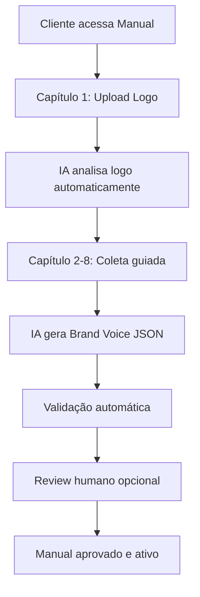

# 📖 Manual de Marca Digital V2 - Sistema Expandido

> **Versão:** 2.0 | **Status:** ✅ Ativo | **Última Atualização:** 24/08/2025  
> **Responsável:** Frontend Developer + UI/UX Designer  
> **Integração:** Módulo central do PRD v2.0 para personalização de marca pet

## 🎯 **Visão Geral**

O **Manual de Marca Digital V2** é o sistema expandido que coleta e estrutura a identidade visual e verbal de negócios pet, gerando um **Brand Voice JSON** completo que alimenta toda a plataforma de IA para produção de conteúdo personalizado e alinhado com a marca.

### **Evolução V1 → V2**

| Aspecto | V1 (Básico) | V2 (Expandido) |
|---------|-------------|----------------|
| **Coleta** | Logotipo + cores básicas | 8 capítulos estruturados |
| **Output** | Dados simples | Brand Voice JSON completo |
| **IA Integration** | Limitada | Alimenta 100% das funcionalidades IA |
| **Personalização** | Genérica | Especializada para segmento pet |
| **Validação** | Manual | Automática com IA + humana |

## 🏗️ **Arquitetura do Sistema**

### **Fluxo Principal**


### **Brand Voice JSON Schema**
```json
{
  "brandVoice": {
    "visual": {
      "logo": {
        "url": "string",
        "primaryColors": ["#hex", "#hex"],
        "secondaryColors": ["#hex", "#hex"],
        "style": "moderno|clássico|divertido|profissional",
        "emotions": ["confiança", "carinho", "profissionalismo"]
      },
      "typography": {
        "primaryFont": "string",
        "secondaryFont": "string",
        "tone": "formal|casual|amigável"
      }
    },
    "verbal": {
      "personality": {
        "traits": ["especialista", "cuidadoso", "empático"],
        "tone": "profissional-amigável",
        "voiceAttributes": ["confiável", "educativo", "acolhedor"]
      },
      "communication": {
        "language": "pt-BR",
        "formality": "semiformal",
        "technicalLevel": "intermediário",
        "petTerminology": true
      },
      "content": {
        "messagingPillars": [
          "Saúde e bem-estar pet",
          "Expertise veterinária",
          "Relacionamento de confiança"
        ],
        "keywords": ["saúde pet", "cuidado", "prevenção"],
        "avoidTerms": ["barato", "promoção", "desconto"]
      }
    },
    "business": {
      "segment": "veterinaria|petshop|banho_tosa|hotel_pet",
      "target": {
        "demographics": "25-45 anos, classe B/C",
        "psychographics": "Tutores responsáveis, pet lovers",
        "painPoints": ["falta de tempo", "preocupação com saúde"]
      },
      "positioning": "Clínica de referência em medicina preventiva",
      "competitive": {
        "differentials": ["tecnologia", "especialização", "humanização"],
        "challenges": ["concorrência", "preço", "conveniência"]
      }
    },
    "compliance": {
      "veterinary": {
        "disclaimers": true,
        "technicalTerms": "validated",
        "approvalRequired": true
      },
      "legal": {
        "claims": "substantiated",
        "testimonials": "authorized",
        "privacy": "LGPD_compliant"
      }
    }
  }
}
```

## 📋 **Estrutura dos 8 Capítulos**

### **🎨 Capítulo 1: Identidade Visual**
**Objetivo:** Coletar e analisar elementos visuais da marca

**Componentes UX:**
- **Upload de Logo** - Drag & drop com preview
- **Análise Automática por IA** - Extração de cores e estilo
- **Validação Manual** - Ajustes e confirmação
- **Paleta de Cores** - Primary, secondary, accent

**Dados Coletados:**
```json
{
  "logo": {
    "file": "File",
    "url": "string",
    "colors": ["#primary", "#secondary"],
    "style": "analysis_result",
    "quality": "score_0_100"
  }
}
```

**Componente React:**
```typescript
interface LogoUploadProps {
  onUploadComplete: (logoData: LogoData) => void;
  existingLogo?: LogoData;
  isAnalyzing?: boolean;
}

const LogoUploadChapter: FC<LogoUploadProps> = ({
  onUploadComplete,
  existingLogo,
  isAnalyzing
}) => {
  // Implementação com drag-drop, preview e análise IA
}
```

### **🎯 Capítulo 2: Posicionamento**
**Objetivo:** Definir como a marca se posiciona no mercado pet

**Componentes UX:**
- **Segment Selector** - Veterinária, Pet Shop, Banho & Tosa
- **Positioning Canvas** - Matriz visual interativa
- **Competitor Analysis** - Mapeamento competitivo
- **Differentiation Builder** - Definição de diferenciais

**Interface:**
```typescript
interface PositioningData {
  segment: 'veterinaria' | 'petshop' | 'banho_tosa' | 'hotel_pet';
  positioning: string;
  differentials: string[];
  competitors: {
    name: string;
    strengths: string[];
    weaknesses: string[];
  }[];
}
```

### **👥 Capítulo 3: Público-Alvo**
**Objetivo:** Mapear personas e comportamentos dos tutores

**Componentes UX:**
- **Persona Builder** - Criação guiada de personas
- **Demographics Slider** - Faixas etárias e classes sociais
- **Psychographics Map** - Valores e motivações
- **Pain Points Canvas** - Dores e necessidades

**Schema:**
```json
{
  "target": {
    "primaryPersona": {
      "name": "string",
      "demographics": {},
      "psychographics": {},
      "painPoints": [],
      "petBehavior": {}
    },
    "secondaryPersonas": []
  }
}
```

### **🗣️ Capítulo 4: Tom de Voz**
**Objetivo:** Definir personalidade e estilo de comunicação

**Componentes UX:**
- **Voice Attribute Selector** - Seleção de características
- **Tone Calibrator** - Formal ↔ Casual slider
- **Message Testing** - Preview de mensagens
- **Voice Guidelines** - Regras de comunicação

**Implementação:**
```typescript
interface VoiceSettings {
  personality: VoiceAttribute[];
  toneLevel: number; // 0-100 (formal para casual)
  technicalLevel: 'básico' | 'intermediário' | 'avançado';
  emotionalTone: 'profissional' | 'amigável' | 'empático';
}
```

### **📝 Capítulo 5: Mensagens-Chave**
**Objetivo:** Criar pilares de comunicação e messages house

**Componentes UX:**
- **Message Pillars Builder** - 3-5 pilares principais
- **Tagline Generator** - Criação assistida por IA
- **Value Propositions** - Propostas de valor únicas
- **Message Testing** - A/B test de mensagens

### **🎬 Capítulo 6: Referências Visuais**
**Objetivo:** Coletar inspirações e definir diretrizes estéticas

**Componentes UX:**
- **Mood Board Builder** - Colagem visual interativa
- **Style References** - Upload de imagens inspiradoras
- **Visual Guidelines** - Do's and Don'ts visuais
- **Brand Consistency Checker** - Validação automática

### **📱 Capítulo 7: Aplicações Digitais**
**Objetivo:** Definir como a marca aparece nos canais digitais

**Componentes UX:**
- **Platform Previews** - Instagram, Facebook, WhatsApp
- **Content Templates** - Modelos por tipo de post
- **Hashtag Strategy** - Tags relevantes e estratégicas
- **Bio Templates** - Modelos de biografia

### **📊 Capítulo 8: Guidelines de Uso**
**Objetivo:** Estabelecer regras e padrões para uso consistente

**Componentes UX:**
- **Brand Book Generator** - PDF automático
- **Usage Rules** - Regras visuais e verbais
- **Compliance Checklist** - Validações obrigatórias
- **Team Guidelines** - Orientações para equipe

## 🎨 **Design System - Componentes UI**

### **Layout Base**
```typescript
interface ManualLayout {
  currentChapter: number;
  totalChapters: 8;
  progress: number; // 0-100
  isComplete: boolean;
}

const ManualContainer: FC<ManualLayoutProps> = ({
  children,
  currentChapter,
  onNext,
  onPrevious,
  onSave
}) => (
  <div className="manual-container">
    <ManualHeader chapter={currentChapter} progress={progress} />
    <ManualContent>{children}</ManualContent>
    <ManualNavigation onNext={onNext} onPrevious={onPrevious} />
  </div>
);
```

### **Componentes Especializados**

#### **ChapterCard**
```typescript
interface ChapterCardProps {
  number: number;
  title: string;
  description: string;
  status: 'pending' | 'in_progress' | 'complete';
  estimatedTime: string;
  onClick: () => void;
}

const ChapterCard: FC<ChapterCardProps> = ({
  number,
  title,
  status,
  onClick
}) => (
  <Card 
    className={`chapter-card chapter-card--${status}`}
    onClick={onClick}
  >
    <ChapterNumber>{number}</ChapterNumber>
    <ChapterTitle>{title}</ChapterTitle>
    <ChapterStatus status={status} />
  </Card>
);
```

#### **ProgressTracker**
```typescript
const ProgressTracker: FC<{progress: number; chapters: ChapterStatus[]}> = ({
  progress,
  chapters
}) => (
  <div className="progress-tracker">
    <ProgressBar value={progress} />
    <ChapterIndicators chapters={chapters} />
    <CompletionEstimate chapters={chapters} />
  </div>
);
```

#### **BrandVoicePreview**
```typescript
const BrandVoicePreview: FC<{brandVoice: BrandVoiceJSON}> = ({
  brandVoice
}) => (
  <div className="brand-voice-preview">
    <VisualPreview visual={brandVoice.visual} />
    <VoicePreview verbal={brandVoice.verbal} />
    <MessagePreview messages={generatePreview(brandVoice)} />
  </div>
);
```

## 🔄 **Estados e Fluxos UX**

### **Estados do Manual**
1. **Draft** - Em criação
2. **In Review** - Aguardando validação
3. **Approved** - Aprovado e ativo
4. **Needs Update** - Requer atualização
5. **Archived** - Arquivado

### **Fluxo de Criação**
```
Novo Manual → Capítulo 1 → Análise IA → Capítulos 2-8 → 
Review → Aprovação → Ativação → Uso em Campanhas
```

### **Fluxo de Edição**
```
Manual Existente → Selecionar Capítulo → Editar → 
Validate Changes → Save Draft → Submit Review
```

## 🤖 **Integração com IA**

### **Análise Automática de Logo**
```typescript
interface LogoAnalysis {
  colors: {
    primary: string[];
    secondary: string[];
    accent: string[];
  };
  style: 'moderno' | 'clássico' | 'divertido' | 'profissional';
  emotions: string[];
  recommendations: string[];
}

const analyzeLogoWithAI = async (logoFile: File): Promise<LogoAnalysis> => {
  const formData = new FormData();
  formData.append('logo', logoFile);
  
  const response = await fetch('/api/ai/analyze-logo', {
    method: 'POST',
    body: formData
  });
  
  return response.json();
};
```

### **Geração de Brand Voice JSON**
```typescript
const generateBrandVoice = async (
  manualData: ManualChapters
): Promise<BrandVoiceJSON> => {
  const prompt = buildBrandVoicePrompt(manualData);
  
  const response = await openai.chat.completions.create({
    model: "gpt-4o",
    messages: [
      {
        role: "system",
        content: "Você é um especialista em branding para o mercado pet..."
      },
      {
        role: "user",
        content: prompt
      }
    ],
    response_format: { type: "json_object" }
  });
  
  return JSON.parse(response.choices[0].message.content);
};
```

### **Validação Automática**
```typescript
interface ValidationResult {
  isValid: boolean;
  score: number; // 0-100
  issues: ValidationIssue[];
  suggestions: string[];
}

const validateBrandVoice = async (
  brandVoice: BrandVoiceJSON
): Promise<ValidationResult> => {
  // Validações automáticas:
  // 1. Completude dos dados
  // 2. Consistência visual/verbal
  // 3. Compliance veterinário
  // 4. Qualidade do conteúdo
};
```

## 📱 **Interface Responsiva**

### **Mobile-First Design**
```scss
.manual-container {
  // Mobile (320px+)
  @media (min-width: 320px) {
    padding: 1rem;
    
    .chapter-card {
      width: 100%;
      margin-bottom: 1rem;
    }
  }
  
  // Tablet (768px+)
  @media (min-width: 768px) {
    padding: 2rem;
    
    .chapter-grid {
      display: grid;
      grid-template-columns: repeat(2, 1fr);
      gap: 1.5rem;
    }
  }
  
  // Desktop (1024px+)
  @media (min-width: 1024px) {
    .chapter-grid {
      grid-template-columns: repeat(3, 1fr);
    }
    
    .manual-sidebar {
      display: block;
    }
  }
}
```

### **Componentes Adaptivos**
```typescript
const useResponsiveLayout = () => {
  const [layout, setLayout] = useState<'mobile' | 'tablet' | 'desktop'>('mobile');
  
  useEffect(() => {
    const updateLayout = () => {
      const width = window.innerWidth;
      if (width >= 1024) setLayout('desktop');
      else if (width >= 768) setLayout('tablet');
      else setLayout('mobile');
    };
    
    updateLayout();
    window.addEventListener('resize', updateLayout);
    return () => window.removeEventListener('resize', updateLayout);
  }, []);
  
  return layout;
};
```

## 💾 **Persistência e State Management**

### **Zustand Store**
```typescript
interface ManualStore {
  currentManual: ManualData | null;
  chapters: ChapterData[];
  currentChapter: number;
  isDirty: boolean;
  
  // Actions
  setCurrentManual: (manual: ManualData) => void;
  updateChapter: (chapterNumber: number, data: Partial<ChapterData>) => void;
  saveManual: () => Promise<void>;
  validateManual: () => Promise<ValidationResult>;
}

const useManualStore = create<ManualStore>((set, get) => ({
  // Implementation
}));
```

### **Auto-save**
```typescript
const useAutoSave = (manualId: string) => {
  const { isDirty, saveManual } = useManualStore();
  
  useEffect(() => {
    if (!isDirty) return;
    
    const timeout = setTimeout(() => {
      saveManual();
    }, 2000); // Auto-save after 2 seconds of inactivity
    
    return () => clearTimeout(timeout);
  }, [isDirty, saveManual]);
};
```

## 🎯 **Métricas e Analytics**

### **Tracking de Capítulos**
```typescript
interface ChapterAnalytics {
  chapterNumber: number;
  startTime: Date;
  endTime: Date;
  completionTime: number; // in seconds
  revisits: number;
  abandonment: boolean;
}

const trackChapterProgress = (chapter: number, event: 'start' | 'complete' | 'abandon') => {
  analytics.track('manual_chapter_progress', {
    chapter,
    event,
    timestamp: Date.now()
  });
};
```

### **Conversion Metrics**
- **Chapter Completion Rate** - % de usuários que completam cada capítulo
- **Manual Completion Rate** - % de manuais finalizados vs iniciados
- **Time to Complete** - Tempo médio por capítulo e total
- **Quality Score** - Score médio de brand voice gerados

## 🔒 **Validação e Compliance**

### **Validações Obrigatórias**
1. **Visual:** Logo em formato adequado, cores válidas
2. **Posicionamento:** Segmento definido, diferenciais claros
3. **Público:** Pelo menos 1 persona completa
4. **Tom de Voz:** Atributos selecionados, exemplos validados
5. **Compliance:** Disclaimers veterinários, termos aprovados

### **Review Process**
```typescript
interface ReviewProcess {
  status: 'pending' | 'in_review' | 'approved' | 'rejected';
  reviewer: string;
  feedback: ReviewFeedback[];
  approvalDate?: Date;
}

interface ReviewFeedback {
  chapter: number;
  type: 'suggestion' | 'required_change' | 'approval';
  message: string;
  resolved: boolean;
}
```

## 🚀 **Performance e Otimização**

### **Lazy Loading de Capítulos**
```typescript
const ChapterRenderer = lazy(() => import(`./chapters/Chapter${chapterNumber}`));

const ManualChapterView: FC<{chapterNumber: number}> = ({ chapterNumber }) => (
  <Suspense fallback={<ChapterSkeleton />}>
    <ChapterRenderer number={chapterNumber} />
  </Suspense>
);
```

### **Otimização de Imagens**
```typescript
const OptimizedLogo: FC<{src: string; alt: string}> = ({ src, alt }) => (
  <Image
    src={src}
    alt={alt}
    width={200}
    height={200}
    priority
    placeholder="blur"
    blurDataURL="data:image/svg+xml;base64,..."
  />
);
```

## 🔧 **Desenvolvimento e Testes**

### **Component Testing**
```typescript
describe('ManualChapter', () => {
  it('should render chapter with correct data', () => {
    render(<ChapterCard number={1} title="Identidade Visual" status="complete" />);
    expect(screen.getByText('1')).toBeInTheDocument();
    expect(screen.getByText('Identidade Visual')).toBeInTheDocument();
  });
  
  it('should handle chapter navigation', () => {
    const onNext = jest.fn();
    render(<ManualNavigation onNext={onNext} />);
    fireEvent.click(screen.getByText('Próximo'));
    expect(onNext).toHaveBeenCalled();
  });
});
```

### **E2E Testing**
```typescript
describe('Manual Creation Flow', () => {
  it('should complete full manual creation', () => {
    cy.visit('/manual/novo');
    
    // Chapter 1: Upload Logo
    cy.get('[data-testid="logo-upload"]').selectFile('test-logo.png');
    cy.get('[data-testid="next-chapter"]').click();
    
    // Chapter 2: Positioning
    cy.get('[data-testid="segment-veterinaria"]').click();
    cy.get('[data-testid="positioning-input"]').type('Clínica especializada em medicina preventiva');
    
    // ... test all chapters
    
    cy.get('[data-testid="save-manual"]').click();
    cy.get('[data-testid="success-message"]').should('be.visible');
  });
});
```

## 🎨 **Tokens de Design**

### **Cores Específicas do Manual**
```scss
:root {
  // Manual Brand Colors
  --manual-primary: #8B5CF6; // Purple primary
  --manual-secondary: #06B6D4; // Cyan secondary
  --manual-success: #10B981; // Green for completed
  --manual-warning: #F59E0B; // Orange for in-progress
  --manual-danger: #EF4444; // Red for issues
  
  // Chapter Status Colors
  --chapter-pending: #9CA3AF;
  --chapter-active: var(--manual-primary);
  --chapter-complete: var(--manual-success);
  
  // Interactive Elements
  --manual-hover: #7C3AED;
  --manual-focus: #8B5CF6;
  --manual-disabled: #D1D5DB;
}
```

### **Typography Scale**
```scss
.manual-typography {
  --manual-title: 2.5rem; // 40px
  --manual-subtitle: 1.75rem; // 28px
  --manual-heading: 1.25rem; // 20px
  --manual-body: 1rem; // 16px
  --manual-caption: 0.875rem; // 14px
  
  font-family: 'Inter', -apple-system, BlinkMacSystemFont, sans-serif;
}
```

## 📋 **Status Atual**

- ✅ **Arquitetura definida** - Schema e fluxos documentados
- ✅ **Componentes especificados** - Interface e interações mapeadas
- ✅ **Integração IA planejada** - Endpoints e prompts definidos
- ✅ **Design System criado** - Tokens e componentes especializados
- 🔄 **Em implementação** - Sprint 2 em andamento
- ⏳ **Próximas etapas** - Desenvolvimento dos componentes React

---

**Documento criado em:** 24/08/2025  
**Versão:** 2.0  
**Sprint:** 2 - Semana 3  
**Responsáveis:** Frontend Developer + UI/UX Designer