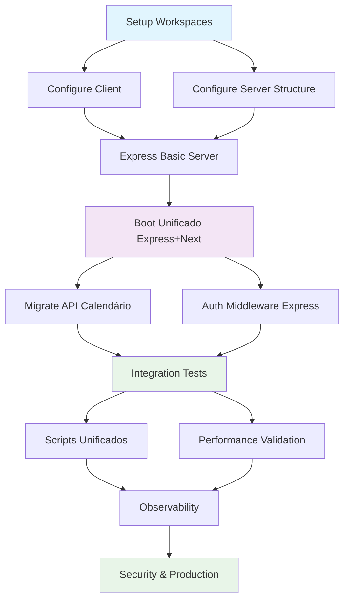

# 🔄 Plano de Migração: Next.js → Client + Server (Express) - Woof Marketing

**Plataforma:** Woof Marketing - Primeira agência de marketing pet operada por IA (80/20)  
**Versão do Plano:** 1.0  
**Data de Criação:** 25 de agosto de 2025  
**Status:** 🔄 Planejamento Completo  

---

## 1. 🎯 Visão & Objetivos

### Objetivo Principal
Migrar a arquitetura atual Next.js monolítica para uma arquitetura separada client + server (Express) com boot unificado via Express servindo páginas Next.js, mantendo todas as funcionalidades da **agência pet operada por IA**.

### Alinhamento com @docs/README.md
**Fonte:** @docs/README.md §Arquitetura & Tecnologia

- ✅ Manter stack Next.js + TypeScript + Supabase + TailwindCSS
- ✅ Preservar integração com IA (OpenAI GPT-4o) para modelo 80/20
- ✅ Garantir continuidade do compliance veterinário
- ✅ Manter performance (Core Web Vitals < 2.5s LCP)
- ✅ Preservar sistema de autenticação Supabase Auth

### Benefícios Esperados
1. **Separação de Responsabilidades**: Frontend focado em UI, backend em APIs/IA
2. **Escalabilidade**: Possibilidade de escalar frontend e backend independentemente  
3. **Desenvolvimento**: Teams podem trabalhar em paralelo em client/server
4. **Deploy Flexível**: Deploy independente de client e server se necessário
5. **Monitoramento**: Métricas granulares por camada

---

## 2. 🔍 Diagnóstico do Projeto

### Stack Atual (Auto-detectado)
```yaml
Framework: Next.js 15.4.2 (App Router confirmado ✅)
Runtime: Node.js v20.18.1
Package Manager: npm v11.4.2 (lockfile: package-lock.json)
TypeScript: v5.x (configurado ✅)
Styling: TailwindCSS v4 
Database: Supabase (PostgreSQL + Auth + Storage)
AI Integration: OpenAI (via .env.example)
Auth: Supabase Auth + JWT + middleware.ts
Deploy: Vercel (inferido dos docs)
```

### Estrutura Atual
```
woof/ (raiz)
├── src/app/           # App Router (✅ Next.js 15)
│   ├── layout.tsx     # Root layout
│   ├── page.tsx       # Landing page
│   ├── api/           # API routes (1 pasta: calendario)
│   ├── (dashboard)/   # Protected routes group
│   └── auth/          # Auth routes
├── middleware.ts      # Auth middleware (Supabase)
├── package.json       # Scripts: dev, build, start, lint
├── next.config.ts     # Build config (TypeScript)
├── tsconfig.json      # TypeScript config
├── tailwind.config.mjs
├── .env.example       # Supabase + OpenAI + Mock flags
└── components/        # UI components
```

### APIs Existentes (para migrar)
1. **src/app/api/calendario/** - API de calendário/agendamentos

### Configurações Atuais
```typescript
// next.config.ts - Permite build com erros (temporário)
eslint: { ignoreDuringBuilds: true }
typescript: { ignoreBuildErrors: true }

// package.json scripts
"dev": "next dev --turbopack"  # Turbopack habilitado
"build": "next build"
"start": "next start"
```

### Middleware Complexo Detectado ⚠️
```typescript
// middleware.ts - Auth com Supabase SSR
- createServerClient com cookies
- Protected routes: /dashboard, /leads, /campanhas, etc.
- Auth redirects: /login ↔ /dashboard
```

### Riscos Identificados
1. **🔴 ALTO**: Middleware complexo com Supabase SSR cookies
2. **🟡 MÉDIO**: API routes limitadas (só calendário)
3. **🟡 MÉDIO**: Build com ignoreBuildErrors/ignoreDuringBuilds  
4. **🟢 BAIXO**: App Router já em uso (migração mais simples)
5. **🟢 BAIXO**: TypeScript configurado

---

## 3. 🏗️ Arquitetura Proposta

### Estrutura Alvo - npm workspaces
```
woof/ (raiz - monorepo)
├── package.json           # Workspaces config + scripts unificados
├── client/                # Next.js frontend
│   ├── package.json       # Next.js + React + UI deps
│   ├── src/app/           # App Router (sem /api)
│   ├── next.config.ts     # Config específico client
│   ├── tailwind.config.mjs
│   └── middleware.ts      # Middleware Next.js (simplificado)
├── server/                # Express backend
│   ├── package.json       # Express + Next + deps
│   ├── src/
│   │   ├── index.ts       # Express + Next boot unificado
│   │   ├── routes/        # API routes (migradas + novas)
│   │   ├── middleware/    # CORS, auth, compression
│   │   └── utils/         # Helpers e utilities
│   ├── tsconfig.json      # Config TypeScript server
│   └── .env.example       # Server-specific env vars
└── shared/ (futuro)       # Types, utils compartilhados
```

### Boot Único - Express + Next
```typescript
// server/src/index.ts (TEMPLATE)
import next from 'next';
import express from 'express';

const app = next({ dev, dir: '../client' });
const handle = app.getRequestHandler();

async function main() {
  await app.prepare();
  const server = express();
  
  // Express APIs
  server.use('/api/health', healthRouter);
  server.use('/api/calendario', calendarioRouter);
  
  // Next.js para tudo mais
  server.all('*', (req, res) => handle(req, res));
  
  server.listen(port);
}
```

### Políticas Operacionais
- **CORS**: Configurável via .env (CORS_ORIGIN)
- **Logs**: Estruturados e concisos 
- **Segurança**: Compression + basic headers
- **Healthcheck**: GET /api/health para monitoramento
- **Port**: 3000 (padrão) ou PORT env var

---

## 4. 📋 Plano de Migração

### Fase 1: Setup Monorepo (P)
**Objetivo**: Estrutura base sem quebrar funcionalidades

1. **Criar estrutura de workspaces**
   - [ ] Mover src/app → client/src/app (sem /api)
   - [ ] Criar server/ com estrutura inicial
   - [ ] Configurar package.json raiz com workspaces
   - [ ] Atualizar scripts para usar workspaces

2. **Configurar client/**
   - [ ] client/package.json com deps Next.js
   - [ ] Mover configurações: next.config.ts, tailwind.config.mjs
   - [ ] Ajustar middleware.ts (apenas Auth, sem APIs)
   - [ ] Atualizar imports (@/ paths)

### Fase 2: Setup Express Server (P)
**Objetivo**: Criar servidor Express funcional

3. **Estrutura básica server/**
   - [ ] server/package.json com Express + Next + deps
   - [ ] server/tsconfig.json para ES Modules
   - [ ] server/src/index.ts (boot unificado Express+Next)
   - [ ] Middlewares: CORS, compression, express.json()

4. **Healthcheck e básicos**
   - [ ] GET /api/health (status, env, uptime)
   - [ ] Logs estruturados (console temporário)
   - [ ] Error handling básico

### Fase 3: Migração APIs (M)
**Objetivo**: Migrar APIs existentes para Express

5. **Migrar API calendario/**
   - [ ] Mover src/app/api/calendario → server/src/routes/calendario
   - [ ] Adaptar para Express Router (req/res)
   - [ ] Testar funcionalidade equivalente
   - [ ] Remover de client/src/app/api/

6. **Auth handling no servidor**
   - [ ] Middleware de autenticação Express 
   - [ ] Validação JWT/Supabase
   - [ ] Proteção de rotas API

### Fase 4: Integração & Testes (M)
**Objetivo**: Sistema funcionando end-to-end

7. **Scripts unificados**
   - [ ] `npm run dev` → server dev com client build
   - [ ] `npm run build` → client + server build
   - [ ] `npm start` → servidor produção
   - [ ] Scripts de teste e lint

8. **Validações**
   - [ ] Autenticação funcionando
   - [ ] APIs retornando dados corretos  
   - [ ] Frontend renderizando corretamente
   - [ ] Middleware Next.js funcionando
   - [ ] Performance mantida

### Fase 5: Melhorias (G)
**Objetivo**: Otimizações e funcionalidades extras

9. **Observabilidade**
   - [ ] Logs estruturados (JSON)
   - [ ] Métricas básicas (request time)
   - [ ] Error tracking
   - [ ] Health checks completos

10. **Segurança & Production**
    - [ ] Rate limiting básico
    - [ ] Security headers
    - [ ] Environment validation
    - [ ] Graceful shutdown

---

## 5. 🧑‍💼 Tarefas & RACI

**Fonte:** @agents/README.md - RACI Simplificado

### Fase 1: Setup Monorepo
| Tarefa | Responsável | Aprovador | Consultado | Informado |
|--------|-------------|-----------|------------|-----------|
| Estrutura workspaces | **Tech_Lead** | Tech_Lead | Frontend | QA, DevOps |
| Configurar client/ | **Frontend_Developer** | Tech_Lead | UX_Designer | QA |
| Mover assets/components | **Frontend_Developer** | Tech_Lead | - | - |
| Scripts package.json | **Tech_Lead** | Tech_Lead | DevOps | Frontend |

### Fase 2: Setup Express Server  
| Tarefa | Responsável | Aprovador | Consultado | Informado |
|--------|-------------|-----------|------------|-----------|
| Estrutura server/ | **Backend_Developer** | Tech_Lead | DevOps | Frontend |
| Boot unificado Express+Next | **Tech_Lead** | Tech_Lead | Backend | DevOps |
| Configurações TypeScript | **Backend_Developer** | Tech_Lead | - | - |
| Healthcheck básico | **Backend_Developer** | Tech_Lead | DevOps | QA |

### Fase 3: Migração APIs
| Tarefa | Responsável | Aprovador | Consultado | Informado |
|--------|-------------|-----------|------------|-----------|
| Migrar API calendário | **Backend_Developer** | Tech_Lead | Frontend | QA |
| Auth middleware Express | **Backend_Developer** | Tech_Lead | Pet_Compliance | QA |
| Testes APIs migradas | **QA_Engineer** | QA_Engineer | Backend | Tech_Lead |

### Fase 4: Integração & Testes
| Tarefa | Responsável | Aprovador | Consultado | Informado |
|--------|-------------|-----------|------------|-----------|
| Scripts unificados | **DevOps_Specialist** | Tech_Lead | Backend | Frontend |
| Testes end-to-end | **QA_Engineer** | QA_Engineer | All | Tech_Lead |
| Performance validation | **Tech_Lead** | Tech_Lead | QA, Frontend | PM |

### Fase 5: Melhorias
| Tarefa | Responsável | Aprovador | Consultado | Informado |
|--------|-------------|-----------|------------|-----------|
| Observabilidade | **DevOps_Specialist** | Tech_Lead | Backend | Data_Analyst |
| Security headers | **Backend_Developer** | Tech_Lead | Pet_Compliance | DevOps |

### Estimativas por Papel
- **Tech_Lead**: 40h (arquitetura + revisões)
- **Backend_Developer**: 32h (servidor + APIs)  
- **Frontend_Developer**: 24h (estrutura client)
- **DevOps_Specialist**: 16h (scripts + observabilidade)
- **QA_Engineer**: 16h (testes + validação)
- **TOTAL**: ~128h (16 dias úteis para 1 pessoa)

---

## 6. ⚙️ Scripts & Execução

### package.json Raiz (Workspaces)
```json
{
  "name": "woof-monorepo",
  "version": "0.1.0",
  "private": true,
  "workspaces": ["client", "server"],
  "scripts": {
    "dev": "npm --workspace server run dev",
    "build": "npm run client:build && npm run server:build", 
    "client:build": "npm --workspace client run build",
    "server:build": "npm --workspace server run build",
    "start": "npm --workspace server run start",
    "lint": "npm --workspace client run lint",
    "test": "npm --workspace client run test"
  },
  "devDependencies": {
    "concurrently": "^8.2.2"
  }
}
```

### client/package.json
```json
{
  "name": "woof-client", 
  "version": "0.1.0",
  "private": true,
  "scripts": {
    "dev": "next dev --port 3001",
    "build": "next build", 
    "start": "next start --port 3001",
    "lint": "next lint",
    "test": "jest"
  },
  "dependencies": {
    "next": "15.4.2",
    "react": "19.1.0",
    "react-dom": "19.1.0",
    "@supabase/ssr": "^0.6.1",
    "@supabase/supabase-js": "^2.52.1",
    "class-variance-authority": "^0.7.1",
    "clsx": "^2.1.1",
    "lucide-react": "^0.525.0",
    "tailwind-merge": "^3.3.1"
  },
  "devDependencies": {
    "@types/node": "^20",
    "@types/react": "^19", 
    "@types/react-dom": "^19",
    "eslint": "^9",
    "eslint-config-next": "15.4.2",
    "tailwindcss": "^4",
    "typescript": "^5"
  }
}
```

### server/package.json
```json
{
  "name": "woof-server",
  "version": "0.1.0", 
  "private": true,
  "type": "module",
  "scripts": {
    "dev": "tsx src/index.ts",
    "build": "tsc -p tsconfig.json",
    "start": "node dist/index.js"
  },
  "dependencies": {
    "express": "^4.19.2",
    "next": "15.4.2",
    "compression": "^1.7.4",
    "cors": "^2.8.5",
    "dotenv": "^16.4.5",
    "@supabase/supabase-js": "^2.52.1"
  },
  "devDependencies": {
    "@types/express": "^4.17.21",
    "@types/compression": "^1.7.5",
    "@types/cors": "^2.8.17",
    "tsx": "^4.7.0", 
    "typescript": "^5.6.3"
  }
}
```

### .env.example Consolidado
```bash
# === EXPRESS SERVER CONFIG ===
PORT=3000
NODE_ENV=development
CORS_ORIGIN=http://localhost:3000,http://localhost:3001

# === SUPABASE CONFIG (compartilhado) ===
NEXT_PUBLIC_SUPABASE_URL=your_supabase_project_url
NEXT_PUBLIC_SUPABASE_ANON_KEY=your_supabase_anon_key

# === AI INTEGRATION ===  
OPENAI_API_KEY=sk-your_openai_api_key_here

# === MOCK CONTROLS (desenvolvimento) ===
MOCK_DATA_ENABLED=true
MOCK_AI_ENABLED=true
MOCK_ANALYTICS_ENABLED=true
DEBUG_PROVIDERS=true
```

---

## 7. 📊 Observabilidade & Qualidade

### Healthcheck Endpoint
```typescript
// GET /api/health
{
  "status": "ok",
  "timestamp": "2025-08-25T14:30:00Z",
  "env": "development", 
  "uptime": 3600,
  "version": "0.1.0",
  "services": {
    "supabase": "connected",
    "next": "ready"  
  }
}
```

### Logs Estruturados
```typescript
// Formato de log padrão
{
  "timestamp": "2025-08-25T14:30:00Z",
  "level": "info|warn|error", 
  "service": "server|client",
  "message": "Request processed",
  "data": {
    "method": "GET",
    "url": "/api/calendario",
    "responseTime": 45,
    "userId": "uuid"
  }
}
```

### Métricas Simples
- **Request Time**: P50, P90, P95 por rota
- **Error Rate**: % erros por período
- **Health Status**: UP/DOWN dos serviços críticos
- **Response Size**: Bytes transferidos

### Testes de Fumaça
```bash
# Testes básicos pós-deploy
curl -f http://localhost:3000/api/health # 200 OK
curl -f http://localhost:3000/ # Landing page
curl -f http://localhost:3000/dashboard # Auth redirect
```

### CI Básico (GitHub Actions sugerido)
```yaml
name: CI
on: [push, pull_request]
jobs:
  test:
    runs-on: ubuntu-latest
    steps:
      - uses: actions/checkout@v4
      - uses: actions/setup-node@v4 
      - run: npm ci
      - run: npm run lint
      - run: npm run build
      - run: npm run test
```

---

## 8. ✅ DoD (Critérios de Aceite)

### Funcional
- [ ] ✅ Landing page acessível em http://localhost:3000
- [ ] ✅ Dashboard com autenticação funcionando  
- [ ] ✅ API calendário retorna dados corretos
- [ ] ✅ Middleware de auth protege rotas corretamente
- [ ] ✅ Todas as páginas existentes funcionando
- [ ] ✅ Upload de assets/logos funcionando

### Performance  
- [ ] ✅ LCP < 2.5s (Core Web Vital)
- [ ] ✅ Response time APIs < 500ms P95
- [ ] ✅ Bundle size client não aumentou >10%
- [ ] ✅ Memory usage server < 512MB

### Desenvolvimento
- [ ] ✅ `npm run dev` inicia todo o sistema
- [ ] ✅ `npm run build` builda client + server
- [ ] ✅ `npm start` roda versão produção
- [ ] ✅ Hot reload funcionando no desenvolvimento
- [ ] ✅ TypeScript sem erros críticos
- [ ] ✅ ESLint passa sem erros

### Operacional
- [ ] ✅ Logs estruturados em produção  
- [ ] ✅ /api/health retorna status correto
- [ ] ✅ Error handling não quebra aplicação
- [ ] ✅ Graceful shutdown (SIGTERM)
- [ ] ✅ Environment variables validadas

---

## 9. ⚠️ Riscos, [GAPs] & [ASSUNÇÕES] + Mitigações

### Riscos ALTOS 🔴

**R001 - Middleware Complexo com Cookies**
- **Risco**: Middleware atual gerencia cookies Supabase SSR complexamente
- **Impacto**: Autenticação quebrada na migração
- **[ASSUNÇÃO]**: Cookies serão gerenciados pelo Express + Next mantendo compatibilidade
- **Mitigação**: 
  1. Testar auth em ambiente isolado primeiro
  2. Manter versão atual funcionando durante migração  
  3. Rollback plan preparado

**R002 - Boot Único Express+Next**  
- **Risco**: await app.prepare() pode falhar ou ser lento
- **Impacto**: Sistema não inicializa
- **[ASSUNÇÃO]**: Next.js 15 é compatível com essa abordagem
- **Mitigação**:
  1. Testar em ambiente desenvolvimento primeiro
  2. Timeout configurável para app.prepare()
  3. Fallback para modo desenvolvimento se necessário

### Riscos MÉDIOS 🟡

**R003 - APIs Existentes Limitadas**
- **[GAP]**: Apenas 1 API route (calendário) identificada
- **[ASSUNÇÃO]**: Outras APIs podem estar ocultas ou ser criadas durante migração
- **Mitigação**: Fazer audit completo de todas as chamadas /api/ no frontend

**R004 - Performance Degradação**
- **Risco**: Extra hop via Express pode introduzir latência
- **[ASSUNÇÃO]**: Overhead será <50ms na prática
- **Mitigação**: Benchmark antes/depois da migração

**R005 - Build Configuration**  
- **[GAP]**: ignoreBuildErrors/ignoreDuringBuilds podem ocultar problemas
- **Mitigação**: Corrigir erros gradualmente durante migração

### Riscos BAIXOS 🟢

**R006 - Dependencies Conflicts**
- **Risco**: Versões conflitantes entre client/server workspaces
- **Mitigação**: Lockfiles específicos + audit regular

**R007 - Development Experience**
- **Risco**: DX pior com arquitetura mais complexa
- **Mitigação**: Scripts bem documentados + hot reload mantido

### [GAPs] Identificados para Validação

1. **[GAP-001]**: **Outras API routes não visíveis** 
   - **Validação**: Grep completo por fetch('/api/') no client
   - **Prazo**: Fase 1

2. **[GAP-002]**: **Edge Runtime usage**
   - **Validação**: Verificar se alguma API usa Edge Runtime  
   - **Prazo**: Fase 2

3. **[GAP-003]**: **Middleware Next.js complex**
   - **Validação**: Testar matcher patterns no novo setup
   - **Prazo**: Fase 3

4. **[GAP-004]**: **Static assets routing**
   - **Validação**: Verificar se public/ e _next/static funcionam via Express
   - **Prazo**: Fase 4

---

## 10. 📅 Cronograma & Marcos

### Sprint 1 (Semana 1) - Foundation
**Marco**: Estrutura básica funcionando

- **Dias 1-2**: Setup monorepo + workspaces
- **Dias 3-4**: Client estruturado + funcionando standalone  
- **Dia 5**: Review e ajustes

**Entrega**: Client rodando independente em client/

### Sprint 2 (Semana 2) - Server Setup  
**Marco**: Express server boot unificado

- **Dias 1-2**: Express server básico
- **Dias 3-4**: Boot unificado Express+Next
- **Dia 5**: Testes integração básica

**Entrega**: Sistema completo funcionando localmente

### Sprint 3 (Semana 3) - Migration & Polish
**Marco**: APIs migradas + produção ready

- **Dias 1-2**: Migrar API calendário
- **Dias 3-4**: Observabilidade + security  
- **Dia 5**: Testes end-to-end + performance

**Entrega**: Sistema pronto para produção

### Marco de Releases

**v0.1 (MVP)**: Boot unificado funcionando
- ✅ Express serve Next.js pages
- ✅ APIs básicas migradas
- ✅ Autenticação funcionando

**v1.0 (Production)**: Sistema completo
- ✅ Todas APIs migradas  
- ✅ Observabilidade implementada
- ✅ Performance otimizada
- ✅ Documentação completa

**v1.1 (Optimization)**: Melhorias
- ✅ Rate limiting
- ✅ Advanced monitoring
- ✅ Security hardening

---

## 11. 📋 ADRs (Arquitetura & Decisões)

### ADR-005: Migração para Arquitetura Client+Server
**Decisão**: Separar Next.js monolítico em client (Next) + server (Express)  
**Status**: 🔄 Proposto  
**Data**: 2025-08-25  

**Contexto**: 
- Aplicação crescendo em complexidade
- Necessidade de escalabilidade independente
- Time expandindo (frontend/backend separation)
- Deploy flexibility para futuro

**Opções Consideradas**:
1. **Manter monolítico Next.js**: Simples, mas limitado para escala
2. **Separação completa**: Client + Server independentes, mas complexity++
3. **Boot unificado Express+Next**: Balance entre simplicidade e separação

**Decisão**: **Opção 3** - Boot unificado via Express
- Express server incorpora Next.js via `app.prepare()`  
- APIs ficam no Express (mais flexibilidade)
- Frontend continua Next.js (zero disruption)
- Single process em desenvolvimento, deploy flexibility

**Consequências**:
- ✅ Separação clara de responsabilidades
- ✅ APIs mais flexíveis (Express ecosystem)  
- ✅ Preparação para microservices futuro
- ✅ Team parallelization possível
- ❌ Complexity adicional na infra
- ❌ Extra hop pode adicionar latência minimal
- ❌ Learning curve para boot pattern

### ADR-006: npm Workspaces como Monorepo Tool
**Decisão**: Usar npm workspaces nativo vs Lerna/Rush/NX  
**Status**: 🔄 Proposto  
**Data**: 2025-08-25  

**Contexto**: Projeto precisa de monorepo para client/server separation

**Decisão**: npm workspaces (nativo Node.js)
- Projeto pequeno/médio (2 workspaces)
- Team familiarizado com npm
- Zero additional tooling
- Compatível com CI existente

**Consequências**:
- ✅ Zero tooling overhead
- ✅ Native npm support  
- ✅ Simple mental model
- ❌ Limited features vs NX/Lerna
- ❌ No build orchestration avançada

### ADR-007: Express.js como Backend Framework  
**Decisão**: Express vs Fastify vs Koa vs Raw Node  
**Status**: 🔄 Proposto  
**Data**: 2025-08-25  

**Contexto**: Precisa servir APIs + integrar Next.js

**Decisão**: Express 4.x
- Ecosystem maduro e estável
- Compatibilidade comprovada com Next.js
- Team knowledge existente
- Rich middleware ecosystem
- Simple mental model

**Consequências**:
- ✅ Proven stability e ecosystem
- ✅ Good Next.js integration examples
- ✅ Rich middleware (CORS, compression, etc.)
- ❌ Performance inferior a Fastify
- ❌ Callback-based (vs async/await first)

---

## 12. 🔀 DAG de Dependências



### Dependências Críticas
- **E** depende de **A,B,C,D** (boot precisa de estrutura completa)
- **H** depende de **F,G** (testes precisam de APIs funcionando)
- **L** depende de **K** (security precisa de observability)

### Paralelização Possível
- **B** e **C** podem ser feitos em paralelo
- **F** e **G** podem ser feitos em paralelo  
- **I** e **J** podem ser feitos em paralelo

---

## 13. ✅ Checklist de Testes & Rollback

### Testes Mínimos por Rota

**Landing Page (GET /)**
- [ ] Página carrega em <3s
- [ ] CSS/JS assets carregam
- [ ] Não há erros console
- [ ] Meta tags SEO presentes

**Dashboard (GET /dashboard)**  
- [ ] Redirect para /login se não autenticado
- [ ] Carrega dashboard se autenticado
- [ ] Sidebar e navegação funcionam
- [ ] Data fetching funciona

**Auth Routes**
- [ ] GET /login retorna form
- [ ] POST /auth/callback processa Supabase
- [ ] Logout limpa sessão
- [ ] Protected routes bloqueiam acesso

**API Routes**
- [ ] GET /api/health retorna 200 + JSON
- [ ] GET /api/calendario/* retorna dados
- [ ] Auth middleware protege APIs privadas
- [ ] Error handling retorna JSON estruturado

### Performance Tests
```bash
# Basic load testing
curl -w "@curl-format.txt" -s http://localhost:3000/ 
curl -w "@curl-format.txt" -s http://localhost:3000/api/health

# Expected thresholds:
# Landing page: <2.5s
# API health: <100ms  
# API calendario: <500ms
```

### Smoke Tests Script
```bash
#!/bin/bash
# smoke-test.sh

set -e

BASE_URL=${BASE_URL:-http://localhost:3000}

echo "🧪 Running smoke tests..."

# Health check
curl -f $BASE_URL/api/health | jq .status | grep -q "ok"
echo "✅ Health check OK"

# Landing page  
curl -f $BASE_URL/ | grep -q "woof" # ou outro texto específico
echo "✅ Landing page OK"

# Dashboard redirect
curl -s -o /dev/null -w "%{http_code}" $BASE_URL/dashboard | grep -q "302"
echo "✅ Dashboard auth redirect OK"

echo "🎉 All smoke tests passed!"
```

### Rollback Plan

**Cenário**: Sistema não funciona após migração

**Rollback Imediato** (< 5 min):
1. `git checkout main` (branch anterior)
2. `npm install` (deps originais)  
3. `npm run build && npm start`
4. Verificar funcionamento básico

**Rollback de Dados**:
- Dados ficam em Supabase (não afetados)
- .env vars mantidas (compatibilidade)
- Assets em public/ mantidos

**Comunicação**:
1. Status page: "Sistema em manutenção"
2. Team notification: Slack/email
3. Logs: Capturar erro root cause
4. Postmortem: Após resolução

**Recovery Steps**:
1. Identificar causa raiz
2. Fix em branch separada  
3. Test em staging/local
4. Deploy gradual (feature flag se possível)

---

## 📋 Conclusão

Este plano fornece um roadmap completo para migrar a **Plataforma Woof Marketing** de uma arquitetura Next.js monolítica para client + server (Express) com boot unificado, mantendo todas as funcionalidades de **agência pet operada por IA** e seguindo as diretrizes estabelecidas em @docs/README.md.

### Key Success Factors
1. **Fase por fase**: Migração incremental sem big bang
2. **Backward compatibility**: Sistema atual continua funcionando
3. **Automated testing**: Smoke tests em cada fase
4. **Performance monitoring**: KPIs antes/durante/depois  
5. **Rollback ready**: Plano de contingência testado

### Next Steps
1. **Aprovação**: Review do plano com stakeholders
2. **Environment setup**: Staging para testes
3. **Kick-off**: Sprint 1 planning
4. **Execution**: Seguir cronograma definido

---

**Autor**: GitHub Copilot (AI Agent)  
**Baseado em**: @docs/README.md + @agents/README.md  
**Projeto**: Woof Marketing - Agência Pet Operada por IA  
**Status**: ✅ Plano Completo - Aguardando Execução